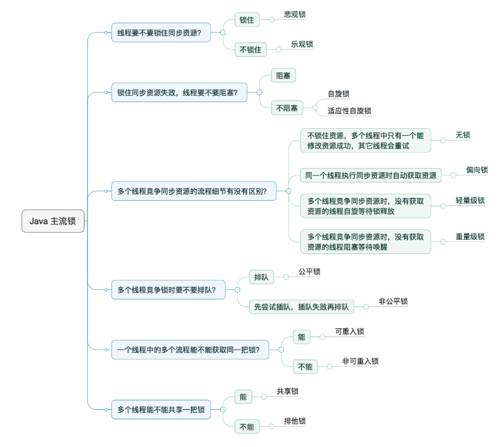
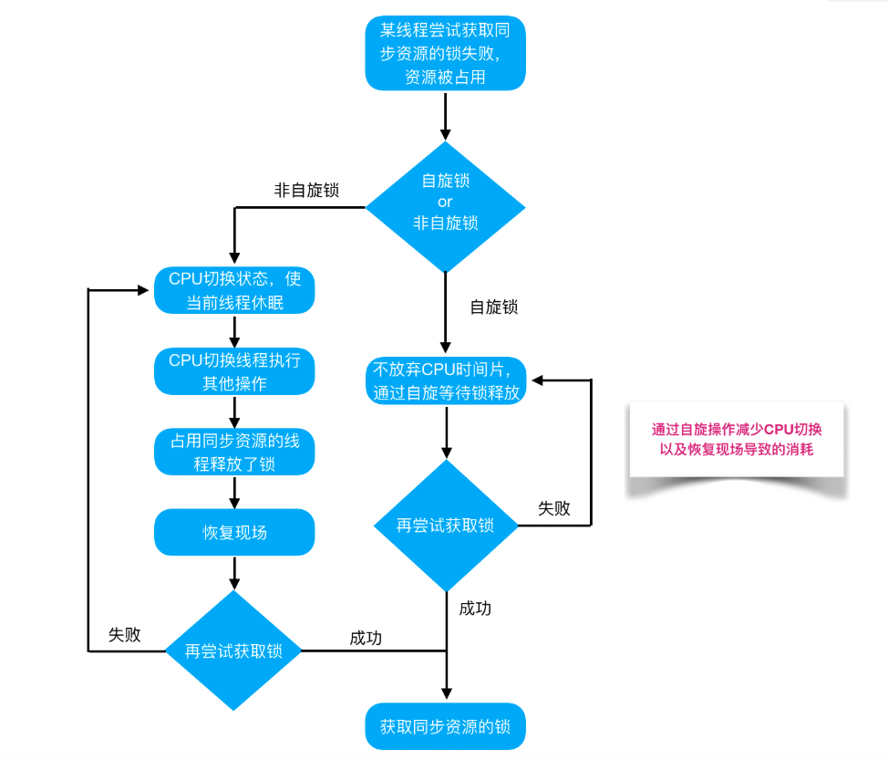

# CAS算法

Java中有各式各样的锁，主流的锁和概念如下：



CAS作为concurrent包基础中的基础，在战胜并发编程的旅途中有着举足轻重的地位。

## 悲观锁和乐观锁


* 悲观锁

悲观的认为自己在使用数据的时候一定有别的线程来修改数据，因此在获取数据的时候会先加锁，确保数据不会被别的线程修改。Java中，synchronized关键字和Lock的实现类都是悲观锁。


* 乐观锁

乐观的认为自己在使用数据时不会有别的线程修改数据，所以不会添加锁，只是在更新数据的时候去判断之前有没有别的线程更新了这个数据。如果这个数据没有被更新，当前线程将自己修改的数据成功写入。如果数据已经被其他线程更新，则根据不同的实现方式执行不同的操作（例如报错或者自动重试）。


* 通过乐观锁和悲观锁的概念，可以总结出：
  * 悲观锁适合**写多**的场景，频繁的写，通过加锁保证数据的正确性。
  * 乐观锁适合**读多**的场景，修改数据不频繁，不加锁使得读操作的性能大大提升。


悲观锁代码示例：

```java
// ------------------------- 悲观锁的使用方法 -------------------------
// synchronized
public synchronized void testMethod() {
    // 操作同步资源
}
// ReentrantLock
private ReentrantLock lock = new ReentrantLock(); // 需要保证多个线程使用的是同一个锁
public void modifyPublicResources() {
    lock.lock();
    // 操作同步资源
    lock.unlock();
}
```

乐观锁代码示例:

```java
AtomicInteger atomicInteger = new AtomicInteger(1);
atomicInteger.getAndIncrement();
atomicInteger.compareAndSet(2, 100);
// getAndIncrement()和compareAndSet()底层都调用了compareAndSwapInt()方法,CAS
```


我们知道，锁的存在是为了保证线程间共享资源的正确性，即要实现线程同步。悲观锁好理解，就是每次一个线程将共享的资源先上锁，等自己使用完了，然后释放锁再让其他的线程使用；而乐观锁需要怎么实现线程同步呢？ 答案就是：**CAS （Compare And Swap），比较并替换。**


## CAS算法原理

**CAS**: Compare And Swap，即**比较并替换**

CAS算法中使用到了3个基本操作数：内存地址V，旧的预期值A，要修改的新值B。

更新一个变量时，只要当内存地址V上的值和旧的预期值相同的时候，才会将内存地址V上的值替换成新的值，图示：


## Java中AtomicXXX 原子操作类

先来看看 `AtomicInteger`类的使用

```java
AtomicInteger atomicInteger = new AtomicInteger(1);
atomicInteger.getAndIncrement();
atomicInteger.compareAndSet(2, 100);
// getAndIncrement()和compareAndSet()底层都调用了compareAndSwapInt()方法,CAS
```

看看 `getAndIncrement()` 和 `compareAndSet()` 方法的源码:

```java
=======================================getAndIncrement方法============================
public final int getAndIncrement() {
    // 调用了Unsafe对象的getAndAddInt方法
    return unsafe.getAndAddInt(this, valueOffset, 1);
}

public final int getAndAddInt(Object var1, long var2, int var4) {
    int var5;
    // 循环获取当前对象存储在主内存中的值(通过valueOffset获取,即值在内存中的偏移量,也就是地址;该值是volatile修饰的,任意时刻获取的都是最新的值,并将值赋给var5),并且和旧的预期值进行比较,如果相等,则执行swap操作,如果不相等,则替换不成功,同时compareAndSeapInt()返回false,继续下次循环,这里相当于自旋操作
    do {
        var5 = this.getIntVolatile(var1, var2);
    } while(!this.compareAndSwapInt(var1, var2, var5, var5 + var4));
    return var5;
}


=======================================compareAndSet方法=============================
public final boolean compareAndSet(int expect, int update) {
    return unsafe.compareAndSwapInt(this, valueOffset, expect, update);
}
```

**CAS操作封装在compareAndSwapInt方法内部，在JNI里是借助于一个CPU指令完成的，属于原子操作，可以保证多个线程都能够看到同一个变量的修改值。后续JDK通过CPU的cmpxchg指令，去比较寄存器中的 A 和 内存中的值 V。如果相等，就把要写入的新值 B 存入内存中。如果不相等，就将内存值 V 赋值给寄存器中的值 A。然后通过Java代码中的while循环再次调用cmpxchg指令进行重试，直到设置成功为止。**


> 可能你会问：Unsafe是什么东东呢？
>
> Java没办法直接访问底层操作系统，但是JVM为我们提供了一个后门，它后门就是unsafe。unsafe为我们提供了**硬件级别的原子操作**。
>
> 
>
> 对于value变量，它是volatile修饰的，根据volatile的特性，多线程情况下，是直接在主内存进行读写的，在各个线程之间能够保证可见性；valueOffset通过unsafe对象获得，我们可以简单的将valueOffset理解为value在内存中的地址。


## CAS问题

1. ABA问题，可以通过版本号解决。参考：<https://juejin.im/post/5c021da16fb9a049e65ffcbf>
2. 循环时间长，开销比较大：如果并发量相当高，CAS操作长时间不成功时，会导致其一直自旋，带来CPU消耗比较大


## 扩展： 自旋锁和非自旋锁的概念




## 参考

https://www.jianshu.com/p/ae25eb3cfb5d

https://juejin.im/post/5c021da16fb9a049e65ffcbf

