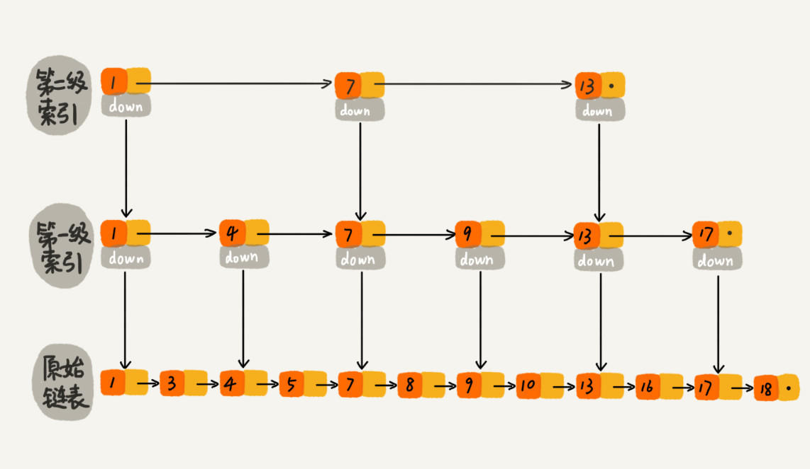

## 1. 并发列表

### Vector

Vector与ArrayList一样，也是通过数组实现的，不同的是它支持线程同步，即某一时刻只有一个线程能够读写Vector，避免多线程同时写而引起不一致性，但实现同步需要很高的花费，因此访问它比访问ArrayList慢。

### CopyOnWriteArrayList

并发版的ArrayList，地城结构也是数组，和ArrayList不同之处在于：当新增和删除元素时会创建一个新的数组，在新的数组中增加或者排除指定对象，最后用新数组替换原来的数组。

适用场景：由于读操作不加锁，写（增、删、改）操作加锁，因此很可能读取到脏数据。它适合读多写少的场景。

### Collections.synchronizedList(xxx)

```java
List<String> nameList = new ArrayList<>();
// 将线程不安全的List转化成线程安全的同步List
List<String> nameListSync = Collections.synchronizedList(nameList);
```

## 2. 并发集合

### CopyOnWriteArraySet 写时复制的并发Set

它是基于CopyOnWriteArrayList实现的，即CopyOnWriteArraySet内含一个CopyOnWriteArrayList成员变量，也就是说它底层是一个数组，意味着每次add操作都需要遍历整个集合才能知道待添加的元素是否已经存在，不存在的时候再执行插入（插入时加锁）

### ConcurrentSkipListSet 基于跳表的并发Set

ConcurrentSkipListSet里面就是一个ConcurrentSkipListMap，他们二者之间的关系就相当于 HashSet和HashMap之间的关系

### Collections.synchronizedSet（xxx） 将线程不安全的集合转化成线程安全的同步集合

```java
HashSet<String> set = new HashSet<>();
Set<String> setSync = Collections.synchronizedSet(set);
```


## 3. Map

### ConcurrentHashMap

并发版HashMap，最常见的Java并发容器之一，可以用作并发场景下的缓存。底层依然是Hash表，它的实现和HashMap一样，都是数组+链表。只是它在此基础上实现了并发的特性。

Java7中采用分段锁来减少锁的竞争（是不是很类似于数据库中的行锁？）；Java8中放弃了分段锁，采用CAS（compare and set，一种乐观锁），同时为了防止哈希冲突严重时退化成链表（hashmap的每一个节点都是一个个的链表，hash冲突时，会将元素放在链表末尾，当链表的长度达到8时，会将链表转化成红黑树；移除元素时，当红黑树元素个数小于6时又会转换成链表）

### ConcurrentSkipListMap

对于一个单链表，即使链表是有序的，如果我们想要在其中查找某个数据，也只能从头到尾遍历链表，这样效率自然就会很低，跳表就不一样了。跳表是一种可以用来快速查找的数据结构，有点类似于平衡树。它们都可以对元素进行快速的查找。但一个重要的区别是：对平衡树的插入和删除往往很可能导致平衡树进行一次全局的调整。而对跳表的插入和删除只需要对整个数据结构的局部进行操作即可。这样带来的好处是：在高并发的情况下，你会需要一个全局锁来保证整个平衡树的线程安全。而对于跳表，你只需要部分锁即可。这样，在高并发环境下，你就可以拥有更好的性能。而就查询的性能而言，跳表的时间复杂度也是 **O(logn)** 所以在并发数据结构中，JDK 使用跳表来实现一个 Map。

跳表的本质是同时维护了多个链表，并且链表是分层的



最低层的链表维护了跳表内所有的元素，每上面一层链表都是下面一层的子集。

跳表内的所有链表的元素都是排序的。查找时，可以从顶级链表开始找。一旦发现被查找的元素大于当前链表中的取值，就会转入下一层链表继续找。这也就是说在查找过程中，搜索是跳跃式的。如上图所示，在跳表中查找元素 18。


查找 18 的时候原来需要遍历 18 次，现在只需要 7 次即可。针对链表长度比较大的时候，构建索引查找效率的提升就会非常明显。 

**跳表是一种用空间换时间的算法**

使用跳表实现的Map和使用哈希算法实现的Map还有个明显的区别就是，跳表实现的map里面的元素都是排好序的（通过比较元素的大小实现排序，compareTo），因此对跳表进行遍历时，会得到一个有序的结果。

JDK中实现这一算法的数据结构是 `ConcurrentSkipListMap`，而`ConcurrentSkipListSet`也是根据`ConcurrentSkipListMap`实现的,因此也具有这种特性。


### HashTable

HashTable是线程安全的，它的方法都是`synchronized`的，因此它是线程安全的。HashTable继承自Dictionary，而HashMap继承自AbstractMap类。但二者都实现Map接口。


## 并发队列


### ConcurrentLinkedQueue    `并发队列（基于链表）`


### ConcurrentLinkedDeque  `并发队列（基于双向链表）`


### ArrayBlockingQueue    `阻塞队列（基于数组）`


###  LinkedBlockingQueue   `阻塞队列（基于链表）`


### LinkedBlockingDeque   `阻塞队列（基于双向链表）`


### PriorityBlockingQueue  `线程安全的优先队列`


### SynchronousQueue  `读写成对的队列`


### LinkedTransferQueue  `基于链表的数据交换队列`


### DelayQueue  `延时队列`


参考：<https://www.cnblogs.com/java-friend/p/11675772.html> 

参考：<https://www.jianshu.com/p/32665a52eba1>


