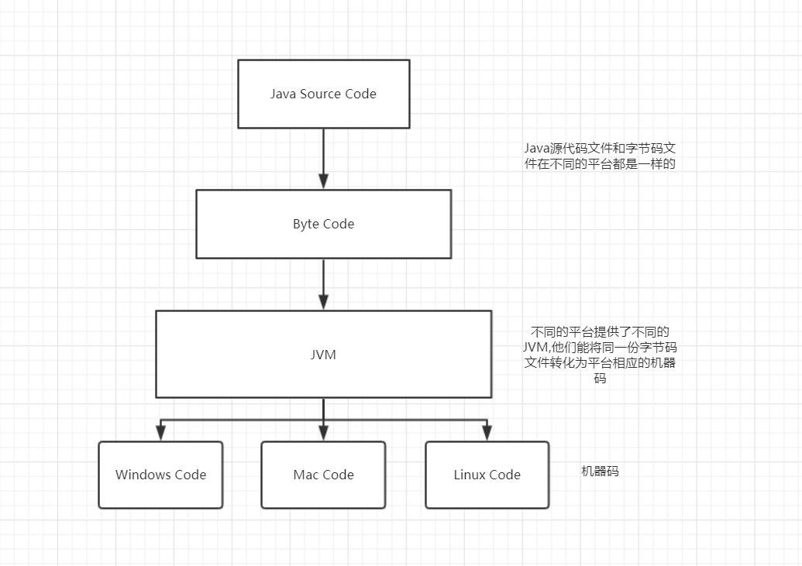
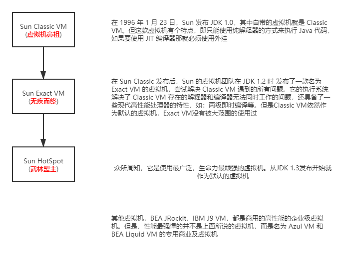
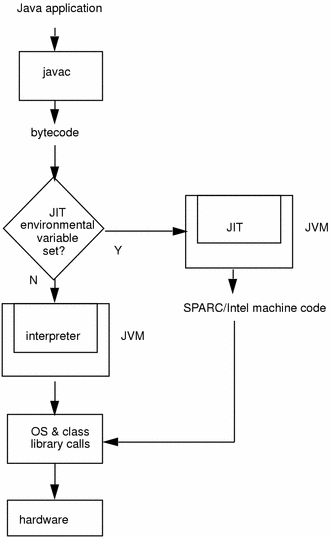

# JVM简介

## Java技术体系

知道几个关键名词：

Java技术体系：官方定义的包括这几个部分：Java程序设计语言、各种硬件平台上的Java虚拟机、Class文件格式、Java API类库、来自商业机构和开源社区的第三方Java类库。

JRE：Java虚拟机和Java核心类库。

JDK：包含JRE，还附带一系列的开发工具以及诊断工具。（有哪些诊断工具呢？JConsole）


Java各个版本引入的一些关键特性：

* 1995年5月23日，Oak语言改名为Java，并在Sun World大会上正式发布1.0版本，提出了“Write Once，Run Anywhere！”。提供了Classic VM虚拟机，技术代表有这些：JAR文件格式、JDBC、JavaBeans、RMI，内部类和反射。
* JDK 1.2 EJB，Swing等，提供了Exact VM，同时HotSpot也成为了备选虚拟机。
* JDK 1.3 相比1.2主要改进在类库上，例如TImer类，仿佛了JNDI类库。还对Java 2D做了一些改进。
* JDK 1.4 正则表达式，异常连，NIO，日志类，XML解析器等
* JDK 1.5 变化非常大，例如自动拆装箱，泛型，动态注解，枚举，可变长参数，遍历循环等。**在虚拟机层面上，改进了Java的内存模型**，提供了concurrent并发包等。
* JDK 1.6 更改了命名方式，启用 Java SE 6、Java ME 6、Java EE 6的命名方式。**对Java虚拟机内部做了大量改进，包括锁与同步、垃圾收集、类加载等方面的算法都有相当多的改动**。同时从这个版本开始，**Java开源**了。
* JDK 1.7 提供新的G1收集器,升级类加载架构等等。这个Oracle收购Sun公司以后的首次发布。
* JDK 1.8 重大更新！lambda表达式、接口默认方法和静态方法、方法引用、其他类库也有重大更新（Stream、Optional、新的Date API）。取消了永久代（方法区的一种实现），代之的是元空间。

## JVM简介

jvm，即 Java Virtual Machine。jvm可以**运行符合Java虚拟机规范的字节码文件**。不管是用什么语言来写的代码，只要你足够牛逼，将源代码编译成符合Java虚拟机规范的字节码文件，也是能够在JVM上运行。



​	

到底什么是虚拟机呢？Java虚拟机是一个字节码翻译器，它将字节码文件翻译成各个操作系统平台能够运行的机器码，确保字节码文件能在各个系统正确运行。

## JVM的发展历程



注意：JDK1.2存在了3个虚拟机：Classic VM，Exact VM，HotSpot。Exact VM只在Solaris平台出现过，Exact VM和HostSpot都内置了JIT编译器，而Classic VM只能以外挂的形式使用JIT编译器，并且Classic VM是一个纯解释执行的Java虚拟机实现。

> 人们为什么会产生了 “Java语言很慢”的印象？
>
> Java 1.0发布的时候Java只提供了Classic VM，它支持解释执行代码，我们知道解释执行代码是执行到了才会将字节码转化为机器码，无疑很慢；如果想使用JIT（即时编译）就必须采用外挂的方式，但是解释执行器和JIT不能同时存在，意味着如果采用JIT就不得不摒弃解释执行，这样所有的代码，不管有没有编译的价值都得进行编译。基于程序响应的压力（总不至于启动了Java程序得等10分钟，等它把全部代码编译好了才给用户响应吧），这些外挂的JIT编译器根本不敢应用编译耗时很高的优化技术，也就是说，几乎没有优化！
>
> 为什么叫做"HotSpot"？
>
> hot spot是”热点“之意，言外之意就是这款虚拟机技术优势就是它的”**热点代码探测技术**“。HotSpot VM的热点代码探测能力可以通过执行计数器找出最具有编译价值的代码，然后通知JIT编译器以方法为单位进行编译。
>
> HotSpot VM通过编译器与解释器恰当地协同工作，可以在最优化的程序响应时间与最佳执行性能中取得平衡，而且无需 等到本地代码（机器码）输出后才能执行程序，即时编译的时间压力也相对较小，这样有助于引入更多的代码优化技术，输出质量更高的本地代码。


## 从源代码到机器码，到底发生了什么

无论什么语言写的代码，其最后都是以机器码运行的。Java由源代码转化到机器能够运行的机器码，少不了三个重要的的编译器：**前端编译器**、**JIT即时编译器**、**AOT编译器**。

这三种编译器的编译速度和编译质量对比如下：

* 编译速度上，解释编译器 > AOT编译器 > JIT编译器
* 编译质量上，JIT编译器 > APT编译器 > 解释执行

### 前端编译器

**源代码到字节码**。因为它处于编译的早期，因此又被称为前端编译器。

最常见的就是我们的`javac编译器`，它将java源代码便以为class文件。`javac编译器`的处理过程可以分为下面四个阶段:

1. 语法、词法分析

   在这个阶段，JVM 会对源代码的字符进行一次扫描，最终生成一个抽象的语法树。简单地说，在这个阶段 JVM 会搞懂我们的代码到底想要干嘛。就像我们分析一个句子一样，我们会对句子划分主谓宾，弄清楚这个句子要表达的意思一样。 

2. 填充符号表

   我们知道类之间是会互相引用的，但在编译阶段，我们无法确定其具体的地址，所以我们会使用一个符号来替代。在这个阶段做的就是类似的事情，即对抽象的类或接口进行符号填充。等到类加载阶段，JVM 会将符号替换成具体的内存地址。 

3. 注解处理

   我们知道 Java 是支持注解的，因此在这个阶段会对注解进行分析，根据注解的作用将其还原成具体的指令集。 

4. 分析与字节码生成

   到了这个阶段，JVM 便会根据上面几个阶段分析出来的结果，进行字节码的生成，最终输出为 class 文件。 


### JIT即时编译器

**从字节码到机器码**。

是sun公司采用了hotspot虚拟机取代其开发的classic vm之后引入的一项技术，目的在于提高Java程序的性能。

当源代码转化成字节码以后，接下来运行程序有2中选择，一种是通过解释器对字节码解释执行，一种是先将字节码一次性的全部转化成机器码然后执行。这两种方式的区别是，前者启动快，但是执行慢；后者启动慢，但是执行和响应快。通常情况下，两者是结合使用的。

在 HotSpot 虚拟机内置了两个即时编译器，分别称为 Client Compiler 和Server Compiler。这两种不同的编译器衍生出两种不同的编译模式，我们分别称之为：C1 编译模式，C2 编译模式。 

> **1. C1 编译模式和 C2 编译模式有什么区别呢** ?
>
> C1会将字节码编辑为本地机器代码，并进行简单、可靠的优化，如有必要会加入性能监控的逻辑；C2编译模式，也是将字节码编译为本地机器代码，但是会启动一些耗时较长的编译优化，甚至会根据性能监控信息进行一些不可靠的激进优化。
>
> **2. 到底应该选择C1编译模式还是C2编译模式呢？**
>
> 实际上对于HotSpot虚拟机来说，其一共有三种运行模式可选，分别是：
>
> * 混合模式（Mixed Mode）。即C1和C2混合起来使用，这是默认的运行模式。也可以通过配置单独使用某一种模式
> * 解释模式（Interpreted Mode）。即所有代码都解释执行，使用`-Xint`参数可以打开这个模式
> * 编译模式（Compiled Mode）。此模式优先采用编译，但是无法编译的时候也会解释执行，使用`-Xcomp`打开这种模式。
>
> 不管是哪种模式，都需要先通过前端解释器（javac）编译成字节码以后才可以。
>
> 在cmd中执行`java -version`可以看到，我机器上的虚拟机默认使用的是Mixed Mode运行模式
>
> ```shell
> C:\Users\KingIsHappy>java -version
> java version "1.8.0_171"
> Java(TM) SE Runtime Environment (build 1.8.0_171-b11)
> Java HotSpot(TM) 64-Bit Server VM (build 25.171-b11, mixed mode)
> ```


最常见的就是HotSpot虚拟机中的 `Client Compiler` 和 `Server Compiler`，它们将Java字节码编译为机器码。


### AOT编译器

**从源代码到机器码**。

AOT 编译器的基本思想是：在程序执行前生成 Java 方法的本地代码，以便在程序运行时直接使用本地代码。

但是 Java 语言本身的动态特性带来了额外的复杂性，影响了 Java 程序静态编译代码的质量。例如 Java 语言中的动态类加载，因为 AOT 是在程序运行前编译的，所以无法获知这一信息，所以会导致一些问题的产生。

###HotSpot JVM的执行模式





1、源代码经javac编译成字节码，class文件

2、程序字节码经过JIT环境变量进行判断，是否属于“热点代码”（多次调用的方法，或循环等）

3、如是，走JIT编译为具体硬件处理器（如sparc、intel）机器码

4、如否，则直接由解释器解释执行

5、操作系统及类库调用

6、硬件


也就是说：“热点代码”使用了即时编译器，非热点代码则直接将字节码解释执行。


## JVM的类型

* client类型

  使用C1编译器，比较轻量，优化层次比较浅。

* server类型

  默认情况下，我们jdk里面默认使用的就是该类型。它使用到了C2编译器，对代码编译和优化比较彻底，甚至能根据监控数据进行一些更加激进的优化。

  ```shell
  C:\Users\KingIsHappy>java -version
  java version "1.8.0_171"
  Java(TM) SE Runtime Environment (build 1.8.0_171-b11)
  Java HotSpot(TM) 64-Bit Server VM (build 25.171-b11, mixed mode)
  ```

  使用了 Server VM，而且默认开启了混合模式，即C1、C2编译器都用。


## JVM的内存结构

也叫作运行时数据区。

* 线程共享的内存区域，即所有线程都能访问到的区域。包括：堆，方法区，常量池。
  1. Java堆指的是直接从JVM划分出来的一块区域，这块区域专门用于Java实例对象的内存分配，几乎所有的实例对象都在这上面分配。之所以说几乎是因为有特殊情况，有些时候小对象会直接在栈上进行分配，这种现象我们称之为「栈上分配」 。

  2. 方法区指的是存储Java类字节码数据的一块儿区域，它存储了每一个类的结构信息，例如运行时常量池、和字符串常量池等（运行时常量池主要存储类信息，JIT即时编译的代码，Class文件中描述的符号引用的；而字符串常量池主要存储常量字符串）。可以看到常量池其实是放在方法区中的，但《Java虚拟机规范》将常量池和方法区放在同一个等级上，这点我们知晓就行。JVM规范的方法区只是一个逻辑部分，对于HotSpot，在JDK 1.7中，方法区的实现被称为永久代（或者说方法区俗称为永久代），而在JDK 1.8中的实现称为MetaSpace，MetaSpace是一块与堆不相连的本地内存空间。注意啦：对于HotSpot，JDK 1.7以后，字符串常量池已经从方法区中移除了，放到堆中去了，因此对于下面的程序，JDK 1.7和JDK 1.7之前的表现是不一样的：

     ```java
     String s = new String("Hello");
     String s1 = s.intern();
     
     System.out.println(s==s1);
     ```

  3. Java堆根据对象存活时间的不同，在内部又被划分为年轻代、老年代两个区域。年轻代包括：Eden区，From Survivor 0，To Survicvor 1区（）
* 私有的内存区域，即PC寄存器（程序计数器），Java虚拟机栈，本地方法栈。


# JVM 自动内存管理机制


