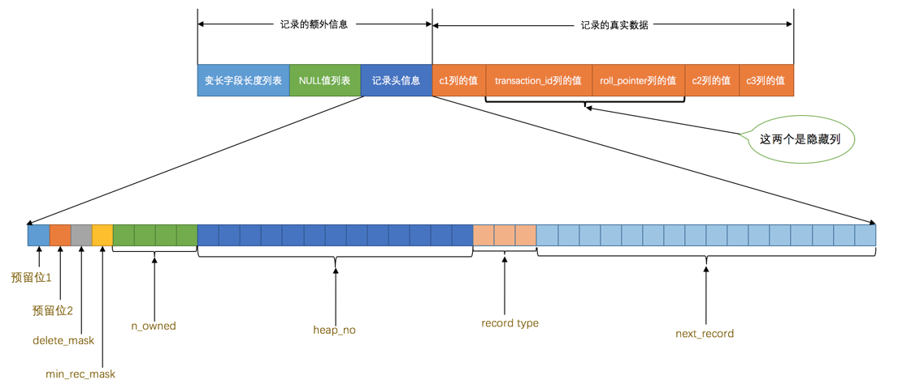

# MVVC原理

> 参考：
>
> 文章地址：<https://juejin.im/book/5bffcbc9f265da614b11b731/section/5c923cfcf265da60f00ecaa9>
>
> 作者：

## 版本链

对于InnoDB存储引擎的表来说，它的聚簇索引记录（也就是InnoDB数据页中的行数据）中都包含两个必要的隐藏列：

* transaction_id

  每次一个事务对某条聚簇索引记录进行改动时，都会把该事务的事务ID赋值给transaction_id

* roll_pointer

  每次对聚簇索引记录进行改动时