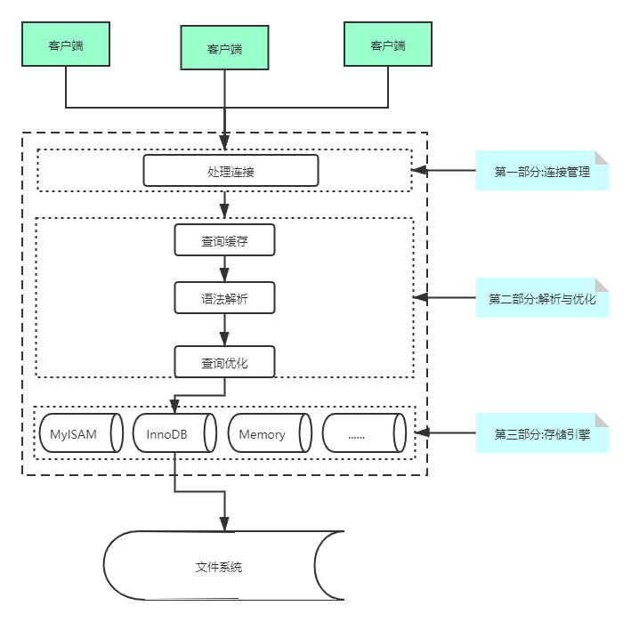
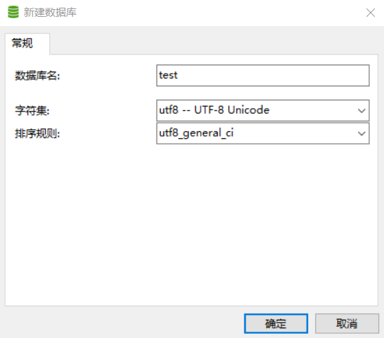
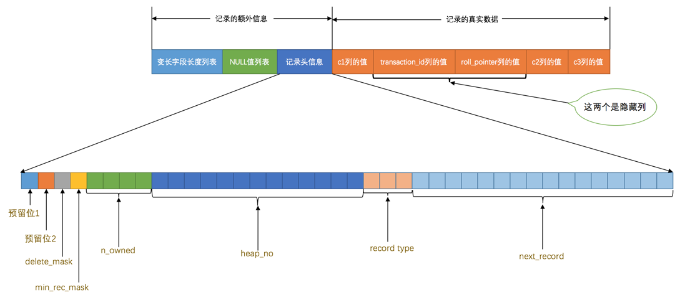
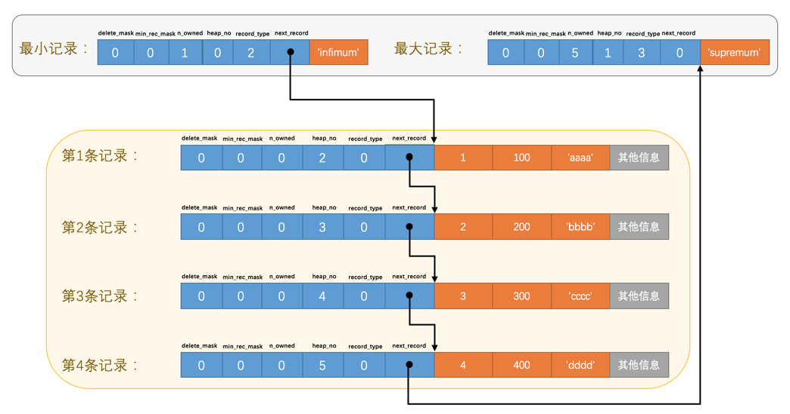

# MySQL

## 1. MySQL的客户端/服务器架构

MySQL的架构也是**客户端/服务器**架构模式，它的服务器程序直接和存储的数据打交道，然后可以有好多客户端程序连接到这个服务器程序，发送增删改查的请求，然后服务器就响应这些请求，从而操作它维护的数据。MySQL的每个客户端都需要提供用户名和密码才能登陆，登陆之后才能给服务器发送请求来操作某些数据。

我们的MySQL服务器程序和客户端程序本质上都算是计算机上的一个进程，这个代表着MySQL服务器的进程也被称作**MySQL数据库实例**，简称**数据库实例**。

每个进程都有一个唯一的编号，称作**进程ID**，英文名叫**PID**，这个编号是在我们启动程序的时候由操作系统随机分配的。每个进程都有一个名称，这个名称是编写程序的人自己定义的，比如我们启动的**MySQL服务器进程**的默认名称为**mysqld**，而我们常用的**MySQL客户端进程**的默认名称为**mysql**。

例如，启动mysql服务器程序以后，在任务管理器中就会有这样一个程序：

```shell
mysqld.exe(32位)
# 截图太占用空间了,所以这里没有截图
```

### 1.1 启动MySQL服务器程序(windows)

在`MySQL`安装目录下的`bin`目录下有一个`mysqld`可执行文件，在命令行里输入`mysqld`，或者直接双击运行它就算启动了`MySQL`服务器程序了。 

>  **以服务的方式运行服务器程序**
>
> 首先看看啥是个`Windows` 服务？如果无论是谁正在使用这台计算机，我们都需要长时间的运行某个程序，而且需要在计算机启动的时候便启动它，一般我们都会把它注册为一个`Windows 服务`，操作系统会帮我们管理它。把某个程序注册为`Windows`服务的方式挺简单，如下：
>
> ```
> "完整的可执行文件路径" --install [-manual] [服务名]
> ```
>
> 其中的`-manual`可以省略，加上它的话表示在`Windows`系统启动的时候不自动启动该服务，否则会自动启动。`服务名`也可以省略，默认的服务名就是`MySQL`。比如我的`Windows`计算机上`mysqld`的完整路径是：
>
> ```
> D:\Program Files\MySQL\MySQL Server 5.5\bin\mysqld
> ```
>
> 所以如果我们想把它注册为服务的话可以在命令行里这么写：
>
> ```
> "D:\Program Files\MySQL\MySQL Server 5.5\bin\mysqld" --install mysql-lee
> # 启动了一个服务名为mysql-lee的mysql服务端进程
> ```
>
> 在把`mysqld`注册为`Windows`服务之后，我们就可以通过下边这个命令来启动`MySQL`服务器程序了：
>
> ```
> net start mysql-lee
> ```
>
> 当然，如果你喜欢图形界面的话，你可以通过`Windows`的服务管理器通过用鼠标点点点的方式来启动和停止服务（作为一个程序猿，还是用黑框框吧～）。
>
> 关闭这个服务也非常简单，只要把上边的`start`换成`stop`就行了，就像这样：
>
> ```
> net stop mysql-lee
> ```


### 1.2 启动MySQL客户端程序

在我们成功启动**MySQL**服务器程序后，就可以接着启动客户端程序来连接到这个服务器，虽然bin目录下有许多客户端程序，例如：mysqladmin、mysqldump、mysqlcheck等等，我们只需要重点了解mysql程序的启动方式：

```shell
mysql -h主机名 -u用户名 -p密码
```

各个参数的含义如下:

| 参数名 | 含义                                                         |
| ------ | ------------------------------------------------------------ |
| `-h`   | 表示服务器进程所在计算机的域名或者IP地址，如果服务器进程就运行在本机的话，可以省略这个参数，或者填`localhost`或者`127.0.0.1`。也可以写作 `--host=主机名`的形式。 |
| `-u`   | 表示用户名。也可以写作 `--user=用户名`的形式。               |
| `-p`   | 表示密码。也可以写作 `--password=密码`的形式。               |
| `-P`   | 大写的P，表示端口号，如果端口号是默认的3306，则这个参数可以省略。 |

例如:

```shell
mysql -uroot -p123
或者:
mysql --user=root --password=123

# 注意:-u后面跟上用户名,可以有空格; -p后面要紧跟密码,-p和密码之间不能有空格,例如 mysql -u root -p 123456 这样就是不对的
```

### 1.3 客户端与服务端的连接过程

MySQL服务端程序和客户端程序本质上是计算机上的一个进程，所以**客户端进程向服务器进程发送请求并得到回复的过程本质上是一个进程间通信的过程**，MySQL支持下面三种客户端进程和服务器进程的通信方式：

1. TCP/IP

   真实环境中，数据库服务器进程和客户端进程可能运行在不同的主机中，它们之间必须通过网络来进行通讯。`MySQL`采用`TCP`作为服务器和客户端之间的网络通信协议。在网络环境下，每台计算机都有一个唯一的`IP地址`，如果某个进程有需要采用`TCP`协议进行网络通信方面的需求，可以向操作系统申请一个`端口号`，这是一个整数值，它的取值范围是`0~65535`。这样在网络中的其他进程就可以通过`IP地址 + 端口号`的方式来与这个进程连接，这样进程之间就可以通过网络进行通信了。

   **`MySQL`服务器启动的时候会默认申请`3306`端口号，之后就在这个端口号上等待客户端进程进行连接，用书面一点的话来说，`MySQL`服务器会默认监听`3306`端口。**

2. 命名管道和共享内存

   在windows上使用，使用较少，可以暂时不用了解。

3. Unix域套接字文件

   如果我们的服务器进程和客户端进程都运行在同一台操作系统为类`Unix`的机器上的话，我们可以使用`Unix域套接字文件`来进行进程间通信。 暂时不用了解

### 1.4 服务器处理客户端请求

不论客户端进程和服务器进程是采用那种方式进行通信，最后实现的效果都是：**客户端进程向服务器进程发送一段文本（MySQL语句），服务器进程处理后再向客户端进程发送一段文本（处理结果）。**那服务器进程对客户端进程发送的请求做了什么处理，才能产生最后的处理结果呢？客户端可以向服务器发送增删改查的各类请求，这里以比较复杂的查询请求为例来展示下大致的过程（这也是MySQL的基本架构）：



从图中我们可以看出，服务器程序处理来自客户端的查询请求大致需要经过三个部分，分别是`连接管理`、`解析与优化`、`存储引擎`。（补充：在“查询优化”节点--->"存储引擎"节点之间加上个"执行器"）

#### 1.4.1 连接管理

**客户端进程可以采用上面提到的TCP/IP、命名管道或共享内存，Unix域套接字这一种方式之一来与服务器进程建立连接，每当有一个客户端进程连接到服务器进程时，服务器进程都会创建一个线程来专门处理与这个客户端的交互，当该客户端退出时会与服务器进程断开连接，但是，断开连接时并不会立即销毁这个线程，而是把它缓存起来，在另一个新的客户端再进行连接时，把这个缓存的线程分配给该新客户端。这样起到了不频繁创建和销毁线程的效果，从而节省了开销。（是不是特别像Java中的线程池呢）。总的来说，MySQL服务器会为每一个连接进来的客户端分配一个线程，连接断开后会将该线程缓存起来，供其他的新的连接使用，体现出了线程重用的特性。但是线程分配的太多会严重的影响系统性能，因此需要对同时连接到服务器的客户端数量进行限制。**（重点）

客户端发起连接的时候，需要携带主机信息（h，host）、用户名（u，user），密码（p，password），服务器验证通过以后就会建立起连接。**当连接建立以后，与该服务端管理的服务器线程会一致等待客户端发送过来的请求**（不管何种连接方式，如果客户端太久没有和服务端交互，连接就会自动断开，这个时间参数是 `wait_timeout` 控制住的，默认时长是`8小时`），MySQL服务器接收到的请求只是一个文本消息，该文本消息还要经过各种处理，也就是下面的服务器端的解析与优化过程了。

> 案例：有个朋友说他们的应用程序第二天总是得重启，不然就会报错，错误是：提示数据库连接失败
>
> 分析：因为是数据库连接时间太长了，这之间客户端和服务端没有交互，所以连接就会自动断开，当连接断开时再操作数据库就会报错，需要重新连接。
>
> 解决办法：将wait_timeout设置的长一些

#### 1.4.2 解析与优化

MySQL服务器获得了文本形式的请求以后，还要经过许多环节的处理，其中几个比较重要的部分是`查询缓存`、`语法解析`和`查询优化`。

##### 1.4.2.1 查询缓存

MySQL服务器处理查询请求时，会将刚刚处理过的**查询请求和结果缓存**起来，如果下一次有**一模一样的请求**过来，直接从缓存中查找结果，就不用去底层的表中查找了。这个查询缓存可以在不同客户端之间共享，也就是说如果客户端A刚刚查询了一个语句，而客户端B之后发送了同样的查询请求，name客户端B的这次查询就可以直接使用查询缓存中的数据。

**注意：**

1. 如果两个查询请求在**任何字符**上有不同（例如：空格、注释、大小写），都会导致**缓存不会命中**。
2. 如果查询请求中包含了**某些系统函数、用户自定义变量和函数、一些系统表**，如mysql、information_schema、performance_schema数据库中的表,那这个请求就不会被缓存。以某些系统函数举例，可能同样的函数的两次调用会产生不一样的结果，比如函数`NOW`，每次调用都会产生最新的当前时间，如果在一个查询请求中调用了这个函数，那即使查询请求的文本信息都一样，那不同时间的两次查询也应该得到不同的结果，如果在第一次查询时就缓存了，那第二次查询的时候直接使用第一次查询的结果就是错误的。

**缓存失效：**

MySQL的缓存系统会监测涉及到的每张表，只要该表的结构或者数据被修改，如对该表使用了`INSERT`、 `UPDATE`、`DELETE`、`TRUNCATE TABLE`、`ALTER TABLE`、`DROP TABLE`或 `DROP DATABASE`语句，那使用该表的所有高速缓存查询都将变为无效并从高速缓存中删除！

tips：关于`delete`和`truncate table`的区别

Truncate是一个能够快速清空资料表内所有资料的SQL语法。并且能针对具有自动递增的字段，做计数重置归零重新计算的作用。来源：[百度百科](https://baike.baidu.com/item/Truncate%20Table/8842756#1 )

> warning: 虽然查询缓存有时可以提升系统性能，但也不得不因维护这块缓存而造成一些开销，比如每次都要去查询缓存中检索，查询请求处理完需要更新查询缓存，维护该查询缓存对应的内存区域。从**MySQL 5.7.20开始，不推荐使用查询缓存，并在MySQL 8.0中删除**。 


##### 1.4.2.2 语法解析

如果查询缓存没有命中，接下来就需要进入正式的查询阶段了。因为客户端程序发送过来的请求只是一段文本而已，所以`MySQL`服务器程序首先要对这段文本做分析，判断请求的语法是否正确，然后从文本中将要查询的表、各种查询条件都提取出来放到`MySQL`服务器内部使用的一些数据结构上来。


##### 1.4.2.3 查询优化

语法解析之后，服务器程序获得到了需要的信息，比如要查询的列是哪些，表是哪个，搜索条件是什么等等，但光有这些是不够的，因为我们写的`MySQL`语句执行起来效率可能并不是很高，`MySQL`的优化程序会对我们的语句做一些优化，如外连接转换为内连接、表达式简化、子查询转为连接吧啦吧啦的一堆东西。优化的结果就是生成一个执行计划，这个执行计划表明了应该使用哪些索引进行查询，表之间的连接顺序是啥样的。


### 1.5 存储引擎

截止到服务器程序完成了查询优化为止，还没有真正的去访问真实的数据表，MySQL服务器把存储和提取操作都封装到了一个叫存储引擎的模块了。我们知道表是由一行一行的记录组成的，但这只是一个逻辑上的概念，物理上如何表示记录，怎么从表中读取数据，怎么把数据存入到具体的存储器中，这些都是存储引擎负责的事情。存储引擎各种各样，但是它们提供了统一的API（例如读取索引第一条内容、读取索引下一条内容等等）供MySQL Server调用。为了方便管理，人们把连接管理、查询缓存、语法解析、查询优化等这些并不涉及真实数据的读写的功能归入到MySQL Server的功能，而把真实的数据读写的功能划分为存储引擎的功能。

常用存储引擎是 `MyISAM`和`InnoDB`：

| Feature                               | MyISAM | Memory  | InnoDB | Archive | NDB   |
| ------------------------------------- | ------ | ------- | ------ | ------- | ----- |
| B-tree indexes                        | yes    | yes     | yes    | no      | no    |
| Backup/point-in-time recovery         | yes    | yes     | yes    | yes     | yes   |
| Cluster database support              | no     | no      | no     | no      | yes   |
| Clustered indexes                     | no     | no      | yes    | no      | no    |
| Compressed data                       | yes    | no      | yes    | yes     | no    |
| Data caches                           | no     | N/A     | yes    | no      | yes   |
| Encrypted data                        | yes    | yes     | yes    | yes     | yes   |
| Foreign key support                   | no     | no      | yes    | no      | yes   |
| Full-text search indexes              | yes    | no      | yes    | no      | no    |
| Geospatial data type support          | yes    | no      | yes    | yes     | yes   |
| Geospatial indexing support           | yes    | no      | yes    | no      | no    |
| Hash indexes                          | no     | yes     | no     | no      | yes   |
| Index caches                          | yes    | N/A     | yes    | no      | yes   |
| Locking granularity                   | Table  | Table   | Row    | Row     | Row   |
| MVCC                                  | no     | no      | yes    | no      | no    |
| Query cache support                   | yes    | yes     | yes    | yes     | yes   |
| Replication support                   | yes    | Limited | yes    | yes     | yes   |
| Storage limits                        | 256TB  | RAM     | 64TB   | None    | 384EB |
| T-tree indexes                        | no     | no      | no     | no      | yes   |
| Transactions                          | no     | no      | yes    | no      | yes   |
| Update statistics for data dictionary | yes    | yes     | yes    | yes     | yes   |

关于存储引擎常用的一些操作：

```shell
# 查看当前服务器支持的存储引擎
show engines;
# 建表时指定存储引擎为innodb
create table {...} engine=innodb;
# 更改表的存储引擎为 MyISAM
alter table table_name engine=MyISAM;
```


## 2. MySQL设置启动配置参数

设置启动项配置只会对当次启动有效，例如：

```shell
# 禁用客户端的TCP/IP连接方式
mysqld --skip_networking

# 指定默认的存储引擎
mysqld --default_storage_engine

# 指定启动之后默认的监听的端口
mysqld -P 3307 # 或者:mysqld --port 3307 注意命令的长形式是两个-,而短形式为一个-
```

## 3. 字符集简介

### 3.1 什么是字符集

计算机中存储的数据都是二进制的数据，如果要想存储字符串，就需要建立字符和二进制数据之间的映射关系，建立这个关系必须要明确2件事：

1. 你要把那些字符映射成二进制数据？就是界定清楚字符范围，比如说a-z和A-Z，所有的中文简体汉字等等。
2. 怎么映射？将一个字符映射成一个二进制数据的过程也叫做**编码**，将一个二进制数据映射到一个字符的过程也叫作**解码**。

> 比方说我们来自定义一个名称为`xiaohaizi`的字符集，它包含的字符范围和编码规则如下：
>
> - 包含字符`'a'`、`'b'`、`'A'`、`'B'`。
>
> - 编码规则如下：
>
>   采用1个字节编码一个字符的形式，字符和字节的映射关系如下：
>
>   ```
>   'a' -> 00000001 (十六进制：0x01)
>   'b' -> 00000010 (十六进制：0x02)
>   'A' -> 00000011 (十六进制：0x03)
>   'B' -> 00000100 (十六进制：0x04)
>   ```
>
> 有了`xiaohaizi`字符集，我们就可以用二进制形式表示一些字符串了，下边是一些字符串用`xiaohaizi`字符集编码后的二进制表示：
>
> ```
> 'bA' -> 0000001000000011  (十六进制：0x0203)
> 'baB' -> 000000100000000100000100  (十六进制：0x020104)
> 'cd' -> 无法表示，字符集xiaohaizi不包含字符'c'和'd'
> ```


注意: mysql中的utf8（或者utf8mb3）指的是utf-8字符集的阉割版，它使用了3个字节来编码字符；而utf8mb4是才指的是真正的utf-8字符集；例如emoji表情应该使用utf8mb4而不是utf8mb3。


### 3.2 mysql中的字符编码相关的设置

还有三个关键的配置，`character_set_client`，`character_set_connection`，`character_set_results`，通过下列的查询配置的方式可以看到：

```powershell
mysql> show variables like 'character_set_client';
+----------------------+-------+
| Variable_name        | Value |
+----------------------+-------+
| character_set_client | utf8  |
+----------------------+-------+
1 row in set

mysql> show variables like 'character_set_connection';
+--------------------------+-------+
| Variable_name            | Value |
+--------------------------+-------+
| character_set_connection | utf8  |
+--------------------------+-------+
1 row in set

mysql> show variables like 'character_set_results';
+-----------------------+-------+
| Variable_name         | Value |
+-----------------------+-------+
| character_set_results | utf8  |
+-----------------------+-------+
1 row in set

mysql> 
```

一般情况下，mysql客户端使用的字符集和当前的操作系统是一致的，不同的操作系统使用的字符集是不一样的，例如：

* 类Unix系统（linux，centos，macos）使用的默认字符集是utf8
* windows使用的默认字符集是 gbk（仅限在中国大陆，也就是我们日常使用的）

上面的三个参数代表什么意思呢？

* 服务器认为客户端发送过来的请求是用`character_set_client`编码的。

  假设你的客户端采用的字符集和 **character_set_client** 不一样的话，这就会出现意想不到的情况。比如我的客户端使用的是`utf8`字符集，如果把系统变量`character_set_client`的值设置为`ascii`的话，服务器可能无法理解我们发送的请求，更别谈处理这个请求了。

* 服务器将把得到的结果集使用`character_set_results`编码后发送给客户端。

  假设你的客户端采用的字符集和 **character_set_results** 不一样的话，这就可能会出现客户端无法解码结果集的情况，结果就是在你的屏幕上出现乱码。比如我的客户端使用的是`utf8`字符集，如果把系统变量`character_set_results`的值设置为`ascii`的话，可能会产生乱码。

* `character_set_connection`只是服务器在将请求的字节串从`character_set_client`转换为`character_set_connection`时使用，它是什么其实没多重要，但是一定要注意，该字符集包含的字符范围一定涵盖请求中的字符，要不然会导致有的字符无法使用`character_set_connection`代表的字符集进行编码。比如你把`character_set_client`设置为`utf8`，把`character_set_connection`设置成`ascii`，那么此时你如果从客户端发送一个汉字到服务器，那么服务器无法使用`ascii`字符集来编码这个汉字，就会向用户发出一个警告。

一般情况下，我们会将上面这三个参数都设置为utf8，这样可以省去许多的字符之间的转化。


### 3.3 比较规则的运用

**比较规则**的作用通常体现比较字符串大小的表达式以及对某个字符串列进行排序中，有时候也称为**排序规则**。想想我们在创建mysql数据库的时候，通常都需要指定一个配置：




在查询的时候可以根据比较规则的不同，排序以后也会有不同的效果，例如：

```shell
CREATE TABLE `user` (
  `id` int(11) NOT NULL,
  `name` varchar(255) DEFAULT NULL,
  `address` varchar(100) CHARACTER SET gbk DEFAULT NULL,
  PRIMARY KEY (`id`)
) ENGINE=InnoDB DEFAULT CHARSET=utf8;

# address列的排序规则为: gbk_chinese_ci
mysql> select * from user order by address;
+----+----------+---------+
| id | name     | address |
+----+----------+---------+
|  1 | zhangsan | a       |
|  2 | Zhangsan | A       |
|  3 | wangwu   | b       |
|  4 | Wangwu   | B       |
+----+----------+---------+
4 rows in set

# 当修改address列的排序规则为:gbk_bin时
mysql> select * from user order by address;
+----+----------+---------+
| id | name     | address |
+----+----------+---------+
|  2 | Zhangsan | A       |
|  4 | Wangwu   | B       |
|  1 | zhangsan | a       |
|  3 | wangwu   | b       |
+----+----------+---------+
4 rows in set
```


### 3.4 MySQL中的四个级别的字符集和比较规则

* 服务器级别

  `character_set_server`表示服务器级别的字符集，collation_server表示服务器级别的比较规则。

* 数据库级别

  创建和修改数据库时可以指定字符集和比较规则：

  ```
  CREATE DATABASE 数据库名
      [[DEFAULT] CHARACTER SET 字符集名称]
      [[DEFAULT] COLLATE 比较规则名称];
  
  ALTER DATABASE 数据库名
      [[DEFAULT] CHARACTER SET 字符集名称]
      [[DEFAULT] COLLATE 比较规则名称];
  ```

  `character_set_database`表示当前数据库的字符集，`collation_database`表示当前默认数据库的比较规则，这两个系统变量是只读的，不能修改。如果没有指定当前默认数据库，则变量与相应的服务器级系统变量具有相同的值。

* 表级别

  创建和修改表的时候指定表的字符集和比较规则：

  ```
  CREATE TABLE 表名 (列的信息)
      [[DEFAULT] CHARACTER SET 字符集名称]
      [COLLATE 比较规则名称]];
  
  ALTER TABLE 表名
      [[DEFAULT] CHARACTER SET 字符集名称]
      [COLLATE 比较规则名称];
  ```

* 列级别

  创建和修改列定义的时候可以指定该列的字符集和比较规则：

  ```
  CREATE TABLE 表名(
      列名 字符串类型 [CHARACTER SET 字符集名称] [COLLATE 比较规则名称],
      其他列...
  );
  
  ALTER TABLE 表名 MODIFY 列名 字符串类型 [CHARACTER SET 字符集名称] [COLLATE 比较规则名称];
  ```


## 4. InnoDB记录结构

InnoDB行结构示意图：



1. 页是MySQL中磁盘和内存交互的基本单位，也是MySQL管理存储空间的基本单位。`InnoDB`是一个将表中的数据存储到磁盘上的存储引擎，所以即使关机后重启我们的数据还是存在的。而真正处理数据的过程是发生在内存中的，所以需要把磁盘中的数据加载到内存中，如果是处理写入或修改请求的话，还需要把内存中的内容刷新到磁盘上。而我们知道读写磁盘的速度非常慢，和内存读写差了几个数量级，所以当我们想从表中获取某些记录时，`InnoDB`存储引擎需要一条一条的把记录从磁盘上读出来么？不，那样会慢死，`InnoDB`采取的方式是：将数据划分为若干个页，以页作为磁盘和内存之间交互的基本单位，InnoDB中页的大小一般为 **16** **KB**。也就是在一般情况下，一次最少从磁盘中读取16KB的内容到内存中，一次最少把内存中的16KB内容刷新到磁盘中。 

2. InnoDB行格式。我们平时是以记录为单位来向表中插入数据的，这些记录在磁盘上的存放方式已被称为行格式或者记录格式。InnoDB行格式有四种常用的行格式，分别是Compact，Redundant，Dynamic，Compressed。InnoDB默认的是Dynamic

3. 指定和修改行格式的语法如下：

   ```shell
   # 指定新建表的行格式为compact
   mysql> create table table_format_row (id int,name varchar(10)) row_format = compact;
   Query OK, 0 rows affected
   
   # 修改表的行格式为redundant
   mysql> alter table table_format_row row_format = redundant;
   Query OK, 0 rows affected
   Records: 0  Duplicates: 0  Warnings: 0
   
   mysql> 
   ```

4. 一个页一般是16KB，当记录中的数据太多，当前页放不下的时候，会把多余的数据存储到其他页中，这种现象称为行溢出。

## 5. InnoDB数据页结构

### 5.1 不同类型的数据页

页，它是InnoDB管理存储空间的基本单位，一个页的大小一般是16KB。InnoDB为了不同的目的而设计了许多种不同类型的页，比如存放表空间头部信息的页，存放`Insert Buffer`信息的页，存放`INODE`信息的页，存放`undo日志信息`的页等等，其中最重要的当属存储数据的页，官方称之为**索引页**，通俗来说它们就是**数据页**。


### 5.2 数据页结构


在页的7个组成部分中，我们自己存储的数据会按照我们指定的**行格式**存储在User Records部分。但是在一开始生成页的时候，其实并没有User Records这个部分，每当我们插入一条记录就会从Free Space部分，也就是尚未使用的存储空间中申请一个纪录大小的空间划分到User Records部分，当Free Space部分被全部划分到User Records部分以后，也就意味着这个页用完了，如果还有新的插入记录的话，就只得去申请新的页了。

为了更好的管理InnoDB页中的数据，InnoDB记录的行结构中的记录头信息发挥了重要的作用。

比如向表中插入主键分别为1,2,3,4的四条数据,它们在数据页中存放的大致效果如下:



需要注意的是，数据按照主键（如果没有主键，也没有unique的列，则会生成隐藏的row_id作为"主键"）排列起来，并且所有的记录呈现出一个单链表的形态（通过next_record指向下个记录行）。

更多详细的说明移步：<https://juejin.im/book/5bffcbc9f265da614b11b731/section/5bffdb30518825773a2ed38c> 


InnoDB会把页中的记录划分为若干个组，每个组的最后一个记录的偏移量作为一个**槽**，存放在Page Directory中，所以在一个页中根据主键查找记录是非常快的，分为2步：

* 通过二分法确定该记录所在的槽
* 通过记录的next_record属性遍历该槽所在的组中的各个记录

