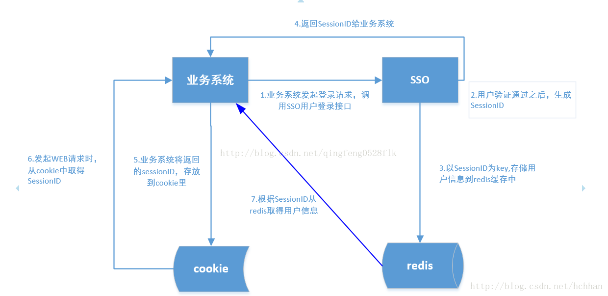

# Redis

> 为啥要用redis？
>
> 传统的关系型数据库如Mysql已经不能适用所有的场景了，比如秒杀的库存扣减，APP首页的访问流量高峰等等，都很容易把数据库打崩，所以引入了缓存中间件，目前市面上比较常用的缓存中间件有 **Redis** 和 **Memcached** 不过中和考虑了他们的优缺点，最后选择了Redis。
>
> 作者：敖丙
>
> 链接：https://juejin.im/post/5db66ed9e51d452a2f15d833
>
> 来源：掘金

## 1. NoSql基本概念

为了解决高并发、高可用、高可扩展、大数据存储等一系列问题而产生的数据库解决方案，就是**NoSql**。

NoSql，就做非关系型数据库，它的全名**Not Only Sql**。它不能替代关系型数据库，只能作为关系型数据库的一个良好补充。


## 2. NoSql分类

* 键值（Key-Value）存储数据库：Tokyo Cabinet/Tyrant、Voldemort、Berkeley DB、**Redis**。
  * 典型应用：内容缓存，主要用于处理大数据量的高访问负载。
  * 数据模型：一些列键值对。
  * 优势：快速查询。
  * 劣势：存储的数据缺少结构化。
* 列存储数据库：Cassandra、HBase、Riak。
  * 典型应用：分布式文件系统 
  * 数据模型：以列簇式存储，将同一列数据存在一起
  * 优势：查找速度快、可扩展性强，更容易进行分布式扩展
  * 劣势：功能相对局限
* 文档型数据库：CouchDB、**MongoDB**
  * 典型应用：Web应用（与Key-Value类似，Value是结构化的）
  * 数据模型：一些列键值对
  * 优势：数据结构要求不严格
  * 劣势：查询性能不高，而且缺乏统一的查询语法
* 图形数据库：Neo4J、InfoGrid、Infinite Graph
  * 典型应用：社交网络
  * 数据模型：图结构
  * 优势：利用图结构相关算法
  * 劣势：需要对整个图做计算才能得出结果，不容易做分布式的集群方案


## 3. Redis数据类型

Redis是使用**C语言**开发的一个高性能键值数据库。Redis可以通过一些键值类型来存储数据库。它的**键类型只能为字符串，常用的值类型有5种：String、Hash（散列表）、List、Set、SortedSet。**

| 数据类型 | 可以存储的值           | 操作                                                         |
| -------- | ---------------------- | ------------------------------------------------------------ |
| STRING   | 字符串、整数或者浮点数 | 对整个字符串或者字符串的其中一部分执行操作 对整数和浮点数执行自增或者自减操作 |
| LIST     | 列表                   | 从两端压入或者弹出元素  对单个或者多个元素进行修剪， 只保留一个范围内的元素 |
| SET      | 无序集合               | 添加、获取、移除单个元素 检查一个元素是否存在于集合中 计算交集、并集、差集 从集合里面随机获取元素 |
| HASH     | 包含键值对的无序散列表 | 添加、获取、移除单个键值对 获取所有键值对 检查某个键是否存在 |
| ZSET     | 有序集合               | 添加、获取、删除元素 根据分值范围或者成员来获取元素 计算一个键的排名 |

### String

```shell
127.0.0.1:6379> set lee lee
OK
127.0.0.1:6379> get lee
"lee"
127.0.0.1:6379> set a "hello"
OK
127.0.0.1:6379> get a
"hello"
127.0.0.1:6379>
```

指令就2个：get、set

如果key里面装的数据是整数类型，还可以执行递增、递减操作：

```shell
127.0.0.1:6379> set num 1
OK
127.0.0.1:6379> incr num
(integer) 2
127.0.0.1:6379> get num
"2"
127.0.0.1:6379> incrby num 5
(integer) 7
127.0.0.1:6379> get num
"7"
127.0.0.1:6379> decr num
(integer) 6
127.0.0.1:6379> decrby num 4
(integer) 2
127.0.0.1:6379> get num
"2"
127.0.0.1:6379>                                                                                                                                                                                                                                                         
```

相关指令有：incr、incrby、decr、decrby、strlen key（获取String长度）

#### 使用场景

自增主键、商品编号、订单号使用String的递增数字这一特性生成。

### List

Arraylist是使用数组来存储数据，特点：查询快、增删慢

Linkedlist是使用双向链表存储数据，特点：增删快、查询慢，但是查询链表两端的数据也很快。

**Redis的list是采用来链表来存储的，所以对于redis的list数据类型的操作，是操作list的两端数据来操作的。**

```shell
127.0.0.1:6379> rpush list-key shanghai
(integer) 4
127.0.0.1:6379> lrange list-key 0 -1
1) "chongqing"
2) "beijing"
3) "shanghai"
4) "shanghai"
127.0.0.1:6379> lrange list-key 0 1
1) "chongqing"
2) "beijing"

# lindex指令,获取指定位置处的数据
127.0.0.1:6379> lindex list-key 3
"shanghai"
127.0.0.1:6379> lpop list-key
"chongqing"
127.0.0.1:6379> lrange list-key 0 -1
1) "beijing"
2) "shanghai"
3) "shanghai"
127.0.0.1:6379> rpop list-key
"shanghai"
127.0.0.1:6379> lrange list-key 0 -1
1) "beijing"
2) "shanghai"
127.0.0.1:6379> lpush list-key xian
(integer) 3
127.0.0.1:6379> lrange list-key 0 -1
1) "xian"
2) "beijing"
3) "shanghai"
# 获取列表的长度
127.0.0.1:6379> llen list-key
(integer) 3


127.0.0.1:6379> lrange list-key 0 -1
1) "xian"
2) "beijing"
3) "shanghai"
4) "xian"
5) "beijing"
6) "shanghai"

# lrem命令：lrem key count value，当count>0从列表左侧开始删除,count<0从列表右侧开始删除,count=0删除所有值为value的数据.其中count的绝对值为要删除的数据的个数
127.0.0.1:6379> lrem list-key -1 beijing
(integer) 1
127.0.0.1:6379> lrange list-key 0 -1
1) "xian"
2) "beijing"
3) "shanghai"
4) "xian"
5) "shanghai"

# ltrim指令，只保留指定区间的值
127.0.0.1:6379> ltrim list-key 1 3
OK
127.0.0.1:6379> lrange 0 -1
(error) ERR wrong number of arguments for 'lrange' command
127.0.0.1:6379> lrange list-key 0 -1
1) "beijing"
2) "shanghai"
3) "xian"

# 因为list底层是使用链表实现的，所以肯定要试下在指定位置处插入元素
127.0.0.1:6379> linsert list-key before shanghai shanghai0
(integer) 4
127.0.0.1:6379> lrange list-key 0 -1
1) "beijing"
2) "shanghai0"
3) "shanghai"
4) "xian"
127.0.0.1:6379>
```

常用的指令有：rpush（从数组右边添加，也就是末尾）、lpush（和rpush相对）、lrange（没有rrange）、rpop、lpop、lindex（没有rindex）。tips：是不是像个队列呢？

**可以有重复的元素，存储的元素顺序是有按照放入的顺序**

#### 使用场景

存储商品评论列表，定义商品评论列表key： 商品编号为1001的商品评论key【items: comment:1001】

一般使用list结构作为队列，**rpush**生产消息，**lpop**消费消息。 

### Set

```shell
127.0.0.1:6379> sadd set-key 1
(integer) 1
127.0.0.1:6379> sadd set-key 2
(integer) 1
127.0.0.1:6379> sadd set-key 3
(integer) 1
127.0.0.1:6379> sadd set-key 2
(integer) 0
127.0.0.1:6379> smembers set-key
1) "1"
2) "2"
3) "3"
127.0.0.1:6379> srem set-key 1
(integer) 1
127.0.0.1:6379> smembers set-key
1) "2"
2) "3"
127.0.0.1:6379> 
```

常用命令：sadd（添加）、srem（删除）、smembers（查）、spop、scard（获得集合元素个数）

**不允许有重复的元素，集合元素是无序的**


说道集合，肯定少不了集合的运算

* 差集运算 A-B，A集合中有的，B集合中没有的，命令`sdiff`

  ```shell
  127.0.0.1:6379> sadd num1 1 2 3
  (integer) 3
  127.0.0.1:6379> sadd num2 1 4 5
  (integer) 3
  127.0.0.1:6379> sdiff num1 num2
  1) "2"
  2) "3"
  127.0.0.1:6379> 
  ```

* 集合交集运算 A∩B，即A和B中同时存在的，命令`sinter`

  ```shell
  127.0.0.1:6379> sadd num1 1 2 3
  (integer) 3
  127.0.0.1:6379> sadd num2 1 4 5
  (integer) 3
  127.0.0.1:6379> sinter num1 num2
  1) "1"
  127.0.0.1:6379>                                                                                                                        
  ```

* 集合并集运算A∪B，即在A中或者B中，命令`sunion`

  ```shell
  127.0.0.1:6379> sadd num1 1 2 3
  (integer) 3
  127.0.0.1:6379> sadd num2 1 4 5
  (integer) 3
  127.0.0.1:6379> sunion num1 num2
  1) "1"
  2) "2"
  3) "3"
  4) "4"
  5) "5"
  127.0.0.1:6379> 
  ```

#### 使用场景

待补充。。。


### Hash（散列）

**它的value其实是一个Map**

```shell
127.0.0.1:6379> hset hash-key sub-key1 zhangsan
(integer) 1
127.0.0.1:6379> hset hash-key sub-key2 lisi
(integer) 1
127.0.0.1:6379> hset hash-key sub-key3 wangmazi
(integer) 1
127.0.0.1:6379> hgetall hash-key
1) "sub-key1"
2) "zhangsan"
3) "sub-key2"
4) "lisi"
5) "sub-key3"
6) "wangmazi"
127.0.0.1:6379> hget hash-key sub-key1
"zhangsan"
127.0.0.1:6379> hdel hash-key sub-key1
(integer) 1
```

常用命令：hset、hgetAll、hget、hdel

#### 使用场景

例如存储商品信息

```shell
127.0.0.1:6379> hset item id 1
(integer) 1
127.0.0.1:6379> hset item name iphone7
(integer) 1
127.0.0.1:6379> hset item price 4455.0
(integer) 1
127.0.0.1:6379> hgetall item
1) "id"
2) "1"
3) "name"
4) "iphone7"
5) "price"
6) "4455.0"
127.0.0.1:6379>  
```


### ZSet（zset SortedSet）

有序集合，可排序，里面存储的元素是唯一的。它和Set的不同之处是，会给set中的元素添加一个分数，然后通过这个分数进行排序。

```shell
127.0.0.1:6379> zadd zset-key 3 shenzhen
(integer) 1
127.0.0.1:6379> zadd zset-key 1 shanghai
(integer) 1
127.0.0.1:6379> zadd zset-key 2 beijing
(integer) 1
127.0.0.1:6379> zrange zset-key 0 -1
1) "shanghai"
2) "beijing"
3) "shenzhen"
# 获取指定范围内的元素，如果需要带上分数，则在末尾加上withscores
127.0.0.1:6379> zrange zset-key 0 -1 withscores
1) "shanghai"
2) "1"
3) "beijing"
4) "2"
5) "shenzhen"
6) "3"

# 获取指定分数范围内的元素
127.0.0.1:6379> zrangebyscore zset-key 2 3
1) "beijing"
2) "shenzhen"
# 删除某个元素
127.0.0.1:6379> zrem zset-key beijing
(integer) 1
127.0.0.1:6379> zrange zset-key 0 -1
1) "shanghai"
2) "shenzhen"
# 增加某个元素的分数
127.0.0.1:6379> zincrby zset-key 4 shanghai
127.0.0.1:6379> zrange zset-key 0 -1 withscores
1) "shenzhen"
2) "3"
3) "shanghai"
4) "5"
# 获取元素排名，zrank是从小到大排序的，排名从0开始，
127.0.0.1:6379> zrank zset-key shanghai
(integer) 1
# 获取元素排名，zrevrank是从大到小排序的，
127.0.0.1:6379> zrevrank zset-key shanghai
(integer) 0
127.0.0.1:6379> 
```

常用命令有：zadd、zrem、zrange、zrangebyscore。

可以根据添加时的score进行排序，这也是它的重要的特性，语法格式为：zadd key score value，例如`zadd zset-key 1 beijing`，默认是升序排列。

#### 使用场景

商品销售排行榜

需求：根据商品的销售量对商品进行排行显示

思路：定义一个key用来存储商品排行：items:sellsort，分数（score）设置为商品的销量，商品的id存为value

实现：

1. 写入id为1001销量为10商品：`zadd items:sellsort 10 1001`
2. 写入id为1002销量为11商品：`zadd items:sellsort 11 1002`
3. 商品id1001又卖出一件，则执行：`zincrby items:sellsort 1 1001`
4. 最后查询商品销量前10名：`zrange items:sellsort 0 9`，注意[0,9]是闭区间


### 其他数据机构（面试时如果能答出则会加分的！！！）

* **HyperLogLog**（计算集合“基数”相关的）

* **Geo**（存储地理位置，即经纬度） geo 可以应用在，按照距离排序，查找附近的店铺，根据用户位中心，根据排序 展示数据。

* **Pub/Sub** 即发布/订阅模式

  ```shell
  # 订阅者1
  client1:
  127.0.0.1:6379> subscribe channel_1
  
  # 订阅者2
  client2:
  127.0.0.1:6379> subscribe channel_1
  
  # 发布者,发布者一旦发布消息,订阅了它频道的客户端将会受到消息,消息不会持久化,只有在线的订阅者才会受到消息
  client3:
  127.0.0.1:6379> publish channel_1 "hello"
  ```

* Redis Module（更加高级）

  **BloomFilter，RedisSearch，Redis-ML**

  关于BloomFilter，它是一个避免缓存击穿的利器，详细请参考：<https://juejin.im/post/5db66ed9e51d452a2f15d833>


## 4. Keys命令

```shell
# keys返回满足给定模式的所有的key
127.0.0.1:6379> keys le*
1) "lee"

# 判断一个key是否存在
127.0.0.1:6379> exists lee
(integer) 1

# 删除一个key
127.0.0.1:6379> del lee
(integer) 1

# 重命名一个key
127.0.0.1:6379> set lee abc
OK
127.0.0.1:6379> rename lee lee_new
OK

# 返回值的类型
127.0.0.1:6379> type set-key
set
127.0.0.1:6379> 
```


## 5. 设置key的生存时间

Redis在实际使用过程中更多的用作缓存，然而缓存的数据一般都是需要设置生存时间的，即：到期后数据销毁。 

注：有时候是使用定时任务，定时的刷新缓存。

|                          |                                                      |
| ------------------------ | ---------------------------------------------------- |
| EXPIRE key seconds       | 设置key的生存时间（单位：秒）key在多少秒后会自动删除 |
| TTL key                  | 查看key剩余的生存时间                                |
| PERSIST key              | 清除生存时间                                         |
| PEXPIRE key milliseconds | 生存时间设置单位为：毫秒                             |

 

## 6. Redis持久化方案

Redis是内存型数据库，为了保证数据在断电后不丢失，需要将内存中的数据持久化到硬盘上。


### RDB持久化

将某个时间点的所有数据都存放在硬盘上。

可以将快照复制到其他服务器从而创建具有相同数据的服务器版本。

**如果系统发生故障，将会丢失最后一次创建快照之后的数据。**(可以理解为，最后一次创建快照以后，还没有来得及同步系统就发生崩溃了，所以会丢失最后一次创建快照之后的数据)

#### RDB问题

如果数据量很大，保存快照的时间将会很长。

如果数据不重要，则不必要关心。如果数据不允许丢失，那么要采用aof方式


### AOF持久化

Redis默认是不使用该持久化方案的，开启方式：

* 第一步：开启 aof 方式持久化方案。 将redis.conf中的appendonly改为yes，即开启aof方式的持久化方案。 

  ```shell
  # 开启AOF持久化方案支持
  appendonly yes
  ```

* AOF文件存储的目录和rdb一样。AOF文件存储名称

  ```shell
  appendfilename "appendonly.aof"
  ```

AOF的本质是**将写命令添加到 AOF 文件（Append Only File）的末尾。** 

appendonly.aof文件内容:

```shell
SET
$3
lee
$1
a
*3
$3
```

* 注: 命令 `set lee a` 在aof文件中存储的内容

使用 AOF 持久化需要设置同步选项，从而确保写命令同步到磁盘文件上的时机。这是因为对文件进行写入并不会马上将内容同步到磁盘上，而是先存储到缓冲区，然后由操作系统决定什么时候同步到磁盘。有以下同步选项： 

| 选项     | 同步频率                 |
| -------- | ------------------------ |
| always   | 每个写命令都同步         |
| everysec | 每秒同步一次             |
| no       | 让操作系统来决定何时同步 |

- **always** 选项会严重减低服务器的性能；
- **everysec** 选项比较合适，可以保证系统崩溃时只会丢失一秒左右的数据，并且 Redis 每秒执行一次同步对服务器性能几乎没有任何影响；
- **no** 选项并不能给服务器性能带来多大的提升，而且也会增加系统崩溃时数据丢失的数量。

随着服务器写请求的增多，AOF 文件会越来越大。Redis 提供了一种将 AOF 重写的特性， 当AOF文件的大小超过所设定的阈值时，Redis就会启动AOF文件的内容压缩，只保留可以恢复数据的最小指令集 ，从而能够去除 AOF 文件中的冗余写命令。

> 如何实现重写？
>
> AOF文件持续增长而过大时，会**fork出一条新进程来将文件重写(也是先写临时文件最后再rename)，遍历新进程的内存中数据，每条记录有一条的Set语句。重写aof文件的操作，并没有读取旧的aof文件，而是将整个内存中的数据库内容用命令的方式重写了一个新的aof文件**，这点和快照有点类似。
>
> ————————————————
> 原文链接：https://blog.csdn.net/qq_28652401/article/details/83509913

如果同时开启了RDB模式和AOF模式，则加载AOF文件，相同的数据集AOF文件要远大于RDB文件，并且AOF的恢复速度慢于RDB

#### AOF优点和缺点

* 优点

  备份机制更稳健，丢失数据概率更低。

  可读的日志文件，通过操作AOF文件，可以更加高效的处理误操作。

* 缺点

  比起RDB占用更多的磁盘空间，恢复备份速度要慢，每次读写都同步的话，有一定的性能压力


## 7. 事务

一个事务包含了多个命令，服务器在执行事务期间，不会改去执行其它客户端的命令请求。

事务中的多个命令被一次性发送给服务器，而不是一条一条发送，这种方式被称为流水线，它可以减少客户端与服务器之间的网络通信次数从而提升性能。

Redis 最简单的事务实现方式是使用 MULTI 和 EXEC 命令将事务操作包围起来。

> Redis 事务的本质是一组命令的集合。事务支持一次执行多个命令，一个事务中所有命令都会被序列化。在事务执行过程，会按照顺序串行化执行队列中的命令，其他客户端提交的命令请求不会插入到事务执行命令序列中。
>
> 总结说：redis事务就是一次性、顺序性、排他性的执行一个队列中的一系列命令。　　
>
> ----------------------------------------------------------------------------------------------------------------------------------------------
>
> <https://www.cnblogs.com/DeepInThought/p/10720132.html> 


## 8. 事件

Redis服务器是一个事件驱动程序


## 9.Redis数据淘汰策略

redis可使用的内存是有限的，在redis由于日积月累存储的内容越来越多的时候，很容易使内存飙高，影响性能。Redis可以设置内存最大使用量，当内存使用量超出时，会施行数据淘汰策略。

Redis有6种淘汰策略：

| 策略            | 描述                                                 |
| --------------- | ---------------------------------------------------- |
| volatile-lru    | 从已设置过期时间的数据集中挑选最近最少使用的数据淘汰 |
| volatile-ttl    | 从已设置过期时间的数据集中挑选将要过期的数据淘汰     |
| volatile-random | 从已设置过期时间的数据集中任意选择数据淘汰           |
| allkeys-lru     | 从所有数据集中挑选最近最少使用的数据淘汰             |
| allkeys-random  | 从所有数据集中任意选择数据进行淘汰                   |
| noeviction      | 禁止驱逐数据                                         |

作为内存数据库，出于对性能和内存消耗的考虑，Redis 的淘汰算法实际实现上并非针对所有 key，而是抽样一小部分并且从中选出被淘汰的 key。

**使用 Redis 缓存数据时，为了提高缓存命中率，需要保证缓存数据都是热点数据。可以将内存最大使用量设置为热点数据占用的内存量，然后启用 allkeys-lru 淘汰策略，将最近最少使用的数据淘汰。**

Redis 4.0 引入了 volatile-lfu 和 allkeys-lfu 淘汰策略，LFU 策略通过统计访问频率，将访问频率最少的键值对淘汰。


## 10. 分片

> 分片是将数据划分为多个部分的方法，可以将数据存储到多台机器里面，这种方法在解决某些问题时可以获得线性级别的性能提升。
>
> 假设有 4 个 Redis 实例 R0，R1，R2，R3，还有很多表示用户的键 user:1，user:2，... ，有不同的方式来选择一个指定的键存储在哪个实例中。
>
> - 最简单的方式是范围分片，例如用户 id 从 0~1000 的存储到实例 R0 中，用户 id 从 1001~2000 的存储到实例 R1 中，等等。但是这样需要维护一张映射范围表，维护操作代价很高。
> - 还有一种方式是哈希分片，使用 CRC32 哈希函数将键转换为一个数字，再对实例数量求模就能知道应该存储的实例。
>
> 根据执行分片的位置，可以分为三种分片方式：
>
> - 客户端分片：客户端使用一致性哈希等算法决定键应当分布到哪个节点。
> - 代理分片：将客户端请求发送到代理上，由代理转发请求到正确的节点上。
> - 服务器分片：Redis Cluster。
>
> --------------------------------------------------------------
>
> <https://github.com/CyC2018/CS-Notes/blob/master/notes/Redis.md#%E4%BA%94redis-%E4%B8%8E-memcached>


## 11. Redis的使用场景

* 计数器

  可以对String类型的数字类型进行自增自减操作，从而实现计数器功能。

  Redis这种内存型数据库的读写性能非常高，很适合存储频繁读写的计数量。

* 缓存

  将热点数据放在内存中，设置内存的最大使用量以及淘汰策略来保证缓存的命中率。

* 查找表

  例如 `DNS` 记录就很适合使用Redis进行存储。

  查找表和缓存类似，也是利用了Redis的快速的查找特性。但是查找表的内容不能失效，因为缓存不作为可靠的数据来源。

  > 什么是查找表？
  >
  > 一个经典的例子就是三角表。每次计算所需的正弦值在一些应用中可能会慢得无法忍受，为了避免这种情况，应用程序可以在刚开始的一段时间计算一定数量的角度的正弦值，譬如计算每个整数角度的正弦值，在后面的程序需要正弦值的时候，使用查找表从内存中提取临近角度的正弦值而不是使用数学公式进行计算。 
  >
  > -------------------------------------------------------------------------------------------------------------------------------------------
  >
  > <https://baike.baidu.com/item/%E6%9F%A5%E6%89%BE%E8%A1%A8/2968924?fr=aladdin> 

* 消息队列

  List是一个双向链表，可以通过lpush、rpush和rpop、lpop来进行写入和读取消息。

  不过最好还是使用Kafka、RabbitMQ等消息中间件。

* 会话缓存

  可以使用Redis来统一存储多台应用服务器的会话信息。

  例如Redis在单点登录SSO中的应用，图示如下：

  

* 分布式锁实现

  在分布式场景下，无法使用单机环境下的锁来对多个节点上的进程进行同步。

  可以使用Redis自带的`SETNX`命令实现分布式锁，除此之外，还可以使用官方提供的RedLock分布式锁实现。

* 其他

  Set可以实现交集，并集等操作，从而实现共同好友等功能。

  ZSet可以实现有序性操作，从而实现排行榜等功能。

  > 商品销售排行榜
  >
  > 需求：根据商品的销售量对商品进行排行显示
  >
  > 思路：定义一个key用来存储商品排行：items:sellsort，分数（score）设置为商品的销量，商品的id存为value
  >
  > 实现：
  >
  > 1. 写入id为1001销量为10商品：`zadd items:sellsort 10 1001`
  > 2. 写入id为1002销量为11商品：`zadd items:sellsort 11 1002`
  > 3. 商品id1001又卖出一件，则执行：`zincrby items:sellsort 1 1001`
  > 4. 最后查询商品销量前10名：`zrange items:sellsort 0 9`，注意[0,9]是闭区间


## 12. 常见面试题

1. Redis单线程问题

   单线程指的是网络请求模块使用了一个线程（所以不需要考虑并发安全性），即一个线程处理所有的网络请求，其他模块仍使用了多个线程

2. 为什么说Redis能够快速执行？

   - Redis是基于内存的，绝大部分的请求都是纯粹的内存操作（非常快速）
   - 采用单线程，避免了不必要的上下文切换和竞争条件
   - 非阻塞IO -IO多路复用

3. Redis关于线程安全问题

   redis实际上是采用了线程封闭的概念，把任务疯转到一个线程，自然避免了线程安全问题。不过对于需要依赖多个redis操作的复合操作来说，依然需要锁，而且可能是分布式锁。


   进阶面试：<https://juejin.im/post/5db66ed9e51d452a2f15d833>


## 13. 一个简单的点赞功能的实现

redis存储点赞信息：被点赞人::点赞人 （10000::10001,代表用户id为10000的用户点赞了10001的用户）

redis存储点赞数量信息：以用户id为key，点赞数量为value，当用户被点赞了，就自增1，当用户取消点赞了，就自减1。

使用java实现，可以开启一个定时任务，定时去扫描redis中的信息，然后持久化到mysql数据库中，同时删除redis里面的记录。

demo地址：<https://github.com/BlueLeer/SimpleCommend>


## 14. 参考：

<https://juejin.im/post/5b4dd82ee51d451925629622> 

<https://github.com/CyC2018/CS-Notes/blob/master/notes/Redis.md>

<https://blog.csdn.net/qq_28652401/article/details/83509913> 


