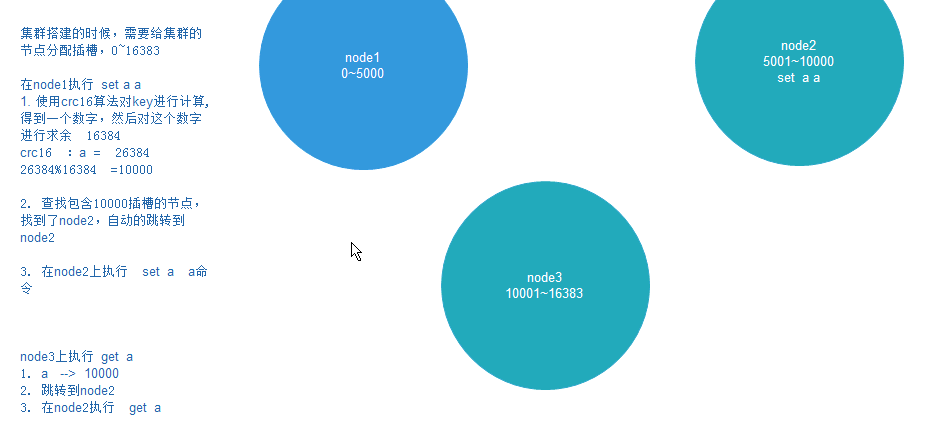

搭建过程参考:<https://juejin.im/entry/596343056fb9a06bc340ac15> 

<https://juejin.im/post/5ad54d76f265da23970759d3> (这个)

gem安装失败问题:<https://blog.csdn.net/j15533415886/article/details/88081772> ,如果还是失败的话,就去<https://rubygems.org/gems/redis/versions/3.0.0> 这个地址下载下来,然后传入linux中,然后执行**gem install -l ./redis-3.0.0.gem** 来安装

启动集群：./redis-trib.rb create --replicas 1 122.51.109.246:7001 122.51.109.246:7002 122.51.109.246:7003 122.51.109.246:7004 122.51.109.246:7005 122.51.109.246:7006

。。。。。。。。依然没有搭建成功。。。。。。

## Redis集群的原理

3.0版本之前是不支持集群的，3.0版本之前想要搭建集群的话需要中间件来找到存值和取值的对应节点。

3.0版本之后的redis集群架构图：

redis集群的节点会**两两相连**，只要客户端连接到其中任何一台redis服务器就可以对其他redis服务器进行存读操作。

**怎么实现的呢？**

Redis集群中内置了16384个哈希槽，当需要在Redis集群中放置一个key-value时，redis会先对key使用crc 16算法算出一个结果（相当于取hash），然后把结果对16384求余数，这样每个key就会对应一个编号在0-16383之间的hash槽，redis会根据节点数量大致均等的将hash槽映射到不同的节点。如下图所示：

说明：

​	集群搭建的时候，需要给急缺分配插槽，我们使用的是`      redis-trib.rb `命令，这样，16384个插槽机会会平均的分配到每个master节点上。

## Redis集群投票机制

Redis集群中有多台服务器相互连接，不可避免的是有服务器挂掉。Redis集群服务之间通过互相的**ping-pong**判断节点是否可以连接上。**当有一半以上的节点去ping一个节点的时候没有回应，集群就认为这个节点宕机了**。这个就是为了容错而生的redis集群投票机制。

