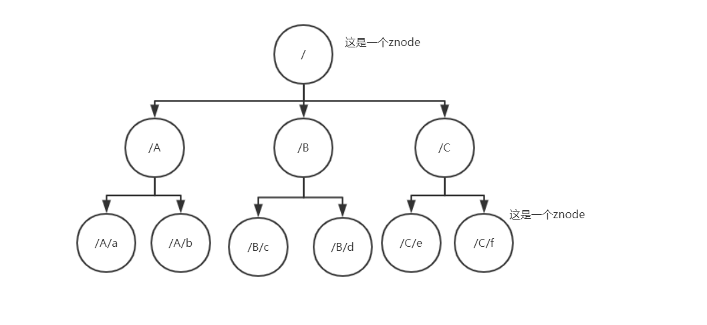
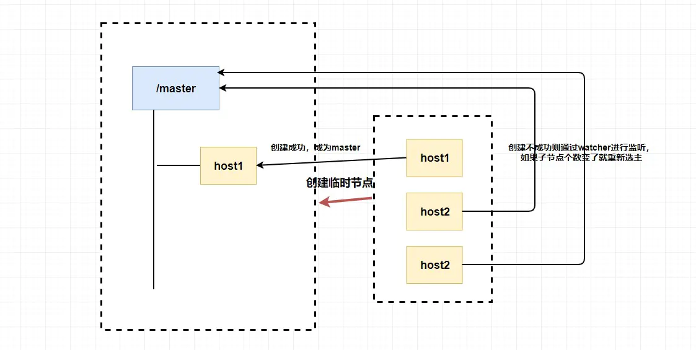
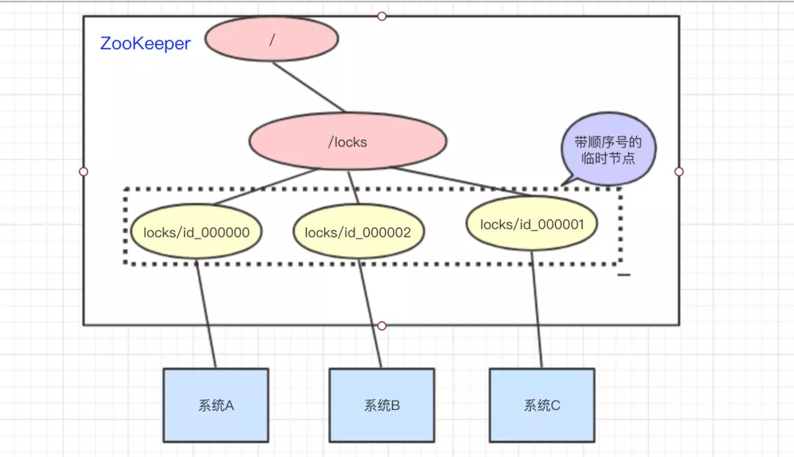
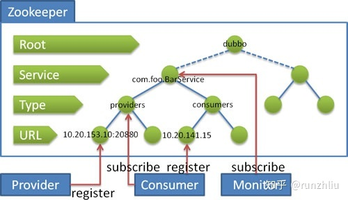

# Zookeeper

Zookeeper在我使用dubbox（前身是阿里巴巴的Dubb）入门的时候接触过，当时也是知道它必须和Dubbo配合起来使用，作为Dubbo的注册中心。

Zookeeper是Apache Hadoop的子项目，后面成为了Apache的顶级项目。Zookeeper是一个开源的分布式应用协调服务器，其为分布式系统提供一致性服务。它主要功能包括：配置维护、分布式同步、集群管理、分布式事务等等。

使用分布式系统就无法避免对节点的管理问题，它需要实时的感知各个子系统（子节点）的状态，对节点进行统一管理等等。Zookeeper是一个分布式应用协调服务器，使用它以后，解决了分布式系统大复杂性问题。


## Zookeeper数据存储结构

zookeeper数据存储结构与标准的Unix文件系统非常类似，都是在根节点下面挂很多子目录，这样一层一层的，形成了一个树形结构。只是做了一个类比，但是zookeeper中没有文件系统中的目录和文件的概念，而是使用了znode作为数据节点。znode是zookeeper中的最小数据单元，每个znode上都可以保存数据，同时还可以挂在子节点，形成了一个树形的命名空间。



每个`znode`都有自己所属的**节点类型**和**节点状态**。

其中**节点类型**可以分为**持久节点、持久顺序节点、临时节点和临时顺序节点**。

* 持久节点

  一旦创建就一直存在，直到将其删除

* 持久顺序节点

  一个父节点可以为其子节点**维护一个创建的先后顺序**，这个顺序体现在**节点名称**上，是节点名称后自动添加一个由10位数字组成的数字串，从0开始计数。例如（node-a-0000000000，node-b-0000000001）

* 临时节点

  临时节点的生命周期是与客户端会话绑定的，会话消失则节点消失。**临时节点只能创建叶子节点，不能创建子节点。**

* 临时顺序节点

  父节点可以创建一个维持了顺序的临时节点（和持久顺序节点命名一致）

节点状态中包含了很多节点的属性，比如czxid、mzxid等等，在zookeeper中是使用Stat这个类来维护的。下面雷剧一些属性解释：

* czxid：Created ZXID，该数据节点被创建时的事务ID。
* mzxid：Modified ZXID，节点最后一次被更新时的事务ID。
* ctime：Create Time，该节点被创建的时间。
* mtime：Modified Time，该节点最后一次被修改时的时间。
* version：节点的版本号。
* cversion：**子节点**的版本号
* aversion：节点的`ACL` 版本号。
* ephemeralOwner：创建该节点的会话的SessionID，如果该节点为持久节点，该值为0。
* dataLength：节点数据内容的长度。
* numChildren：该节点的子节点的个数，如果该节点为临时节点则为0。
* pzxid：该节点子节点列表最后一次被修改时的事务ID，注意是子节点的列表，不是内容。


## Zookeeper会话

zookeeper也是c/s架构，客户端和服务端是通过TCP长连接维持会话机制，其实对于会话来说你可理解为保持连接状态。

在zookeeper中，会话还有对应的事件，比如`CONNECTION_LOSS连接丢失事件`、`SESSION_MOVED会话转移事件`、`SESSION_EXPIRED会话超时失效事件`。


## ACL

ACL为Access Control Lists，它是一种权限控制。在zookeeper中定义了5种权限，它们分别为：

* CREATE 创建子节点的权限
* READ 获取节点数据和子节点列表的权限
* WRITE 更新节点数据的权限
* DELETE 删除子节点的权限
* ADMIN 设置节点ACL的权限，可以理解为超级管理员权限


## Watcher机制

Watcher为事件监听器，是zookeeper非常重要的一个特性，很多功能都依赖于它，它有点儿类似于订阅的方式，即客户端向服务端注册指定的watcher，当服务端出现了相应的事件以后，服务端会向客户端发送事件通知，然后客户端收到通知以后，执行相应的回调逻辑。

常见的监听场景有以下两个：

1. 监听zookeeper节点数据的变化
2. 监听子节点的增减变化


正是由于zookeeper的 `znode（临时+永久）+监听` 就可以玩出好多花样了。


## Zookeeper典型应用场景

### 1. 选主（Master选举）

还记得上面我们的所说的临时节点吗？因为 `Zookeeper` 的强一致性，能够很好地在保证 **在高并发的情况下保证节点创建的全局唯一性** (即无法重复创建同样的节点)。

利用这个特性，我们可以 **让多个客户端创建一个指定的节点** ，创建成功的就是 `master`。

但是，如果这个 `master` 挂了怎么办？？？

你想想为什么我们要创建临时节点？还记得临时节点的生命周期吗？`master` 挂了是不是代表会话断了？会话断了是不是意味着这个节点没了？还记得 `watcher` 吗？我们是不是可以 **让其他不是 master 的节点监听节点的状态** ，比如说我们监听这个临时节点的父节点，如果子节点个数变了就代表 `master` 挂了，这个时候我们 **触发回调函数进行重新选举** ，或者我们直接监听节点的状态，我们可以通过节点是否已经失去连接来判断 `master` 是否挂了等等。

 

总的来说，我们可以完全利用 **临时节点**、**节点状态**和**watcher**来实现**master选举**的功能，临时节点主要用来标记那个是主，节点状态和watcher可以用来判断是否需要重新选举。


### 2.分布式锁

分布式锁的实现方式有很多种，比如Redis、数据库、zookeeper等等。

> redis实现分布式锁，参考：<https://juejin.im/post/59edeb18f265da430a4fc076> 、<https://blog.csdn.net/varyall/article/details/88751345> 


#### 2.1 互斥锁（独占锁）

zookeeper在高并发情况下，能够保证节点创建全局唯一性，利用这一特性，很多客户端都去创建同一节点，但是最终只有一个能够创建成功，那么创建成功与否是互斥的。因此就可以实现互斥锁了，也就是分布式锁了。

分布式情况下，如何获取锁呢？因为创建节点的唯一性，我们可以让多个客户端同时创建一个**临时节点**，创建成功的就说明它获得了锁。没有创建成功的客户端也像上面master选举一样创建一个`watcher`进行节点状态监听，如果这个互斥锁被释放了（可能是客户端主动释放了锁；或者是客户端宕机了导致锁被释放了，什么？宕机怎么也可以释放锁呢？上面提到过，临时锁生命周期和客户端会话绑定的，宕机以后会话肯定没了，肯定也消失了），然后调用回调函数重新参与锁的获取。

**zookeeper中不需要像redis那样考虑如果占有锁的客户端挂了得不到锁的问题，因为当客户端挂了，节点也挂了，锁也释放了。** 

> 可能有的地方说将上面的**临时节点**换成**临时顺序节点**。A、B、C三个系统都去访问 `/lock`节点，访问的时候会创建带有顺序号的**临时顺序节点**，比如系统A创建了`lock_0000000000`节点，系统B创建了`lock_0000000001`节点，系统C创建了`lock_0000000002`节点。如图所示：
>
> 
>
> 接着lock节点下的所有节点通过比对，**判断自己是不是顺序号最小的节点**：
>
> * 如果是，得到锁
>
>   执行完以后 ，将自己创建的节点删除掉
>
> * 如果不是，监听顺序号比自己小1的节点
>
> 举个例子：
>
> 1. 系统A拿到/lock节点下所有的子节点，比对顺序号发现自己是最小的，所以得到锁
> 2. 系统B拿到/lock节点下所有的子节点，比对顺序号以后，发现比自己小的是id_000000节点，然后就去监听比自己小1的节点，也就是A节点
> 3. 系统C如是...
> 4. 系统A执行完自己的逻辑之后，删除了id_000000节点，因为B系统监听了id_000000节点的状态，当收到id_000000节点已经删除的通知（该通知只会通知B系统）以后，发现自己是最小的节点了，于是顺利的拿到锁了。
>
> 我觉得这种创建带顺序号的节点的方案要好一些，它避免了羊群效应（id_000000节点删除以后，id_000001、id_000002节点都收到了通知，如果同时有成百上千个客户端都同时监听id_000000节点，就会导致大量不必要的通知被发出，严重影响系统的性能）。


#### 2.2 如何同时实现共享锁和独占锁

这个时候必须保证创建的节点是 **顺序临时节点**。

当是读请求（要获取共享锁）的话，如果没有比自己更小的写请求节点（要获取独占锁），则可以顺利的获取读锁，然后可以正常对数据进行读操作了。若比自己小的节点中有写请求的时候，则无法获取读锁，只能等到比自己小的写请求的节点执行完释放锁以后才能顺利的拿到锁。

当时写请求（要获取独占锁）的话，如果没有比自己更小的请求节点（读或者写请求节点），则直接获取到写锁（独占锁）。若发现有比自己更小的节点（读或者写请求节点），当前客户端都无法获取到写锁，必须要等到前面的操作完成以后才能获取到写锁。


更多使用场景，参考：<https://www.zhihu.com/collection/496193531> 


## Zookeeper在大型分布式系统中的应用

1. dubbo

   zookeeper作为远程服务调用分布式框架dubbo的注册中心。zookeeper存储了服务名称和ip地址的对应关系，它通过心跳机制来检测挂掉的机器（如果机器挂掉了，则zookeeper上的临时节点就会被删除），并将其从服务列表中删除。Dubbo+Zookeeper的组合支持高并发，简单来说，就是横向扩展很容易，在不更改代码的情况下通过添加机器来提高吞吐量、并发量。新的机器在zookeeper上注册成为服务提供者，自然支持更多的访问了。

   

2. kafka

   kafka用zookeeper来存储元数据（描述数据的数据，也就是说kafka用zookeeper来存储配置信息，也就是zookeeper使用场景中的：**配置维护**）。kafka中大部分组件都应用了zookeeper。

   1. Broker注册 

      `/broker/ids/[0...N]`记录了服务其列表记录，这个临时的节点数据是ip端口之类的信息。

   2. Topic注册

      `/broker/topics`记录了topic的分区信息和Broker的对应关系

      ```shell
      # 1.登录zookeeper容器
      [root@VM_0_13_centos ~]# docker exec -it zookeeper /bin/bash
      root@3f74f16b91ee:/apache-zookeeper-3.5.6-bin# ls /
      apache-zookeeper-3.5.6-bin  boot  data	   dev			 etc   lib    logs   mnt  proc	run   srv  tmp	var
      bin			    conf  datalog  docker-entrypoint.sh  home  lib64  media  opt  root	sbin  sys  usr
      
      # 2.进入到bin目录
      root@3f74f16b91ee:/apache-zookeeper-3.5.6-bin# cd bin/
      root@3f74f16b91ee:/apache-zookeeper-3.5.6-bin/bin# ls
      README.txt  zkCleanup.sh  zkCli.cmd  zkCli.sh  zkEnv.cmd  zkEnv.sh  zkServer-initialize.sh  zkServer.cmd  zkServer.sh  zkTxnLogToolkit.cmd  zkTxnLogToolkit.sh
      
      # 3.运行zkCli.sh进入zookeeper客户端
      root@3f74f16b91ee:/apache-zookeeper-3.5.6-bin/bin# ./zkCli.sh
      Connecting to localhost:2181
      2020-02-24 12:16:16,923 [myid:] - INFO  [main:Environment@109] - Client environment:zookeeper.version=3.5.6-c11b7e26bc554b8523dc929761dd28808913f091, built on 10/08/2019 20:18 GMT
      2020-02-24 12:16:16,969 [myid:] - INFO  [main:Environment@109] - Client environment:host.name=3f74f16b91ee
      2020-02-24 12:16:16,973 [myid:] - INFO  [main:Environment@109] - Client environment:java.version=1.8.0_242
      2020-02-24 12:16:17,030 [myid:] - INFO  [main:Environment@109] - Client environment:java.vendor=Oracle Corporation
      2020-02-24 12:16:17,030 [myid:] - INFO  [main:Environment@109] - Client environment:java.home=/usr/local/openjdk-8
      ......
      
      # 4. 接下来就像操作linux文件目录一样的操作了
      [zk: localhost:2181(CONNECTED) 0] ls /
      [dubbo, kafka, zookeeper]
      [zk: localhost:2181(CONNECTED) 1] ls /kafka
      [admin, brokers, cluster, config, consumers, controller, controller_epoch, isr_change_notification, latest_producer_id_block, log_dir_event_notification]
      [zk: localhost:2181(CONNECTED) 2] ls /kafka/brokers
      [ids, seqid, topics]
      [zk: localhost:2181(CONNECTED) 4] ls /kafka/brokers/topics
      # 可以看到所有的topic
      [__consumer_offsets, lee123, logCenter, logCenter_test, sun]
      [zk: localhost:2181(CONNECTED) 5] ls /kafka/brokers/topics/logCenter
      [partitions]
      # logCenter这个topic下面一共有2个partitions(分区)
      [zk: localhost:2181(CONNECTED) 6] ls /kafka/brokers/topics/logCenter/partitions
      [0, 1]
      [zk: localhost:2181(CONNECTED) 7] 
      
      # 当前zookeeper维护的kafka一共只有一个服务端机器
      [zk: localhost:2181(CONNECTED) 12] ls /kafka/brokers/ids
      [0]
      
      # 此时停掉 kafka容器
      [zk: localhost:2181(CONNECTED) 17] ls /kafka/brokers/ids
      []
      ```

      当我把 kafka服务器停掉以后,发现`ls /kafka/brokers/ids` 执行以后,显示为`[]` .

   3. 生产者负载均衡

      **服务提供者** 在 `zookeeper` 中创建一个临时节点并且将自己的 `ip、port、调用方式` 写入节点，当 **服务消费者** 需要进行调用的时候会 **通过注册中心找到相应的服务的地址列表(IP端口什么的)** ，并缓存到本地(方便以后调用)，当消费者调用服务时，不会再去请求注册中心，而是直接通过负载均衡算法从地址列表中取一个服务提供者的服务器调用服务。

   4. 消息消费进度 Offset 记录 

      消费者对指定消息分区进行消息消费的过程中，需要定时将分区消息的消费进度 Offset 记录到 ZooKeeper 上，以便消费者进行重启或者其他消费者重新阶段该消息分区的消息消费后，能够从之前的进度开始继续系消费 

3. Hadoop

   今后补充。。。

4. Spark

   今后补充。。。

5. 。。。。


参考:

1. [🔥🔥🔥万字带你入门Zookeeper](https://juejin.im/post/5e184673f265da3df716d449 ) 作者：FrancisQ
2. [什么是ZooKeeper？](https://mp.weixin.qq.com/s?__biz=MzI4Njg5MDA5NA==&mid=2247485115&idx=1&sn=5d269f40f820c82b460993669ca6242e&chksm=ebd747badca0ceac9953f82e08b1d1a49498ebd4af77ec5d628a0682bb9f0ac5ab347411f654&mpshare=1&scene=24&srcid=0221Oje7oert0ClVjjku5QOB&sharer_sharetime=1582294962714&sharer_shareid=dc8fc270d4895826988f6a2f3145b443&key=59a92d8c8d4313e957ab97356c98a09e28487f0c638567286c75da744a17622e0ca49b029c5bbfbe6c794c771a20f3d4af87bc95a652cca1df90003cbcaafbd6721631d2105ac0d44606e39b5f424429&ascene=14&uin=MjczMjY2MTk2MA%3D%3D&devicetype=Windows+10&version=62080079&lang=zh_CN&exportkey=A%2B6jQ6pHoHdYGcts7un7aho%3D&pass_ticket=sqHlWJCqhl94tL9VgJ7Ebb4cSzl05I1aTYLDH3e8QrRC0%2FNXIghd97AZPHOJGNGG ) 作者：Java3y
3. [ZooKeeper 的应用场景](https://zhuanlan.zhihu.com/p/59669985 ) 作者：runzhliu