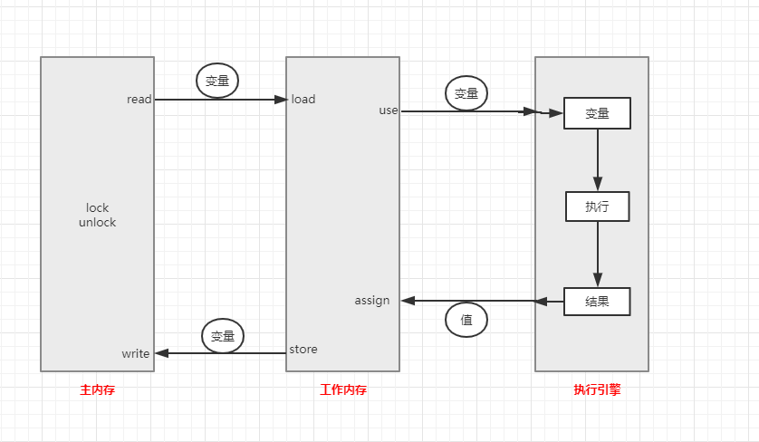

# 多线程

## 1. 四种线程池拒绝策略

当线程池的任务缓存队列已满，并且线程池中的线程数目达到maximumPoolSize时，如果还有任务到来，就会采取任务拒绝策略，通常有以下四种策略：

1. ` ThreadPoolExecutor.AbortPolicy` : 丢弃任务并抛出**RejectedExecutionException**异常
2. `ThreadPoolExecutor.DiscardPolicy` : 丢弃任务,但是不抛出异常
3. `ThreadPoolExecutor.DiscardOldestPolicy` : 丢弃队列最前面的任务,然后重新提交被拒绝的任务
4. `ThreadPoolExecutor.CallerRunsPolicy` : 由调用线程（提交任务的线程）处理该任务


线程池的默认拒绝策略是: AbortPolicy，即当线程池中的线程数目达到maximumPoolSize时，就会拒绝新来的任务，并且抛出RejectedExecutionException异常。


## 2. 创建线程池方法列举

### 2.1  Executors创建线程池

创建方法大致有以下四个静态方法：

* newFixedThreadPool（int threads） 创建固定数目线程的线程池
* newSingleThreadExecutor（）创建只有一个线程的线程池,提交给该线程池中的任务都是串行的
* newCachedThreadPool（）创建一个可缓存的线程池,调用execute方法,如果有空闲的线程就会重用前面已经创建好了的空闲的线程
* newScheduledThreadPool（int corePoolSize）创建一个支持定时及周期性的任务执行线程池

```java
/**
 * @author lee
 * @date 2020/1/13 22:13
 */
public class ExecutorsTest {
    public static void main(String[] args) {
        create1();
        create2();
        create3();
        create4();
    }

    /**
     * 创建一个支持定时及周期性的任务执行线程池
     */
    private static void create4() {
        ScheduledExecutorService scheduledExecutorService = Executors.newScheduledThreadPool(5);
        // 提交任务的时候,可以规划任务的执行时间
        scheduledExecutorService.schedule(() -> {
            System.out.println("hello");
        }, 5, TimeUnit.SECONDS);
        
    }

    /**
     * 创建一个可缓存的线程池,调用execute方法,如果有空闲的线程就会重用前面已经创建好了的空闲的线程
     * 问题:线程的个数最大是 Integer.MAX_VALUE, 可能会创建数量非常多的线程,甚至OOM
     */
    private static void create3() {
        ExecutorService executorService = Executors.newCachedThreadPool();
    }

    /**
     * 创建只有一个线程的线程池,提交给该线程池中的任务都是串行的
     * 主要问题是:堆积的请求处理队列可能会耗费非常大的内存,甚至OOM
     */
    private static void create2() {
        ExecutorService executorService = Executors.newSingleThreadExecutor();
    }

    /**
     * 创建固定数目的线程池
     * 主要问题是:堆积的请求处理队列可能会耗费非常大的内存,甚至OOM
     */
    private static void create1() {
        ExecutorService executorService = Executors.newFixedThreadPool(10);
        Runnable task_1 = () -> {
            System.out.println("I am task_1");

            try {
                TimeUnit.SECONDS.sleep(5);
            } catch (InterruptedException e) {
                e.printStackTrace();
            }
        };
        Callable<String> task_2 = () -> {
            System.out.println("I am task_2");
            
            TimeUnit.SECONDS.sleep(5);
            
            return System.currentTimeMillis() + "";
        };

        // 使用execute提交任务,异步执行,不知道执行的结果
        executorService.execute(task_1);
        
        // 使用submit提交任务,会返回一个Future对象,当调用future对象的get方法时,会阻塞线程,直到线程执行完毕返回结果为止
        Future<?> future = executorService.submit(task_1);
        try {
            Object result = future.get();
        } catch (InterruptedException e) {
            e.printStackTrace();
        } catch (ExecutionException e) {
            e.printStackTrace();
        }
    }
}
```

使用**Executors**创建线程池的主要问题是: 

**1)** newFixedThreadPool和newSingleThreadExecutor 主要问题时线程数固定,很容易导致任务堆积而占用很大的内存,甚至OOM

**2)** newCachedThreadPool和newScheduledThreadPool 主要问题是可创建的线程的最大数目为 `Integer.MAX_VALUE` 可能会创建非常多的线程（线程的创建和销毁是非常耗时耗资源的），甚至OOM


### 2. 2 ScheduledThreadPoolExecutor、ThreadPoolExecutor、Spring提供的ThreadPoolTaskExecutor

```java
Positive example 1：
    //org.apache.commons.lang3.concurrent.BasicThreadFactory
    ScheduledExecutorService executorService = new ScheduledThreadPoolExecutor(1,
        new BasicThreadFactory.Builder().namingPattern("example-schedule-pool-%d").daemon(true).build());
       
            
Positive example 2：
    ThreadFactory namedThreadFactory = new ThreadFactoryBuilder()
        .setNameFormat("demo-pool-%d").build();
 
    //Common Thread Pool
    ExecutorService pool = new ThreadPoolExecutor(5, 200,
        0L, TimeUnit.MILLISECONDS,
        new LinkedBlockingQueue<Runnable>(1024), namedThreadFactory, new ThreadPoolExecutor.AbortPolicy());
 
    pool.execute(()-> System.out.println(Thread.currentThread().getName()));
    pool.shutdown();//gracefully shutdown
           
            
Positive example 3：
    <bean id="userThreadPool"
        class="org.springframework.scheduling.concurrent.ThreadPoolTaskExecutor">
        <property name="corePoolSize" value="10" />
        <property name="maxPoolSize" value="100" />
        <property name="queueCapacity" value="2000" />
 
    <property name="threadFactory" value= threadFactory />
        <property name="rejectedExecutionHandler">
            <ref local="rejectedExecutionHandler" />
        </property>
    </bean>
    //in code
    userThreadPool.execute(thread);
```

**jdk 1.7中java.util.concurrent.Executor线程体系:**

java.util.concurrent.Executor : 负责线程的使用与调度的根接口 
　|–ExecutorService：Executor的子接口，线程池的主要接口 
　　　|–ThreadPoolExecutor：ExecutorService的实现类 
　　　|–ScheduledExecutorService：ExecutorService的子接口，负责线程的调度 
　　　　　|–ScheduledThreadPoolExecutor：既继承了ThreadPoolExecutor，同时实现了							   ScheduledExecutorService


例如上面的`ScheduledThreadPoolExecutor`类的继承关系是:

```java
ublic class ScheduledThreadPoolExecutor extends ThreadPoolExecutor implements ScheduledExecutorService {
    ...
}
```

> ThreadPoolExecutor类详解:
>
> `java.uitl.concurrent.ThreadPoolExecutor` 类是线程池中最核心的一个类 ,如果要透彻的了解Java中的线程池，首先得非常透彻的了解这个类。下面是`ThreadPoolExecutor`的四个构造方法:
>
> ```java
> public class ThreadPoolExecutor extends AbstractExecutorService {
>     .....
>     public ThreadPoolExecutor(int corePoolSize,int maximumPoolSize,long keepAliveTime,TimeUnit unit,
>             BlockingQueue<Runnable> workQueue);
>  
>     public ThreadPoolExecutor(int corePoolSize,int maximumPoolSize,long keepAliveTime,TimeUnit unit,
>             BlockingQueue<Runnable> workQueue,ThreadFactory threadFactory);
>  
>     public ThreadPoolExecutor(int corePoolSize,int maximumPoolSize,long keepAliveTime,TimeUnit unit,
>             BlockingQueue<Runnable> workQueue,RejectedExecutionHandler handler);
>  
>     public ThreadPoolExecutor(int corePoolSize,int maximumPoolSize,long keepAliveTime,TimeUnit unit,
>         BlockingQueue<Runnable> workQueue,ThreadFactory threadFactory,RejectedExecutionHandler handler);
>     ...
> }
> ```
>
> 通过源码我们可以得知，前三个构造方法都是调用第四个构造方法，对于第四个构造方法，它的参数的含义如下：
>
> * corePoolSize: 线程池中核心线程的数量。在创建了线程池后，默认情况下，线程池中并没有任何线程，而是等待有任务到来才创建任务去执行任务，除非调用了`prestartAllCoreThreads()`或者`prestartCoreThread()`方法，意思是在没有任务到来时就提前创建corePoolSize数目的线程或者一个线程。默认情况下，在创建了线程池以后，线程池中的线程的数目为0，当有任务到来之后，就会创建一个线程去执行任务，当线程池中的线程的数目达到corePoolSize的时候，就会将任务缓存至缓存队列中去；
> * maximumPoolSize：线程池最大线程数，这个参数也是一个非常重要的参数，它表示在线程池中最多能创建多少个线程；
> * keepAliveTime：表示线程没有任务执行时最多保持多久时间会终止。默认情况下，只有当线程池中的线程数大于corePoolSize时，keepAliveTime才会起作用，直到线程池中的线程数不大于corePoolSize，即当线程池中的线程数大于corePoolSize时，如果一个线程空闲的时间达到keepAliveTime，则会终止，直到线程池中的线程数不超过corePoolSize。但是如果调用了allowCoreThreadTimeOut(boolean)方法，在线程池中的线程数不大于corePoolSize时，keepAliveTime参数也会起作用，直到线程池中的线程数为0；
> * unit：参数keepAliveTime的时间单位，有7种取值。TimeUnit.DAYS、TimeUnit.HOURS、TimeUnit.MINUTES、TimeUnit.SECONDS、TimeUnit.MILLISECONDS、TimeUnit.MICROSECONDS、TimeUnit.NANOSECONDS
> * workQueue：一个阻塞队列，用来存储等待执行的任务，这个参数的选择也很重要，会对线程池的运行过程产生重大影响，一般来说，这里的阻塞队列有以下几种选择：ArrayBlockingQueue、LinkedBlockingQueue、SynchronousQueue。 
>   ArrayBlockingQueue和PriorityBlockingQueue使用较少，一般使用LinkedBlockingQueue和Synchronous。线程池的排队策略与BlockingQueue有关。
> * threadFactory：线程工厂，主要用来创建线程；
> * handler：表示当拒绝处理任务时的策略，有以下四种取值： 
>   ThreadPoolExecutor.AbortPolicy:丢弃任务并抛出RejectedExecutionException异常。 
>   ThreadPoolExecutor.DiscardPolicy：也是丢弃任务，但是不抛出异常。 
>   ThreadPoolExecutor.DiscardOldestPolicy：丢弃队列最前面的任务，然后重新尝试执行任务（重复此过程）ThreadPoolExecutor.CallerRunsPolicy：由调用线程处理该任务


### 2.3 关于线程池的submit和execute方法的区别

Executor框架架构主要由3部分组成:

* 任务: Runnable/Callable

  ```java
  Runnable task = () -> {
              System.out.println("任务开始执行...");
              try {
                  TimeUnit.SECONDS.sleep(5);
              } catch (InterruptedException e) {
                  e.printStackTrace();
              }
              System.out.println("任务执行完毕...");
          };
  
  Callable<String> task = () -> {
              System.out.println("任务开始执行...");
              try {
                  TimeUnit.SECONDS.sleep(5);
              } catch (InterruptedException e) {
                  e.printStackTrace();
              }
              return "任务执行完毕...";
          };
  ```

  可以看到，Runnable执行任务以后是没有返回值的，而Callable是有返回值的，它的返回值类型可以在声明Callable时指定

* 线程池，线程池的创建方式是多样的，可以由Executors创建(不推荐),也可以有ThreadPoolExecutor来创建(推荐)

* 异步计算的结果

  使用线程的submit()方法提交的任务,会返回一个Future对象,该对象中包含了执行任务结束后的结果

  ```java
  public static void test2() {
          Runnable task = () -> {
              System.out.println("任务开始执行...");
              try {
                  TimeUnit.SECONDS.sleep(5);
              } catch (InterruptedException e) {
                  e.printStackTrace();
              }
              System.out.println("任务执行完毕...");
          };
  
          // 创建线程池
          ThreadPoolExecutor poolExecutor = new ThreadPoolExecutor(5, 10, 10, TimeUnit.SECONDS, new ArrayBlockingQueue<>(5));
          // 将任务交给线程池进行执行,返回的future中包含了任务执行返回的结果,因为这里task是Runnable对象,它没有返回值,所以future中包含的返回结果为null
          Future<?> future = poolExecutor.submit(task);
          try {
              Object o = future.get();
              System.out.println("任务执行完毕,返回执行结果: " + o);
          } catch (InterruptedException e) {
              e.printStackTrace();
          } catch (ExecutionException e) {
              e.printStackTrace();
          }
  
          poolExecutor.shutdown();
  
      }
  
      public static void test3() {
          Callable<String> task = () -> {
              System.out.println("任务开始执行...");
              try {
                  TimeUnit.SECONDS.sleep(5);
              } catch (InterruptedException e) {
                  e.printStackTrace();
              }
              return "任务执行完毕...";
          };
  
          // 创建线程池
          ThreadPoolExecutor poolExecutor = new ThreadPoolExecutor(5, 10, 10, TimeUnit.SECONDS, new ArrayBlockingQueue<>(5));
          // 将任务交给线程池进行执行,返回的future中包含了任务执行返回的结果,因为这里task是Runnable对象,它没有返回值,所以future中包含的返回结果为null
          Future<String> future = poolExecutor.submit(task);
          try {
              // 阻塞式的,一直等到任务执行完毕,返回执行结果以后才会继续往下执行
              String result = future.get();
              System.out.println("任务执行完毕,返回执行结果: " + result);
          } catch (InterruptedException e) {
              e.printStackTrace();
          } catch (ExecutionException e) {
              e.printStackTrace();
          }
  
          poolExecutor.shutdown();
  
      }
  ```

  execute只能用来提交Runnable类型的任务，它不能够知道任务执行结果的；而使用submit提交任务，会返回一个Feature实例，通过Feature实例的`get（）`方法可以阻塞式的得到返回结果。


## 3. Spring 中的线程池


## 4. synchronized 关键字

### 4.1 synchronized关键字的使用

* 使用在代码块中

  ```java
  example1:
  public class T {
      private int count = 10;
      private Object o = new Object();
  
      public void m() {
          //任何线程要执行下面的代码，必须先拿到o的锁
          synchronized (o) {
              count--;
              System.out.println(Thread.currentThread().getName() + " count = " + count);
          }
      }
  
  }
  
  example2:
  public class T {
  	private int count = 10;
  	public void m() {
  		//任何线程要执行下面的代码，必须先拿到this的锁,即当前对象
  		synchronized(this) {
  			count--;
  			System.out.println(Thread.currentThread().getName() + " count = " + count);
  		}
  	}
  	
  }
  ```

* 使用在方法上

  实例方法:

  ```java
  public class T {
  
  	private int count = 10;
  	
      //等同于在方法的代码执行时要synchronized(this)
  	public synchronized void m() {
  		count--;
  		System.out.println(Thread.currentThread().getName() + " count = " + count);
  	}
  
  }
  ```

  静态方法:

  ```java
  public class T {
  	private static int count = 10;
  	// 这里等同于synchronized(T.class),T.class是一个Class对象,该对象只有一个
  	public synchronized static void m() {
  		count--;
  		System.out.println(Thread.currentThread().getName() + " count = " + count);
  	}
  
  }
  ```

### 4.2 synchronized关键字的其他特性

* 一个同步方法可以调用另外一个同步方法，一个线程已经拥有某个对象的锁，再次申请的时候仍然会得到该对象的锁。也就是说synchronized获得的锁是可重入的;继承中,子类同步方法中调用父类的同步方法也是可以自动获得锁的,也是synchronized的可重入特性

  ```java
  public class T {
  	synchronized void m1() {
  		System.out.println("m1 start");
  		try {
  			TimeUnit.SECONDS.sleep(1);
  		} catch (InterruptedException e) {
  			e.printStackTrace();
  		}
  		m2();
  	}
  	
  	synchronized void m2() {
  		try {
  			TimeUnit.SECONDS.sleep(2);
  		} catch (InterruptedException e) {
  			e.printStackTrace();
  		}
  		System.out.println("m2");
  	}
  
  	public static void main(String[] args) {
  		T t = new T();
  		// m1是同步方法,执行是需要获得t对象上的锁,而m2也是同步方法,也需要t对象上的锁,m1方法中调用m2方法,会自动获得t对象上的锁
  		t.m1();
  	}
  }
  ```

* 程序在执行过程中，如果出现异常，默认情况锁会被释放。所以，在并发处理的过程中，有异常要多加小心，不然可能会发生不一致的情况。比如，在一个web app处理过程中，多个servlet线程共同访问同一个资源，这时如果异常处理不合适，在第一个线程中抛出异常，其他线程就会进入同步代码区，有可能会访问到异常产生时的数据。因此要非常小心的处理同步业务逻辑中的异常。

  ```java
  public class T {
  	int count = 0;
  	synchronized void m() {
  		System.out.println(Thread.currentThread().getName() + " start");
  		while(true) {
  			count ++;
  			System.out.println(Thread.currentThread().getName() + " count = " + count);
  			try {
  				TimeUnit.SECONDS.sleep(1);
  				
  			} catch (InterruptedException e) {
  				e.printStackTrace();
  			}
  			if(count == 5) {
                  //此处抛出异常，锁将被释放，要想不被释放，可以在这里进行catch，然后让循环继续
  				int i = 1/0; 
  				System.out.println(i);
  			}
  		}
  	}
  	
  	public static void main(String[] args) {
  		T t = new T();
  		Runnable r = new Runnable() {
  
  			@Override
  			public void run() {
  				t.m();
  			}
  			
  		};
  		new Thread(r, "t1").start();
  		
  		try {
  			TimeUnit.SECONDS.sleep(3);
  		} catch (InterruptedException e) {
  			e.printStackTrace();
  		}
  		new Thread(r, "t2").start();
  	}
  	
  }
  ```

* 锁定某对象o，如果对象o的属性发生改变，不影响锁的使用，但是如果o变成另外一个对象，则锁定的对象发生改变，应该避免将锁定的对象编程其他的对象，其实这个也很好理解，锁是存在对象上的

* 锁不要使用简单对象，也不要使用String对象，例如下面的程序：

  ```java
  public class T {
      // 不要以字符串常量作为锁定的对象,s1和s2其实是同一个对象(字符串字面量相同,在堆中指的是同一个对象)
  	String s1 = "Hello";
  	String s2 = "Hello";
  	void m1() {
  		synchronized(s1) {
  			// ...
  		}
  	}
  	void m2() {
  		synchronized(s2) {
  			// ...
  		}
  	}
  }
  ```


### 4.3 synchronized关键字的工作原理

#### 4.3.1 主内存和工作内存

要了解synchronized关键字的工作原理，首先必须了解**Java内存模型**。Java内存模型的主要目标是**定义程序中各个变量的访问规则**，即在虚拟机中将变量存储到内存和从内存中读取变量这样的底层细节。此处的变量与Java编程时所说的变量不一样，指包括了实例字段、静态字段和构成数组对象的元素，但是不包括局部变量与方法参数，后者是线程私有的，不会被共享。

Java内存模型规定了**所有的变量都存储在主内存中，每个线程还有自己的工作内存（就相当于操作系统的内存和高速缓存之间的关系），线程的工作内存中保存了该线程使用到的变量到主内存之间的副本拷贝，线程对变量的所有操作（读取、赋值）都必须在工作内存中进行，而不能直接读写主内存中的变量。不同线程之间无法直接访问对方工作内存中的变量，线程间变量值的传递均需要在主内存来完成，线程、主内存和工作内存的交互关系如下图所示：**


注意，这里的主内存、工作内存与java内存区域的Java堆、栈、方法区不是同一层次上的划分。可以看到它是更加底层的。

#### 4.3.2 主内存和工作内存间交互操作

关于主内存与工作内存之间的具体交互协议，即一个变量如何从主内存拷贝到工作内存、如何从工作内存同步到主内存之间的实现细节，Java内存模型定义了以下八种操作来完成：

- **lock（锁定）**：作用于主内存的变量，把一个变量标识为一条线程独占状态。

- **unlock（解锁）**：作用于主内存变量，把一个处于锁定状态的变量释放出来，释放后的变量才可以被其他线程锁定。

- **read（读取）**：作用于主内存变量，把一个变量值从主内存传输到线程的工作内存中，以便随后的load动作使用

- **load（载入）**：作用于工作内存的变量，它把read操作从主内存中得到的变量值放入工作内存的变量副本中。

- **use（使用）**：作用于工作内存的变量，把工作内存中的一个变量值传递给执行引擎，每当虚拟机遇到一个需要使用变量的值的字节码指令时将会执行这个操作。

- **assign（赋值）**：作用于工作内存的变量，它把一个从执行引擎接收到的值赋值给工作内存的变量，每当虚拟机遇到一个给变量赋值的字节码指令时执行这个操作。

- **store（存储）**：作用于工作内存的变量，把工作内存中的一个变量的值传送到主内存中，以便随后的write的操作。

- **write（写入）**：作用于主内存的变量，它把store操作从工作内存中一个变量的值传送到主内存的变量中。

  


  #### 4.3.3 synchronized的实现原理

  **synchronized的底层是使用操作系统的mutex lock实现的（mutex：互斥锁），锁有2层含义：**

  * 内存可见性

    同步快的可见性是由“如果对一个变量执行lock操作，将会清空工作内存中此变量的值，在执行引擎使用这个变量前需要重新执行load或assign操作初始化变量的值”、“对一个变量执行unlock操作之前，必须先把此变量同步回主内存中（执行store和write操作）”这两条规则获得的。

  * 操作原子性

    持有同一个锁的两个同步块只能串行地进入


  **锁的内存含义：**

  - 当线程释放锁时，JMM会把该线程对应的本地内存中的共享变量刷新到主内存中
  - 当线程获取锁时，JMM会把该线程对应的本地内存置为无效。从而使得被监视器保护的临界区代码必须从主内存中读取共享变量


  **synchronized用的锁是存在Java对象头里的**

  JVM基于进入和退出Monitor对象来实现方法同步和代码块同步。代码块同步是使用`monitor enter`和`monitor exit`指令实现的，`monitor enter`指令是在编译后插入到同步代码块的开始位置，而`monitor exit`是插入到方法结束处和异常处。任何对象都有一个monitor与之关联，当且一个monitor被持有后，它将处于锁定状态。

  根据虚拟机规范的要求，在执行monitorenter指令时，首先要去尝试获取对象的锁，如果这个对象没被锁定，或者当前线程已经拥有了那个对象的锁，把锁的计数器加1；相应地，在执行monitorexit指令时会将锁计数器减1，当计数器被减到0时，锁就释放了。如果获取对象锁失败了，那当前线程就要阻塞等待，直到对象锁被另一个线程释放为止。

  注意两点：

  1、synchronized同步快对同一条线程来说是可重入的，不会出现自己把自己锁死的问题；

  2、同步块在已进入的线程执行完之前，会阻塞后面其他线程的进入。


  > 更深入全面的了解，可以参考：
  >
  > Java synchronized原理总结 - EnjoyMoving的文章 - 知乎
  > https://zhuanlan.zhihu.com/p/29866981


### 4.4 jdk 1.6以后对synchronized做了哪些优化?

- 1.适应自旋锁

  自旋锁：为了减少线程状态改变带来的消耗 不停地执行当前线程 

- 2.锁消除

  不可能存在共享数据竞争的锁进行消除

- 3.锁粗化

   将连续的加锁 精简到只加一次锁

- 4.轻量级锁

  无竞争条件下 通过CAS消除同步互斥

- 5.偏向锁

  无竞争条件下 消除整个同步互斥，连CAS都不操作。

## 5. volatile关键字

### 5.1 volatile关键字的工作原理(简述)

volatile 关键字，使一个变量在多个线程间可见
A、B线程都用到一个变量，java默认是A线程中（线程的工作内存）保留一份copy，这样如果B线程修改了该变量，则A线程未必知道
使用volatile关键字，会让所有线程都会读到变量的修改值
在下面的代码中，running是存在于堆内存的t对象中
当线程t1开始运行的时候，会把running值从内存中读到t1线程的工作区，在运行过程中直接使用这个copy，并不会每次都去读取堆内存，这样，当主线程修改running的值之后，t1线程感知不到，所以不会停止运行
使用volatile，将会强制所有线程都去堆内存中读取running的值

```java
public class T {
	//对比一下有无volatile的情况下，整个程序运行结果的区别
	/*volatile*/ boolean running = true;
	void m() {
		System.out.println("m start");
		while(running) {
			/*
			try {
				TimeUnit.MILLISECONDS.sleep(10);
			} catch (InterruptedException e) {
				e.printStackTrace();
			}*/
		}
		System.out.println("m end!");
	}
	
	public static void main(String[] args) {
		T t = new T();
		new Thread(t::m, "t1").start();
		try {
			TimeUnit.SECONDS.sleep(1);
		} catch (InterruptedException e) {
			e.printStackTrace();
		}
		t.running = false;
	}
}
```


可以阅读这篇文章进行更深入的理解http://www.cnblogs.com/nexiyi/p/java_memory_model_and_thread.html
volatile并不能保证多个线程共同修改running变量时所带来的不一致问题，也就是说volatile不能替代synchronized
**volatile只能保证多个线程之间共享变量的可见性,不能保证原子性**

volatile并不能保证多个线程共同修改running变量时所带来的不一致问题，也就是说volatile不能替代synchronized运行下面的程序，并分析结果：

```java
public class T {
    volatile int count = 0;

    void m() {
        for (int i = 0; i < 10000; i++) count++;
    }

    public static void main(String[] args) {
        T t = new T();

        List<Thread> threads = new ArrayList<Thread>();

        for (int i = 0; i < 10; i++) {
            threads.add(new Thread(t::m, "thread-" + i));
        }

        threads.forEach((o) -> o.start());

        threads.forEach((o) -> {
            try {
                // 让创建的线程依次优先执行,等到这些线程都执行完了,才会执行主线程(main线程)
                o.join();
            } catch (InterruptedException e) {
                e.printStackTrace();
            }
        });

        System.out.println(t.count);
        // 主线程睡眠10秒钟,为了保证主线程已经执行完了
        try {
            TimeUnit.SECONDS.sleep(10);
        } catch (InterruptedException e) {
            e.printStackTrace();
        }
        System.out.println(t.count);
    }

}

运行多次以后,发现会出现意外情况,输出为:
85012
85012
```

而synchronized既可以保证原子性又能保证可见性，对于上面的程序,只需要更改两行代码即可:

```java
public class T {
	/*volatile*/ int count = 0;

	synchronized void m() { 
		for (int i = 0; i < 10000; i++)
			count++;
	}
    ...其余的代码不变...
}
```


### 5.2 volatile的使用场景

* 场景1 双重检查锁单例模式

  ```java
  public class Singleton {
      private static Singleton sInstance;
      public static Singleton getInstance() {
          if (sInstance == null) {　　// 位置1
              synchronized (Singleton.class) {
                  if (sInstance == null) {
                      sInstance = new Singleton();　　// 位置2
                  }
              }
          }
          return sInstance;
      }
      private Singleton() {}
  }
  ```

  上面的单例模式是存在问题的，在”位置2“处，它创建了一个对象 `new Singleton()`，但是，这个创建对象的操作可以分成下面3行代码（伪代码）：

  ```java
  memory = allocate();　　// 1.分配对象的内存空间
  ctorInstance(memory);　　// 2.初始化对象
  sInstance = memory;　　// 3.设置sInstance指向刚分配的内存地址
  ```

  但是因为指令重排序的存在，实际执行时很可能变成了 1,3,2，如果当前线程刚好指令重排序了，且刚好执行到了第2行代码的时候，另一个线程获得了执行权，判断 `if(sInstance == null)`返回false，就以为此单例已经创建好可以使用了，此时就会返回一个未初始化的对象，从而引发问题。

  此时 **volatile**可以上场了，将`private static Singleton sInstance;`修改为`private static volatile Singleton sInstance;` 即可解决问题，因为`volatile`除了有保持内存可见性的功效以外,还有禁止指令重排序的功能

* 场景2 状态标记

  `flag`作为状态标记，3秒后，一个线程（main线程）将`flag`修改为false以后，其他线程就能获取到最新的flag值，就能停止工作了

  ```java
  public class T2 {
      private static volatile boolean flag = true;
  
      public static void main(String[] args) {
          new Thread(() -> {
              while (flag) {
                  doSomething();
              }
          }, "thread-1").start();
          
          new Thread(() -> {
              while (flag) {
                  doSomething();
              }
          }, "thread-2").start();
          
          new Thread(() -> {
              while (flag) {
                  doSomething();
              }
          }, "thread-3").start();
  
          // main线程睡眠3秒
          try {
              TimeUnit.SECONDS.sleep(3);
          } catch (InterruptedException e) {
              e.printStackTrace();
          }
          flag = false;
  
      }
  
      private static void doSomething() {
          System.out.println(System.currentTimeMillis() + "");
      }
  }
  ```

* 场景3 一写多读（或者是读操作远远大于写操作）

* 更多可以参考： <https://blog.csdn.net/mbmispig/article/details/79255959> 这篇博文


## 6. wait和notify/notifyAll

* wait ，等待锁，它会释放锁，如果没有其他的线程调用notify/notifyAll，则永远会处于等待状态
* notify，唤醒其他的线程，但是不会释放锁，它告诉那些处于wait状态的线程：“你们不用等了,接下来你们也可以参与锁的竞争了”
* wait/notify必须和synchronized配合起来使用

程序示例1：

```java
public class MyContainer3 {
	//添加volatile，使t2能够得到通知
	volatile List lists = new ArrayList();

	public void add(Object o) {
		lists.add(o);
	}

	public int size() {
		return lists.size();
	}
	
	public static void main(String[] args) {
		MyContainer3 c = new MyContainer3();
		
		final Object lock = new Object();
		
		new Thread(() -> {
			synchronized(lock) {
				System.out.println("t2启动");
				if(c.size() != 5) {
					try {
						lock.wait();
					} catch (InterruptedException e) {
						e.printStackTrace();
					}
				}
				System.out.println("t2 结束");
			}
			
		}, "t2").start();
		
		try {
			TimeUnit.SECONDS.sleep(1);
		} catch (InterruptedException e1) {
			e1.printStackTrace();
		}

		new Thread(() -> {
			System.out.println("t1启动");
			synchronized(lock) {
				for(int i=0; i<10; i++) {
					c.add(new Object());
					System.out.println("add " + i);
					
					if(c.size() == 5) {
						// notify并不会释放锁,而是通知那些处于wait状态的线程:"你们不用等了,接下来你们也可以参与锁的竞争了"
						lock.notify();
					}
					
					try {
						// 睡眠状态,不释放锁
						TimeUnit.SECONDS.sleep(1);
					} catch (InterruptedException e) {
						e.printStackTrace();
					}
				}
			}
		}, "t1").start();
		
		
	}
}
```

它是曾经的一道面试题：

实现一个容器，提供两个方法，add，size。写两个线程，线程1添加10个元素到容器中，线程2实现监控元素的个数，当个数到5个时，线程2给出提示并结束：

```java
public class MyContainer3 {

	//添加volatile，使t2能够得到通知
	volatile List lists = new ArrayList();

	public void add(Object o) {
		lists.add(o);
	}

	public int size() {
		return lists.size();
	}
	
	public static void main(String[] args) {
		MyContainer3 c = new MyContainer3();
		
		final Object lock = new Object();
		
		new Thread(() -> {
			synchronized(lock) {
				System.out.println("t2启动");
				if(c.size() != 5) {
					try {
						lock.wait();
					} catch (InterruptedException e) {
						e.printStackTrace();
					}
				}
				System.out.println("t2 结束");
			}
			
		}, "t2").start();
		
		try {
			TimeUnit.SECONDS.sleep(1);
		} catch (InterruptedException e1) {
			e1.printStackTrace();
		}

		new Thread(() -> {
			System.out.println("t1启动");
			synchronized(lock) {
				for(int i=0; i<10; i++) {
					c.add(new Object());
					System.out.println("add " + i);
					
					if(c.size() == 5) {
						// notify并不会释放锁,而是通知那些处于wait状态的线程:"你们不用等了,接下来你们也可以参与锁的竞争了"
						lock.notify();
					}
					
					try {
						// 睡眠状态,不释放锁
						TimeUnit.SECONDS.sleep(1);
					} catch (InterruptedException e) {
						e.printStackTrace();
					}
				}
                // 只到for循环执行完了,才会释放锁,此时t2才能参与锁的竞争
			}
		}, "t1").start();
		
		
	}
}
```

上面的代码，使用了`volatile`关键字，并且保证t2线程先启动，并且处于`wait` 状态，让它处于监听。t1线程往容器里面添加元素，当`c.size() = 5`的时候，调用了`notify()`方法，可以读到输出结果并不是size=5时t2退出，而是t1结束时t2才接收到通知而退出，这是什么原因呢？

原因就是，notify/notifyAll方法并不会释放锁，它只是通知那些处于lock锁的锁定状态的线程：“你们不用等了,接下来你们也可以参与锁的竞争了”。

要想在`c.size() = 5 ` 时,t1线程暂停，t2线程启动，t2线程执行完以后，t1线程接着执行，就必须在t1线程调用`notify`以后再调用一次`wait`,t2线程执行完以后,调用一次`notify`。程序如下：

```java
public class MyContainer4 {

	//添加volatile，使t2能够得到通知
	volatile List lists = new ArrayList();

	public void add(Object o) {
		lists.add(o);
	}

	public int size() {
		return lists.size();
	}
	
	public static void main(String[] args) {
		MyContainer3 c = new MyContainer3();
		
		final Object lock = new Object();
		
		new Thread(() -> {
			synchronized(lock) {
				System.out.println("t2启动");
				if(c.size() != 5) {
					try {
						lock.wait();
					} catch (InterruptedException e) {
						e.printStackTrace();
					}
				}
				System.out.println("t2 结束");
                //通知t1继续执行
				lock.notify();
			}
			
		}, "t2").start();
		
		try {
			TimeUnit.SECONDS.sleep(1);
		} catch (InterruptedException e1) {
			e1.printStackTrace();
		}

		new Thread(() -> {
			System.out.println("t1启动");
			synchronized(lock) {
				for(int i=0; i<10; i++) {
					c.add(new Object());
					System.out.println("add " + i);
					
					if(c.size() == 5) {
						// notify并不会释放锁,而是通知那些处于wait状态的线程:"你们不用等了,接下来你们也可以参与锁的竞争了"
						lock.notify();
                        
                        //释放锁，让t2得以执行
						try {
							lock.wait();
						} catch (InterruptedException e) {
							e.printStackTrace();
						}
					}
					
					try {
						// 睡眠状态,不释放锁
						TimeUnit.SECONDS.sleep(1);
					} catch (InterruptedException e) {
						e.printStackTrace();
					}
				}
                // 只到for循环执行完了,才会释放锁,此时t2才能参与锁的竞争
			}
		}, "t1").start();
		
		
	}
}
```


### 6.1 wait和notify/notifyAll的经典案例

生产者和消费者：

面试题：写一个固定容量同步容器，拥有put和get方法，以及getCount方法，能够支持2个生产者线程以及10个消费者线程的阻塞调用.

```java
public class MyContainer1<T> {
	final private LinkedList<T> lists = new LinkedList<>();
	final private int MAX = 10; //最多10个元素
	private int count = 0;
	
	
	public synchronized void put(T t) {
	    // effective java一书中说过,99%的情况下,wait()是和while一起使用的
        // 当生产者线程被唤醒的时候,如果当前容器是满的,不能说不让人家生产了,需要等着,持续的等着
        // 如果使用if,当前如果容器满了,调用wait()释放锁,然后等着,下次线程被唤醒以后,执行从add(t)开始了,
        // 不会重复判断了,如果此时容器还是满的,再被唤醒就会出现问题了
        // 场景: 2个put的线程因为容器满了,都在等着,此时get取走一个以后,唤醒两个put线程,其中一个put线程能够往容器里面放东西,放完以后容器又慢了,另一个线程一定又会往里面放东西,此时肯定出问题
		while(lists.size() == MAX) { //想想为什么用while而不是用if？
			try {
				this.wait(); //effective java
			} catch (InterruptedException e) {
				e.printStackTrace();
			}
		}
		
		lists.add(t);
		++count;
		// 为什么使用notifyAll()而不使用notify()?
        // 因为notify()只是唤醒一个线程,如果下次唤醒的还是put线程,就会出现问题
		this.notifyAll(); //通知消费者线程进行消费
	}
	
	public synchronized T get() {
		T t = null;
		while(lists.size() == 0) {
			try {
				this.wait();
			} catch (InterruptedException e) {
				e.printStackTrace();
			}
		}
		t = lists.removeFirst();
		count --;
		this.notifyAll(); //通知生产者进行生产
		return t;
	}
	
	public static void main(String[] args) {
		MyContainer1<String> c = new MyContainer1<>();
		//启动消费者线程
		for(int i=0; i<10; i++) {
			new Thread(()->{
				for(int j=0; j<5; j++) System.out.println(c.get());
			}, "c" + i).start();
		}
		
		try {
			TimeUnit.SECONDS.sleep(2);
		} catch (InterruptedException e) {
			e.printStackTrace();
		}
		
		//启动生产者线程
		for(int i=0; i<2; i++) {
			new Thread(()->{
				for(int j=0; j<25; j++) c.put(Thread.currentThread().getName() + " " + j);
			}, "p" + i).start();
		}
	}
}
```

在这里示例中注意的地方是:

* 生产者生产,当容器满了以后就停下来等待，**并释放锁，同时唤醒所有的生产者和消费者线程**
* 消费者消费，当容器size为0时，停下来等待，并释放锁，同时唤醒所有的生产者和消费者线程
* `wait`和`while`在99%的情况下是搭配使用的(Effective Java一书中说的)
* 唤醒时,必须是调用`notifyAll()`方法,同时唤醒所有的生产者和消费者线程。

## 7. CountDownLatch

CountDownLatch使用方式很简单，创建的时候指定一个`count`,可以将其理解为"门栓的个数"，当门栓的个数变为0的时候， 处于wait状态的线程得以执行

```java
public class MyContainer5 {

	// 添加volatile，使t2能够得到通知
	volatile List lists = new ArrayList();

	public void add(Object o) {
		lists.add(o);
	}

	public int size() {
		return lists.size();
	}

	public static void main(String[] args) {
		MyContainer5 c = new MyContainer5();

		CountDownLatch latch = new CountDownLatch(1);

		new Thread(() -> {
			System.out.println("t2启动");
			if (c.size() != 5) {
				try {
					latch.await();
					
					//也可以指定等待时间
					//latch.await(5000, TimeUnit.MILLISECONDS);
				} catch (InterruptedException e) {
					e.printStackTrace();
				}
			}
			System.out.println("t2 结束");

		}, "t2").start();

		try {
			TimeUnit.SECONDS.sleep(1);
		} catch (InterruptedException e1) {
			e1.printStackTrace();
		}

		new Thread(() -> {
			System.out.println("t1启动");
			for (int i = 0; i < 10; i++) {
				c.add(new Object());
				System.out.println("add " + i);

				if (c.size() == 5) {
					// 打开门闩，让t2得以执行
					latch.countDown();
				}

				try {
					TimeUnit.SECONDS.sleep(1);
				} catch (InterruptedException e) {
					e.printStackTrace();
				}
			}

		}, "t1").start();

	}
}
```


使用场景：当不涉及同步，只是涉及线程通信的时候，用synchronized + wait/notify就显得太重了，可以考虑使用CountDownLatch

## 8. ReentrantLock 可重入锁

ReentrantLock称为重入锁，位于JUC包的locks，和CountDownLatch、FutureTask一样基于AQS实现。能够实现比synchronized更细粒度的控制，比如控制公平性。此外需要注意，调用lock（）之后，必须调用unlock（）释放锁，即使是发生了异常也不会主动释放锁，必须在finally中释放。它的性能未必比synchronized高，并且是可重入的。ReentrantLock可以在构造的时候指定其是否为公平锁（公平情况下：等待时间越长的会优先获得锁；非公平情况下：随机的；synchronized是非公平锁）

使用示例：

```java
public class ReentrantLock2 {
	Lock lock = new ReentrantLock();

	void m1() {
		try {
			lock.lock(); //synchronized(this)
			for (int i = 0; i < 10; i++) {
				TimeUnit.SECONDS.sleep(1);

				System.out.println(i);
			}
		} catch (InterruptedException e) {
			e.printStackTrace();
		} finally {
			lock.unlock();
		}
	}

	void m2() {
		lock.lock();
		System.out.println("m2 ...");
		lock.unlock();
	}

	public static void main(String[] args) {
		ReentrantLock2 rl = new ReentrantLock2();
		new Thread(rl::m1).start();
		try {
			TimeUnit.SECONDS.sleep(1);
		} catch (InterruptedException e) {
			e.printStackTrace();
		}
		new Thread(rl::m2).start();
	}
}
```

它除了有lock()锁定方法外,还可以进行`tryLock`,即尝试锁定,还可以设置等待时间，等待时间到了，如果依然没法获取到锁的活，线程可以自己决定是否等待。

使用ReentrantLock还可以调用`lockInterruptibly()`方法，可以对线程interrupt方法做出响应。


## 9. Condition

Condition可以控制更加细粒度的线程间同步和通信，根据下面的例子来了解即可

```java
public class MyContainer2<T> {
	final private LinkedList<T> lists = new LinkedList<>();
	final private int MAX = 10; //最多10个元素
	private int count = 0;

	private Lock lock = new ReentrantLock();
	private Condition producer = lock.newCondition();
	private Condition consumer = lock.newCondition();
	public void put(T t) {
		try {
			lock.lock();
			while(lists.size() == MAX) { //想想为什么用while而不是用if？
				producer.await();
			}

			lists.add(t);
			++count;
			consumer.signalAll(); //通知消费者线程进行消费
		} catch (InterruptedException e) {
			e.printStackTrace();
		} finally {
			lock.unlock();
		}
	}
	
	public T get() {
		T t = null;
		try {
			lock.lock();
			while(lists.size() == 0) {
				consumer.await();
			}
			t = lists.removeFirst();
			count --;
			producer.signalAll(); //通知生产者进行生产
		} catch (InterruptedException e) {
			e.printStackTrace();
		} finally {
			lock.unlock();
		}
		return t;
	}
	
	public static void main(String[] args) {
		MyContainer2<String> c = new MyContainer2<>();
		//启动消费者线程
		for(int i=0; i<10; i++) {
			new Thread(()->{
				for(int j=0; j<5; j++) System.out.println(c.get());
			}, "c" + i).start();
		}
		
		try {
			TimeUnit.SECONDS.sleep(2);
		} catch (InterruptedException e) {
			e.printStackTrace();
		}
		
		//启动生产者线程
		for(int i=0; i<2; i++) {
			new Thread(()->{
				for(int j=0; j<25; j++) c.put(Thread.currentThread().getName() + " " + j);
			}, "p" + i).start();
		}
	}
}
```

上述代码还是用到了生产者/消费者模型。每次只能有一个线程能拿到lock这把锁，当调用了conditionA.await()时,必须得到conditionA.signal或者conditionA.signalAll的通知时才能参与接下来的锁的竞争。


## 10. ThreadLocal

ThreadLocal使用了空间换时间，而synchronized则是时间换空间。

ThreadLocal提供了线程内存储变量的能力，这些变量不同之处在于每一个线程读取的变量是对应的互相独立的。通过get和set方法就可以得到当前线程对应的值。

从表面看ThreadLocal相当于维护了一个map，key相当于ThreadLocal实例，value就是存储的对象。

它的实现原理是：ThreadLocal中有个静态内部类ThreadLocalMap，每个线程都有自己独立的ThreadLocalMap实例，当set值时，会获取当前线程的threadLocalMap实例，然后以ThreadLocal实例为key，值为value，放入到map中去

示例代码：

```java
public class ThreadLocal2 {
    static ThreadLocal<Person> tl = new ThreadLocal<>();
    static ThreadLocal<Room> tlRoom = new ThreadLocal<>();
    

    public static void main(String[] args) {
        Person p = new Person("张三");
        Room room = new Room("北京市朝阳区");
        tl.set(p);
        tlRoom.set(room);
        new Thread(() -> {
            Person pp = new Person("李四");
            Room room1 = new Room("重庆市江北区");
            tl.set(pp);
            tlRoom.set(room1);

            try {
                TimeUnit.SECONDS.sleep(3);
            } catch (InterruptedException e) {
                e.printStackTrace();
            }

            System.out.println("t1-people: "+tl.get().toString());
            System.out.println("t1-room: "+tlRoom.get().toString());

        }, "t1").start();

        try {
            TimeUnit.SECONDS.sleep(2);
        } catch (InterruptedException e) {
            e.printStackTrace();
        }

        System.out.println("main-people: "+tl.get().toString());
        System.out.println("main-room: "+tlRoom.get().toString());
    }

    static class Person {
        String name;

        public Person(String name) {
            this.name = name;
        }

        @Override
        public String toString() {
            return "Person{" +
                    "name='" + name + '\'' +
                    '}';
        }
    }
    
    static class Room{
        String address;

        public Room(String address) {
            this.address = address;
        }

        @Override
        public String toString() {
            return "Room{" +
                    "address='" + address + '\'' +
                    '}';
        }
    }
}
```


