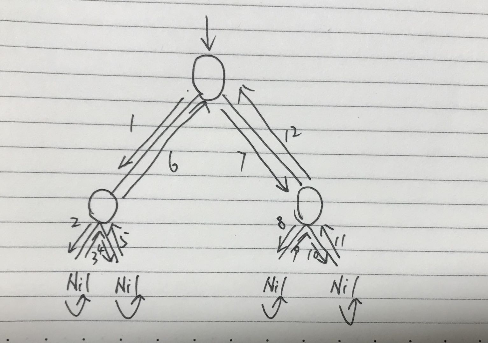
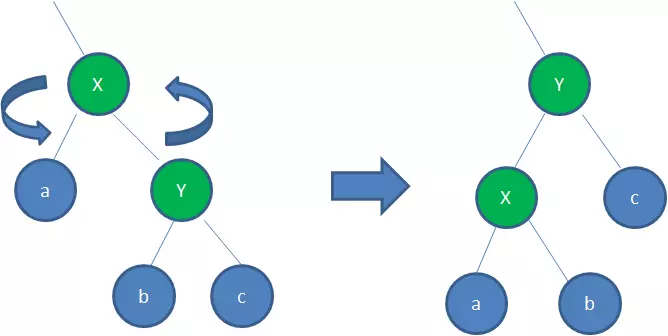
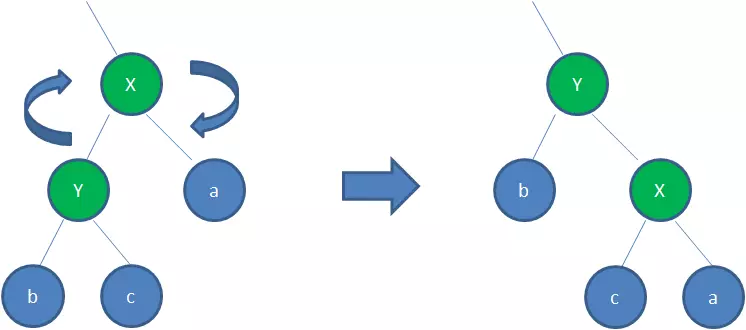

# 树

树的概念：它是一种数据结构，它是有`n(n≥1)` 个有限节点组成的一个具有层次关系的集合。（要点：**它是一种数据结构**，**有层次关系的集合**）。

节点：保存了必要的信息。

节点的度：一个节点拥有的子节点的个数。

树的度：所有节点的度的最大值。

叶子节点：没有子节点的节点，也就是度为0的节点。


## 二叉树

对一般的树加了约束：

1. 每个节点最多拥有2个子树
2. 每个子树有左右之分，左边的叫做左子树，右边的叫做右子树。

二叉树的一些性质：

```shell
叶子节点数:N0
单分支节点数:N1
双分支节点数:N2
1.总节点数 = N0+N1+N2
2.总分支数 = 2N2+N1
3.总分支数 = 总节点数-1
由1.2.3解得:
N0 = N2+1,也就是说,叶子节点数比双分支节点数多一个
```

由上面可以引申出对于任意的一颗树，不管树的度是多少，都有：

`N0 = 1+N2+2N3+3N4......+(n-1)Nn`，`n`为树的度。


## 满二叉树

除了最底层的节点之外，其他层的节点都有左右两个孩子。视觉上来看是个三角形。


## 完全二叉树

除了最底层的节点之外，其他层的节点都有左右两个孩子，在最后一层上只连续缺少右边的若干节点（也就是说最后一层节点连续集中在左边）。

完全二叉树的高度（有2中计算方式）：

```shell
h = [log2(n)] + 1,[]表示向下取整
h = [log2(n+1)],[]表示向上取整
```


## 二叉树的存储结构

### 顺序存储结构


但是顺序存储结构是有局限性的，对于完全二叉树或者满二叉树来说，取的时候可以根据下标来计算从而还原出原来二叉树的逻辑结构，但是其他的树就不满足了，（其实也不能说不满足，例如可以用0占位空的位置，但是这样会浪费很多空间）因此就引申出了树的链式存储结构。

### 链式存储结构


可以看到，在链式存储结构中，一个节点有三个要素：左孩子节点，当前节点数据，右孩子节点。按照这样的结构，我们可以从root节点开始遍历从而得到任何一个节点。

对于非二叉树，也是可以通过上述这种方式存储的，但是首先要稍微的将其转换成二叉树，这里放上自己的一张草图吧：


可以看到，转换成二叉树以后，左线代表的是父子关系，右线代表的是兄弟关系。森林转换成二叉树的思路是一样的，先将每个树转换成二叉树，然后将各个树的根节点用右线连接起来即可。


## 二叉树的遍历

### 广度优先遍历（层次遍历）

从上至下，从左至右进行遍历。如图所示：


遍历后得到的节点依次为：

1.2.3.4.5.6

遍历代码：

```java
public void level(TreeNode root) {
    Queue<TreeNode> queue = new LinkedList<>();
    queue.add(root);
    while (!queue.isEmpty()) {
        // 出栈
        TreeNode poll = queue.poll();
        System.out.print(poll.value + ",");
        if (poll.lChild != null) queue.add(poll.lChild);
        if (poll.rChild != null) queue.add(poll.rChild);
    }
}
```


### 深度优先遍历（先序、中序和后序遍历）

对于一棵二叉树来说，它遍历的路径是：根节点→左子节点→根节点→右子节点→根节点，如果是叶子结点，则叶子结点的左右孩子都是`Nil`结点，如下图所示（图有点儿丑，别见怪，哈哈）：



我们可以看到，除了Nil结点，任何一个结点都有3个箭头指向它，因此：

先序遍历：第一次来到该节点时构成的结果序列就是先序遍历的结果（根→左→右）

中序遍历：第二次来到该节点时构成的结果序列就是中序遍历的结果（左→根→右）

后序遍历：第三次来到该节点时构成的结果序列就是后序遍历的结果（左→右→根）

* 先序遍历

  ```java
  // 递归方式
  public void pre(TreeNode root) {
      if (root == null) return;
      System.out.print(root.value+",");
      pre(root.lChild);
      pre(root.rChild);
  }
  
  // 非递归方式
  public void pre2(TreeNode root) {
      Stack<TreeNode> stack = new Stack<>();
      stack.push(root);
      while(!stack.empty()) {
          TreeNode temp = stack.pop();
          System.out.print(temp.value + ",");
          // 关键在于:右孩子先入栈
          if (temp.rChild != null) stack.push(temp.rChild);
          if (temp.lChild != null) stack.push(temp.lChild);
      }
  }
  ```

* 中序遍历

  ```java
  // 递归方式
  public void in(TreeNode root) {
      if (root == null) return;
      in(root.lChild);
      System.out.print(root.value+",");
      in(root.rChild);
  }
  
  // 非递归方式
  public void in2(TreeNode root) {
      Stack<TreeNode> stack = new Stack<>();
      TreeNode temp = roo;
      while(temp != null || !stack.empty()) {
          // 左孩子都先入栈
          while(temp!=null) {
              stack.push(temp);
              temp = temp.lChild;
          }
          // 左孩子没了,就出栈
          temp = stack.pop();
          System.out.print(temp.value + ",");
          if (temp.rChild != null) {
              temp = temp.rChild;
          }else{
              // 右孩子为空,继续出栈
              temp = null;
          }
      }
      
  }
  ```

* 后续遍历

  ```java
  // 递归方式
  public void post(TreeNode root) {
      if (root == null) return;
      post(root.lChild);
      post(root.rChild);
      System.out.print(root.value+",");
  }
  // 非递归方式
  public static void post2(TreeNode root){
      Stack<TreeNode> stack = new Stack<>();
      TreeNode temp = root;
      TreeNode pre = null;
      while(temp != null || !stack.empty()) {
          while(temp != null) {
              stack.push(temp);
              temp = temp.lChild;
          }
          if (!stack.empty()){
              temp = stack.peek();
              // 右孩子为空或者右孩子刚刚已经出过栈了,代表自己也可以出栈了
              if(temp.rChild == null || temp.rChild == pre) {
                  temp = stack.pop();
                  System.out.print(temp.value + ",");
                  pre = temp;
                  temp = null;
              }else{
                  temp = temp.rChild;
              }
          }
      }
  }
  ```


## 二叉查找树

二叉查找树又叫做二叉搜索树，或者儿茶排序树，对于一棵二叉查找树，其具有以下特点：

1. 若任意节点的**左**子树不为空，那么左子树上的所有节点的值均**小于**它的根节点的值
2. 若任意节点的**右**子树不为空，那么右子树上的所有节点的值均**大于**它的根节点的值
3. 任意节点的左、右子树也是二叉查找树
4. 没有键值相等的节点

二茬查找树的各种操作：

* 插入

  如果待插入的树是一棵空树，直接生成根节点；如果插入的树不是空树，则比较根节点，若大于根节点则去右树，若小于根节点去左树，只到找到叶子结点为止。

  代码如下：

  ```java
  public class BST2 {
      private static TreeNode tree;
      public static TreeNode insert(TreeNode root, TreeNode node) {
          if (root == null) {
              return node;
          }
          if (node == null) {
              return root;
          }
          if (node.value == root.value) {
              System.out.println("插入失败");
              return root;
          } else if (node.value > root.value) {
              root.rChild = insert(root.rChild, node);
          } else {
              root.lChild = insert(root.lChild, node);
          }
          return root;
      }
  
      public static void main(String[] args) {
          TreeNode[] treeNodes = new TreeNode[10];
          Stream.of(5, 3, 4, 6, 8, 9, 2, 7, 1).forEach(integer -> {
              TreeNode treeNode = new TreeNode(integer);
              tree = insert(tree, treeNode);
          });
          in(tree);
      }
  
      /**
       * 中序遍历
       */
      private static void in(TreeNode root) {
          Stack<TreeNode> stack = new Stack<>();
          TreeNode temp = root;
          while (temp != null || !stack.empty()) {
              // 左孩子都先入栈
              while (temp != null) {
                  stack.push(temp);
                  temp = temp.lChild;
              }
              TreeNode pop = stack.pop();
              System.out.println(pop.value + ",");
              if (pop.rChild != null) {
                  temp = pop.rChild;
              } else {
                  temp = null;
              }
          }
      }
  }
  ```

* 删除操作

  如果删除的是叶子结点，则直接删除；如果删除的结点有一个子结点，则直接将子结点移动到被删除的位置；如果删除的节点有两个子结点，这时候采取中序遍历，拿到待删除的下一个结点，然后将其与被删除结点互换，此时待删除的节点已经是叶子结点，直接删除即可。

## 平衡二叉树

又称**平衡二叉搜索树**，平衡二叉树是一棵空树或它的左右两个子树的高度差的绝对值不超过1，并且左右两个子树都是一棵平衡二叉树。平衡二叉树的实现方法有**红黑树**、AVL树、替罪羊树、Treap、伸展树等。

由于普通的二叉查找树会容易失去”平衡“，极端情况下会退化成线性的链表，导致插入和查找的复杂度下降到**O(n)**，所以这也是平衡二叉树设计的初衷。那么平衡二叉树如何保持平衡呢？根据定义：一是左右子树的高度差不能超过1，二是左右子树也是平衡二叉树。

我们知道，平衡二叉树保证其平衡是至关重要的，尤其在插入和删除的时候，保证平衡很重要，而红黑树是平衡二叉树的一种实现。我们接下来来了解下红黑树：


## 红黑树

红黑树是一种含有红黑节点并能自平衡的二叉查找树。它满足下面5个性质

- 性质1：每个节点要么是黑色，要么是红色；
- 性质2：根节点是黑色；
- 性质3：每个叶子节点（NIL）是黑色；
- 性质4：每个红色节点的两个子节点一定都是黑色；
- 性质5：任意一结点到每个叶子节点的路径都包含数量相同的黑节点。

正是因为上面的这些条条框框的限制，才保证了红黑树的自平衡。

为了保持红黑树的规则，会有2种操作：**旋转和变色**。

### 变色

在插入或者删除的时候，为了重新符合红黑树的规则，尝试把红色结点变为黑色，或者把黑色结点变为红色。


### 旋转

旋转又分为左旋转和右旋转

**左旋转：**



左旋就是将节点的右支往左拉，右子节点变成父节点，并把晋升之后多余的左子节点出让给降级节点的右子节点；

**右旋转：**



而右旋就是反过来，将节点的左支往右拉，左子节点变成了父节点，并把晋升之后多余的右子节点出让给降级节点的左子节点。

即左旋就是逆时针旋转变换，右旋就是顺时针旋转变换。不管是左旋还是右旋，**它们的目的都是让结点多的一支出让结点给少的一支。**


### 变色和旋转什么时候用？（变色和旋转组合拳保证红黑树稳定）

待续。。。


