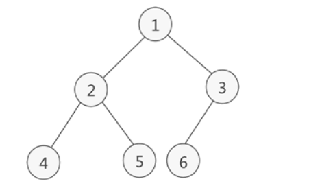

# 树

树的概念：它是一种数据结构，它是有`n(n≥1)` 个有限节点组成的一个具有层次关系的集合。（要点：**它是一种数据结构**，**有层次关系的集合**）。

节点：保存了必要的信息。

节点的度：一个节点拥有的子节点的个数。

树的度：所有节点的度的最大值。

叶子节点：没有子节点的节点，也就是度为0的节点。


## 二叉树

对一般的树加了约束：

1. 每个节点最多拥有2个子树
2. 每个子树有左右之分，左边的叫做左子树，右边的叫做右子树。

二叉树的一些性质：

```shell
叶子节点数:N0
单分支节点数:N1
双分支节点数:N2
1.总节点数 = N0+N1+N2
2.总分支数 = 2N2+N1
3.总分支数 = 总节点数-1
由1.2.3解得:
N0 = N2+1,也就是说,叶子节点数比双分支节点数多一个
```

由上面可以引申出对于任意的一颗树，不管树的度是多少，都有：

`N0 = 1+N2+2N3+3N4......+(n-1)Nn`，`n`为树的度。


## 满二叉树

除了最底层的节点之外，其他层的节点都有左右两个孩子。视觉上来看是个三角形。


## 完全二叉树

除了最底层的节点之外，其他层的节点都有左右两个孩子，在最后一层上只连续缺少右边的若干节点（也就是说最后一层节点连续集中在左边）。

完全二叉树的高度（有2中计算方式）：

```shell
h = [log2(n)] + 1,[]表示向下取整
h = [log2(n+1)],[]表示向上取整
```


## 二叉树的存储结构

### 顺序存储结构


但是顺序存储结构是有局限性的，对于完全二叉树或者满二叉树来说，取的时候可以根据下标来计算从而还原出原来二叉树的逻辑结构，但是其他的树就不满足了，（其实也不能说不满足，例如可以用0占位空的位置，但是这样会浪费很多空间）因此就引申出了树的链式存储结构。

### 链式存储结构


可以看到，在链式存储结构中，一个节点有三个要素：左孩子节点，当前节点数据，右孩子节点。按照这样的结构，我们可以从root节点开始遍历从而得到任何一个节点。

对于非二叉树，也是可以通过上述这种方式存储的，但是首先要稍微的将其转换成二叉树，这里放上自己的一张草图吧：


可以看到，转换成二叉树以后，左线代表的是父子关系，右线代表的是兄弟关系。森林转换成二叉树的思路是一样的，先将每个树转换成二叉树，然后将各个树的根节点用右线连接起来即可。


## 二叉树的遍历

### 广度优先遍历（层次遍历）

从上至下，从左至右进行遍历。如图所示：



遍历后得到的节点依次为：

1.2.3.4.5.6

### 深度优先遍历（先序、中序和后序遍历）

