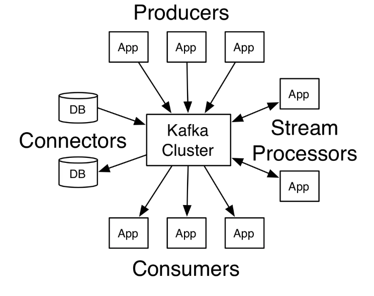
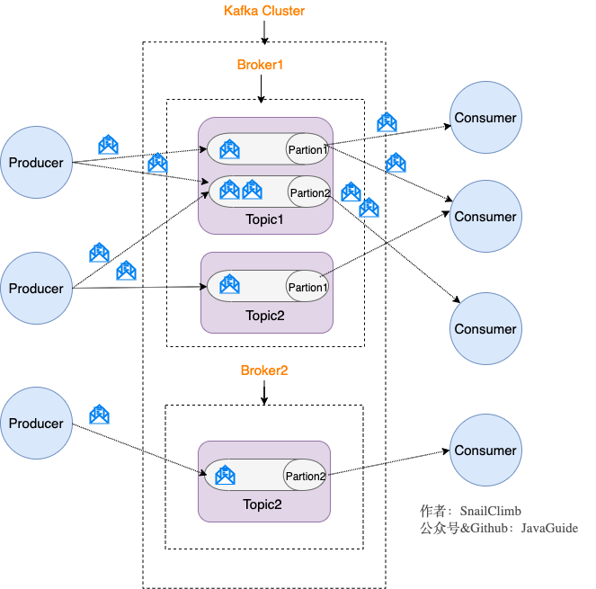
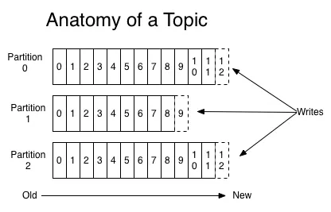
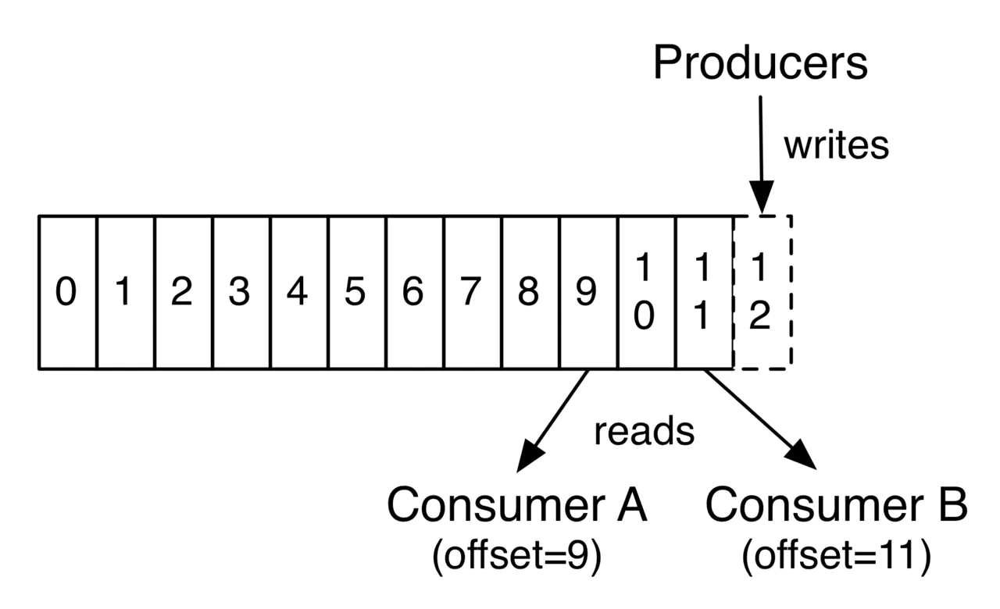

# Kafka

现在一提到消息队列，各个大佬都是说kafka，可见它已经非常的优秀了。Kafka最早是Linkedin开发用来处理海量的日志的，刚开始它并不完备并且有一些小问题如丢失消息、不保证消息可靠性等。随着后续的发展，这些都被Kafka逐渐的完善。它现在已经成为Apache的一个顶级项目了，Kafka作为一个**高吞吐**的**分布式**的消息系统，目前已经被很多公司应用到实际的业务中了，并且**与许多数据处理框架相结合**，比如Hadoop、Spark等。

**一个消息系统应该最基本的能力有：**

* 拥有消息发布和订阅功能

* 能存储消息，并具备容错性

* 能够实时的处理消息

**Kafka是一个分布式流式处理平台，它具备了这些特性：**

* 消息队列：发布和订阅信息流，这个功能类似于消息队列，这也是Kafka也被归类为消息队列的原因。

* 容错的持久方式存储记录消息流：Kafka把消息持久化到磁盘，有效避免了消息丢失的风险。

* 流式处理平台：在消息发布的时候进行处理

**Kafka的一些基本概念：**

* Kafka是运行在一个集群上，所以它可以拥有一个或者多个服务节点
* Kafka集群将消息存储在特定的文件中，对外表现为Topics
* 每条消息记录都包含一个唯一的key、消息内容以及时间戳

**Kafka拥有强大的功能，提供了四大核心API：**

* Producer API 允许应用向Kafka的topics发布消息
* Consumer API 允许引用可以订阅Kafka中的topics，并消费消息
* Stream API 允许应用可以作为消息流的处理者，比如可以从topics A中获取消息，处理完以后将结果发送到topics B中，实现了流式处理（具体可以类比Java 8中的Stream）
* Connector API 提供Kafka与现有的应用或者系统适配的能力，比如与数据库连接器可以捕获表结构的变化

它们与Kafka之间的关系如下图所示：



## 1.Kafka消息模型



发布-订阅模型（Pub-Sub）使用主题（Topic）作为消息通信的载体（中间层），类似于广播模式；发布者发布一条消息，该消息通过主题传递给所有的订阅者，在一条消息广播之后才订阅的用户是收不到该条消息的。由上图我们来看看几个关键的概念：

1. 生产者

   产生消息的一方，发送消息的时候可以指定Topic、Partition、时间戳、key、消息内容。

2. 消费者

   消费消息的一方，消费的时候可以指定topic（可以是多个）、partition等

3. Broker（代理）

   可以看做是一个独立的Kafka实例。多个Kafka Broker组成了Kafka Cluster。

4. Topic

   主题，顾名思义，就是将消息抽象以后分的组，比如我们系统产生的消息有：日志消息、短信消息、邮件消息等，我们将它们按照业务需求划分成一个个主题。每个Broker包含了多个Topic，一个Topic又可以横跨多个Broker。Producer将消息发送到特定的Topic，Consumer通过订阅Topic来消费消息。一个Topic支持多个生产者或消费者同时订阅它。

   

5. Partition

   Partition属于Topic的一部分，相当于元素和集合的关系，1个或者多个Partition构成了一个Topic。同一Topic下的Partition可以分布在不同的broker上，这也是上面提到的一个Topic可以横跨多个Broker的原因。**每个Partition中的消息是有序的**，但多个Partition之间的消息的顺序不能保证，生产者的消息可以指定或者由系统根据算法分配到指定的分区。partition支持消息位移读取，消息位移由消费者自身管理，如下图所示：

   

6. Replica

   Kafka为Partition引入了多副本机制，Partition中的多个副本中会有一个Leader，其他的都是Follower。我们发送的消息会被发送到leader副本，然后follower副本从leader副本中拉取消息进行同步。

   我们真正和数据打交道的是Leader Replica，生产者和消费者只和Leader副本交互。其他副本存在的只是为了保证消息存储的安全性，一个Partition的副本是在不同的Broker上的。当Leader副本发生故障时，会从follower中选举出一个Leader，但是如果Follower中有同步程度达不到要求的则参加不了Leader的选举。

> Kafka的多分区和多副本机制有什么好处呢?
>
> 一个Topic有多个分区，分区可以分布在不同的Broker上，消息发布到到不同的broker上，消费者从不同的broker上消费消息，这样通过负载均衡，从而提供了比较好的并发能力。
>
> 一个Partition可以指定分区数，分区在不同的broker上，当其中一个broker挂掉以后，通过选举，又会有新的leader副本被选举出来，这样提高了容灾能力，实现了高可用，但是也响应的增加了所需的存储空间。

### Consumer（消费者）

Topic根据一定的规则将消息推送给具体的消费者，主要原则如下：

* 若消费者数小于partition数，且消费者数为一个，那么它就消费所有消息；

* 若消费者数小于partition数，假设消费者数为N，partition数为M，那么每个消费者能消费的分区数为M/N或M/N+1；

* 若消费者数等于partition数，那么每个消费者都会均等分配到一个分区的消息；

* 若消费者数大于partition数，则将会出现部分消费者得不到消息分区，出现空闲的情况；

总的来说，Kafka会根据消费者组的情况**均衡分配消息**，比如有消息者实例宕机，亦或者有新的消费者加入等情况。

## 2.Zookeeper在Kafka中扮演的角色

Zookeeper主要为Kafka提供了元数据管理的功能。

kafka中大部分组件都用到了Zookeeper：

* Broker注册 

  `/broker/ids/[0...N]`记录了服务器列表记录，这个**临时的节点**数据是ip端口之类的信息。

  > 临时节点: 临时节点的生命周期是与客户端会话绑定的，会话消失则节点消失。**临时节点只能创建叶子节点，不能创建子节点。**

* Topic注册

  `/broker/topics`记录了topic的分区信息和Broker的对应关系，该节点是**持久节点**。

  > 持久节点：一旦创建就一直存在，直到将其删除

* 生产者负载均衡

  **服务提供者** 在 `zookeeper` 中创建一个临时节点并且将自己的 `ip、port、调用方式` 写入节点，当 **服务消费者** 需要进行调用的时候会 **通过注册中心找到相应的服务的地址列表(IP端口什么的)** ，并缓存到本地(方便以后调用)，当消费者调用服务时，不会再去请求注册中心，而是直接通过负载均衡算法从地址列表中取一个服务提供者的服务器调用服务。

* 消息消费进度Offset记录

  消费者对指定消息分区进行消息消费的过程中，需要定时将分区消息的消费进度 Offset 记录到 ZooKeeper 上，以便消费者进行重启或者其他消费者重新阶段该消息分区的消息消费后，能够从之前的进度开始继续系消费 


## 3.Kafka常见问题

### 3.1 Kafka如何保证消息的顺序性？

我们知道，每次添加消息到Partition（分区）的时候都会采用尾加法，也就是说不管将消息发送到那个分区，都是将消息放到Partition分区的末尾，这样，我么可以保证的是消息在分区中是有序的，但不能保证Topic中的Partition是有序的（怎么理解呢？就是假如一个Topic有2个分区，发送者发送消息到分区中可能是这样的：`partition 0：1,2,4,5,8` `partition 1：3,6,7,9`只有一个消费者订阅了这个Topic，这个消费者获取消息的时候,可能获取的顺序为2,1,3,5,4,6,7,9,8）。那么怎么实现消息的顺序性，也就想实现类似队列（先进先出）的形式？有2种方法：

* 一个Topic只对应一个Partition，消息只在一个partition里面，并且我们知道partition里面的消息本来就是尾加法实现了有序。在消费者端，Kafka能够保证1个Partition只能被一个Consumer消费。这样虽然也可以实现，但是一般不用，因为相当于不用负载均衡了，吞吐量太低了，因为不是需要保证所有的消息顺序，只是某几条消息他们要顺序消费。（问：一定能保证顺序消费嘛？这个要看消费者端的处理逻辑了，如果消费者端把消息收到后又使用多个线程去处理，顺序还是会错乱，只能有一个消费者才能保证消息的顺序性）
* 生产者在发送消息的时候，可以指定`(topic, partition, key) `3个参数，partiton 和 key 是可选的。如果你**指定了 partition**，那就是所有消息发往同1个 partition，就是有序的。并且在消费端，**Kafka 保证1个 partition 只能被1个 consumer 消费**。或者**指定 key**（比如 order id）， **key相同的所有消息，会发往同1个 partition，也是有序的**。

> 我认为，设置一个topic只对应一个partition，这磨灭了kafka最优秀的特性（高吞吐、负载均衡等）；发送时那些需要保证顺序的消息指定partition，没有了负载均衡，当然客户端可以自己实现负载均衡；通过保证key一样使得消息发往同一个partition最灵活。
>
> Kafka适合的场景：适合流式大数据量，要求高吞吐，对数据有序性要求不严格的场景。

### 3.2 Kafka如何保证幂等？


## 4.Kafka安装

kafka使用zookeeper来管理元数据，因此需要先安装zookeeper，安装的docker-compose.yml文件如下：

```shell
version: '3.1'
services:
  zoo_1:
    image: zookeeper:3.5.6
    restart: always
    container_name: zoo_1
    ports:
      - 2181:2181
    volumes:
      - /etc/localtime:/etc/localtime
```

启动命令：`docker-compose up -d`，-d代表后台运行

然后安装kafka，docker-compose.yml文件如下：

```shell
version: '3.1'
services:
  kafka_1:
    restart: always
    image: wurstmeister/kafka:2.12-2.3.0
    container_name: kafka_1
    ports:
      - 9092:9092
    volumes:
      - /etc/localtime:/etc/localtime
    environment:
      KAFKA_BROKER_ID: 1
      KAFKA_ZOOKEEPER_CONNECT: 182.92.115.106:2181/kafka1
      KAFKA_ADVERTISED_LISTENERS: PLAINTEXT://182.92.115.106:9092
      KAFKA_LISTENERS: PLAINTEXT://0.0.0.0:9092
```

**参数解释**：

`-e KAFKA_BROKER_ID=0` ：在Kafka中集群中,每个Kafka都有一个Broker_ID来区分自己

`-e KAFKA_ZOOKEEPER_CONNECT=122.51.109.246:2181/kafka`：配置zookeeper管理kafka的路径122.51.109.246:2181/kafka

`-e KAFKA_ADVERTISED_LISTENERS=PLAINTEXT://122.51.109.246:9092`：把kafka的地址端口注册给zookeeper

`-e KAFKA_LISTENERS=PLAINTEXT://0.0.0.0:9092`：配置kafka的监听端口

`-v /etc/localtime:/etc/localtime wurstmeister/kafka`：容器时间同步docker的宿主机时间

> tips
>
> 使用了最新的zookeeper版本：wurstmeister/zookeeper:lastest 和最新的kafka版本:wurstmeister/kafka:lastest，结果在启动kafka的时候，报错了，错误是连接不上zookeeper，因此更换了上述版本

**启动完成以后，登录进kafka容器，尝试发送消息：**

```shell
[root@VM_0_13_centos ~]# docker exec -it kafka /bin/bash
bash-4.4# cd opt
bash-4.4# ls
kafka             kafka_2.12-2.3.0  overrides
bash-4.4# cd kafka_2.12-2.3.0/
bash-4.4# ls
LICENSE    NOTICE     bin        config     libs       logs       site-docs
bash-4.4# cd bin/
bash-4.4# ls
connect-distributed.sh               kafka-consumer-perf-test.sh          kafka-reassign-partitions.sh         kafka-verifiable-producer.sh
connect-standalone.sh                kafka-delegation-tokens.sh           kafka-replica-verification.sh        trogdor.sh
kafka-acls.sh                        kafka-delete-records.sh              kafka-run-class.sh                   windows
kafka-broker-api-versions.sh         kafka-dump-log.sh                    kafka-server-start.sh                zookeeper-security-migration.sh
kafka-configs.sh                     kafka-log-dirs.sh                    kafka-server-stop.sh                 zookeeper-server-start.sh
kafka-console-consumer.sh            kafka-mirror-maker.sh                kafka-streams-application-reset.sh   zookeeper-server-stop.sh
kafka-console-producer.sh            kafka-preferred-replica-election.sh  kafka-topics.sh                      zookeeper-shell.sh
kafka-consumer-groups.sh             kafka-producer-perf-test.sh          kafka-verifiable-consumer.sh
bash-4.4# ./kafka-console-producer.sh --broker-list localhost:9092 --topic sun
>hello-lee
```

进入到`/opt/kafka_2.12-2.3.0/bin`目录下，使用了`./kafka-console-producer.sh --broker-list localhost:9092 --topic sun` 运行生产者客户端，并发送了一条消息：hello-lee

接下来打开另一个窗口，登录消费者客户端，并订阅名为`sun`的topic：

```shell
[root@VM_0_13_centos ~]# docker exec -it kafka /bin/bash
bash-4.4# cd /opt
bash-4.4# cd kafka_2.12-2.3.0/
bash-4.4# cd bin/
bash-4.4# kafka-console-consumer.sh --bootstrap-server localhost:9092 --topic sun --from-beginning
hello-lee
```

可以看到成功的接收到了hello-lee的消息。

至此，kafka已经安装完毕。

**同样的，我们可以登录zookeeper，看看里面是个啥样子的：**

```shell
# 1.登录zookeeper容器
[root@VM_0_13_centos ~]# docker exec -it zookeeper /bin/bash
# 2.进入bin目录,并看看里面都有些啥
root@3f74f16b91ee:/apache-zookeeper-3.5.6-bin# cd bin
root@3f74f16b91ee:/apache-zookeeper-3.5.6-bin/bin# ls
README.txt  zkCleanup.sh  zkCli.cmd  zkCli.sh  zkEnv.cmd  zkEnv.sh  zkServer-initialize.sh  zkServer.cmd  zkServer.sh  zkTxnLogToolkit.cmd  zkTxnLogToolkit.sh

# 3.运行zkCli.sh进入zookeeper客户端
root@3f74f16b91ee:/apache-zookeeper-3.5.6-bin/bin# ./zkCli.sh
Connecting to localhost:2181
2020-02-23 04:03:30,532 [myid:] - INFO  [main:Environment@109] - Client environment:zookeeper.version=3.5.6-c11b7e26bc554b8523dc929761dd28808913f091, built on 10/08/2019 20:18 GMT
2020-02-23 04:03:30,541 [myid:] - INFO  [main:Environment@109] - Client environment:host.name=3f74f16b91ee
2020-02-23 04:03:30,541 [myid:] - INFO  [main:Environment@109] - Client environment:java.version=1.8.0_242
2020-02-23 04:03:30,545 [myid:] - INFO  [main:Environment@109] - Client environment:java.vendor=Oracle Corporation
2020-02-23 04:03:30,545 [myid:] - INFO  [main:Environment@109] - Client environment:java.home=/usr/local/openjdk-8
...(省略)

# 4.运行`ls /`命令查看zookeeper下面都挂在了那些目录
[zk: localhost:2181(CONNECTED) 5] ls /
[kafka, zookeeper]

更多详细操作，请参考：https://www.jianshu.com/p/e8c29cba9fae
```


参考：

1. https://juejin.im/post/5aa881c26fb9a028c979bfa5#comment
2. <https://mp.weixin.qq.com/s?__biz=Mzg2OTA0Njk0OA==&mid=2247486230&idx=1&sn=24726ec0e0aac72b184023e0bb36e6d0&chksm=cea244ddf9d5cdcb124ec859de6f01f641919124ca50c3a9026a6367334e29faa5d1ebe450b3&token=820400845&lang=zh_CN&scene=21#wechat_redirect>

