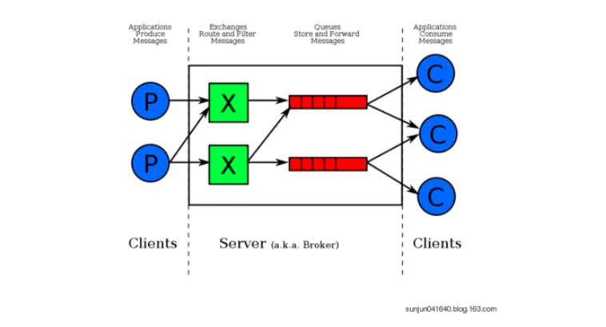

## RabbitMQ

RabbitMQ是用Erlang（面向并发的编程语言）开发的，它是一个开源的，在AMQP基础上完整的，可复用的企业消息消费系统。

### 概览

通常我们谈到队列服务，会有三个概念：消息发送者、队列、消息消费者，RabbitMQ在这个基本的概念之上，多做了一层抽象，在消息发送者和队列之间加入了交换机（Exchange）。这样消息发送者和队列之间就没有直接联系，转而变成消息发送者将消息发送给交换机，交换机根据调度策略再把消息给队列。



* 左边的P代表生产者，也就是往RabbitMQ中发消息的程序
* 中间即是RabbitMQ，也可以将它看做RabbitMQ的服务端，其中包含了交换机和队列
* 右边的C代表了消费者，也就是从消息队列中拿消息的程序

其中比较重要的概念有4个，分别为：虚拟主机、交换机、队列和绑定。

### 虚拟主机

一个虚拟主机有一组交换机、队列和绑定。为什么需要多个虚拟主机呢？很简单，在RabbitMQ中，用户只能在虚拟主机的粒度进行权限控制。如果我们想禁止A组访问B组的交换机/队列/绑定，那么就必须为A和B分别建一个虚拟主机。每一个RabbitMQ服务器都有一个默认的虚拟主机 `/`

### 交换机

交换机（Exchange）用于转发消息，但是它不会做存储，如果没有Queue绑定到该交换机的话，它会直接丢弃掉生产者发送来的消息。这里还有个比较重要的概念：**路由键**，消息发送到交换机的时候，消息里面携带着routingKey，交换机就会根据这个路由键找到应该目的队列（Queue）。

### 队列

也就是消息队列，用来保存消息直到发送给消费者。它是消息的容器，也是消息的终点。一个消息可以投入一个或者多个队列，消息一直在队列里面，等待消费者连接到这个队列将其取走。

### 绑定

也就是说队列需要和交换机进行绑定（不然交换机怎么把消息转发到队列。。。）

### Broker

标识消息队列服务器实体。

### Channel

信道，多路复用连接中一条独立的双向数据流通道。信道是建立在真实的TCP连接之上的，AMQP命令都是通过信道发送出去的，不管是发布消息、订阅队列还是接收消息，这些动作都是通过信道完成。因为对于操作系统来说，建立和销毁TCP连接都是非常昂贵的开销，因此引入了信道的概念，用以**复用一条TCP连接**。


### 交换机类型

交换机不存储消息，它的主要功能是接收到消息以后，将消息转发到绑定的队列。在启用ACK模式后（RabbitMQ默认就是打开的），交换机找不到队列就会返回错误。交换机有四种类型：Direct，Topic，Headers，Fanout

* Direct

  direct类型的行为是“先匹配，再投送”。即在交换机和队列绑定的时候，指定一个routingKey，消息的routingKey匹配的时候，交换机才会把消息发送到对应的队列

* Topic

  按规则转发消息。它转发消息主要是通过通配符，在这种交换机下，队列和交换机绑定的时候会定义一种路由模式。当消息的routingKey和该路由模式匹配的时候，交换机才会将消息发送到对应的队列中。

  在这种交换机下：

  * 路由键必须是一串字符，用英文句号（`.`）隔开单词，比如说：`msg.order.delete`、`msg.order.add`等等

  * 路由模式中可以带`*`和`#`，其中*代表**一个单词**，#代表0或者多个单词（也就是说可以有可以没有），例如：

    ```java
    队列和交换机绑定的时候设置的路由模式为:order.*.delete,发送消息的时候路由键:
    order.delete         不能匹配上
    order.a.delete       能匹配上
    order.a.delete.lee   不能匹配上
    ```

* Headers

  headers 也是根据规则匹配, 相较于 direct 和 topic 固定地使用 routing_key , headers 则是一个自定义匹配规则的类型。
  在队列与交换器绑定时, 会设定一组键值对规则, 消息中也包括一组键值对( headers 属性), 当这些键值对有一对, 或全部匹配时, 消息被投送到对应队列。

* Fanout

  Fanout Exchange 消息广播的模式，不管路由键或者路由模式，*会把消息发给绑定给它的全部队列*，如果配置了routing_key会被忽略。


> **啥叫RabbitMQ的ACK机制（模式）？**
>
> 消费者从RabbitMQ收到消息并处理完成以后，反馈给RabbitMQ，RabbitMQ收到反馈以后才会将该消息从队列中删除。如果一个消费者在处理消息时，出现了网络不稳定，没有收到消息，或者收到消息以后进行ACK应答的时候，应答消息丢了，这个时候RabbitMQ服务端就不会收到ACK反馈，RabbitMQ会认为这个消息没有被正常消费，会将消息重新放回队列中；


它支持6种消息类型：

* 简单队列

  一个生产者，一个消费者，生产者将消息发送到队列，消费者从队列中获取消息消费。

  不足：耦合性高，生产消费一一对应。

* 工作队列

  一般生产者会耗不费力的将消息往队列里面发，但是消费者消费消息的时候可能要做一些逻辑处理，这样处理的速度比发送的速度慢很多的话，就会导致消息队列里面的消息产生积压。因此，有时候需要多个消费者来消费消息。按照分发策略的不同，可以分为以下两种：

  * 轮询分发

    就是消息队列将消息一个一个的往消费者那里发，比如100条消息，2个生产者每人就是50条。其实在简单队列基础上，同时开启多个消费者，使用的就是这种模式。

  * 公平分发

    轮询分发的问题是，有的消息处理起来很简单，有的消息处理起来很费事，很不幸，消费者A接收到的50条消息平均每条需要3秒，而消费者B接收的消息平均每条只需要1秒，这样，B快闲死了，A快累死了。这样就引出了公平分发。在发送的时候通过设置`channel.basicQos(1);`来限制发送者只发不超过一条消息给同一个消费者。当消息处理完毕以后，有了消费者的ack，才会进行第二次发送。所以总体的关键代码是：

    ```java
    // 设置channel每次只发送一条消息给消费者
    channel.basicQos(1);
    
    // 在消费者端:
    // 定义一个消息的消费者
            DefaultConsumer consumer = new DefaultConsumer(channel) {
                @Override
                public void handleDelivery(String consumerTag, Envelope envelope, AMQP.BasicProperties properties, byte[] body) throws IOException {
                    String msg = new String(body, "UTF-8");
                    System.out.printf("[receive 1] %s \n", msg);
                    // 休眠1秒,模拟收到消息以后进行的逻辑处理
                    // 手动确认消息【参数说明，参数1：该消息的index；参数2：是否批量应答，true：批量确认消息index的消息】
                    channel.basicAck(envelope.getDeliveryTag(), false);
                    }
                }
            };
    // 设置为手动应答
    boolean autoAck = false;
    channel.basicConsume(QUEUE_NAME, autoAck, consumer);
    ```

    可以看到，一共有2个步骤：

    1. 设置channel每次只发送一条消息给消费者，当消息被消费者处理完毕以后，有了ack，才会进行第二次发送；如果消费者接收到消息以后没有应答，RabbitMQ就不会发送更多的消息给该消费者了
    2. 设置消费者的应答模式为手动应答。

* 订阅模式Publish/Subscribe

  前面我们说的消息发送出去以后，一条消息只能被一个消费者消费，如果我们想一条消息被多个消费者消费，那该怎么办呢？这个时候就可以用到消息中的**发布/订阅模型**。

  具体怎么操作呢？

  设置Exchange交换机的类型为Fanout类型，然后将需要接受消息的队列与交换机绑定

* 路由模式

  发送消息时指定交换机，设置消息的路由键；队列与交换机绑定的时候，设置路由键

* Topic模式

  发送消息时指定交换机，设置消息的路由键；队列与交换机绑定的时候，设置路由模式


## 

### RabbitMQ如何解决消息丢失的问题

1. 在RabbitMQ中我们可以通过**持久化**来解决因服务器异常重启后导致消息的丢失问题，也就是说消息到达服务器以后，放在队列里面的消息会持久化到硬盘当中，此时消费者还没来得及消费，而RabbitMQ服务器挂掉了，重启以后，消息没有丢，消费者可以继续消费。

2. 生产者将消息发送出去以后，消息到底有没有正确的到达RabbitMQ服务器呢，因为在发消息的中途需要网络传输，这个过程很容易出现问题。默认情况下，消息生产者是不知道有没有正确到达RabbitMQ服务器的（因为RabbitMQ服务器不会反馈给生产者任何信息），这个时候导致的问题是：消息在发送到达服务器之前丢失，即使我们设置了持久化也是解决不了这种问题的，因为消息根本就没有到达RabbitMQ服务器。此时Rabbit为我们提供了两种解决方案：

1. 通过AMQP的事务机制实现，这也是AMQP协议层面提供的解决方案

   ```java
   try {
       String msg = "hello tx!";
       channel.txSelect(); // 开启事务
       channel.basicPublish(exchange_name,queue_name,null,msg.getBytes()); // 发送消息
       channel.txCommit(); // 提交事务
   } catch (Exception e) {
       e.printStackTrace();
       channel.txRollback(); //回滚事务
       System.out.println("[send tx] 出现错误!");
   }
   ```

   这种模式很耗时，而且降低了RabbitMQ的吞吐量。

2. 通过将channel设置成confirm模式来实现

   参考：https://www.cnblogs.com/Mrchengs/p/10531721.html


参考：

<https://juejin.im/post/5a67f7836fb9a01cb74e8931>

<https://juejin.im/post/59687c57f265da6c360a23c8>


