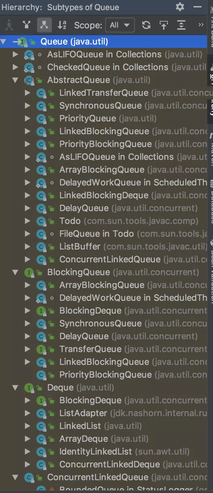

# 什么是消息队列?

消息队列，一般我们会简称它为MQ（Message Queue）。**消息**，是高度抽象化的，它可以是一段数据，也可以是一个请求。**队列**，顾名思义，就是一种先进先出的数据结构。在Java中，已经实现了不少的队列：

其中，我们比较熟悉的有：双端队列（LinkedList），LinkedBlockingQueue，ArrayBlockingQueue，DelayQueue等。

总的来说，消息队列可以简单的理解为：把要传输的数据放在队列中。其中，生产者将消息放入到队列中，消费者从队列中取出消息去消费。

# 为什么要用消息队列？

## 1. 解耦

用户请求A系统，A系统要调用下B系统，C系统，D系统，在A系统中要手动的发起请求，调用B、C、D三个系统；随着业务需求的变更，A系统不需要调用C系统了，同时需要新增一个调用E系统的逻辑，这样就不得不在A系统中增删代码了；随着需求变更，又....；这样看起来A、B、C、D、...系统紧紧的耦合在一起了。引入消息队列以后，A系统只需要向消息队列中发送一条信息（消息中包含了请求其他系统的必要参数），其他系统从消息队列中取消息，然后处理它们自己的逻辑，这样就起到了**解耦**的目的。

## 2. 异步

还是上面的场景，此时A系统调用B系统需要花费200ms，调用C系统需要花费150ms，调用D系统需要花费100ms，如果由A系统去挨个的调用，在自己的线程里就是一个同步调用过程，总共花费的时间为：200+150+100=450ms；如果引入了消息队列，A向消息队列中发送消息花费了20ms，B、C、D从消息队列中取消息也花费了20ms，然后他们各自的处理自己的逻辑，总共花费的时间为：20ms，只有向消息队列发送消息的时候才会耗费时间，它不管B、C、D系统是否消费消息。这样异步化请求之后，总共花费的时间大大的减少了，同时提供了系统的吞吐量。

## 3. 削峰/限流

场景：有个在线商城，现在我们每个月要搞一次大促，大促期间的并发可能会很高的，比如每秒3000个请求。假设我们现在有两台机器处理请求，并且每台机器只能每次处理1000个请求。 那多出来的1000个请求，可能瞬间把我们的系统搞崩溃了。因此我们可以引入消息队列，将每个请求放入到消息队列中；系统B和系统C**根据自己的能够处理的请求数去消息队列中拿数据**，这样即便有每秒有8000个请求，那只是把请求放在消息队列中，去拿消息队列的消息**由系统自己去控制**，这样就不会把整个系统给搞崩。 

# 引入消息队列以后会带来哪些问题？

JDK虽然有不少的队列实现，但它们都是简单的内存实现，要实现消息队列（中间件）可能要考虑到以下问题：

## 1. 高可用

消息中间件如果是单机的，一旦机器挂了，那我们整个系统都可能用不了了。也就是说，引入消息队列以后，我们系统的可用性就会降低，因此，当我们的系统中使用消息队列时，都得是集群/分布式的。

## 2. 数据丢失问题

## 3. 数据重复消费问题

## 4. 需要保证消息的顺序性

