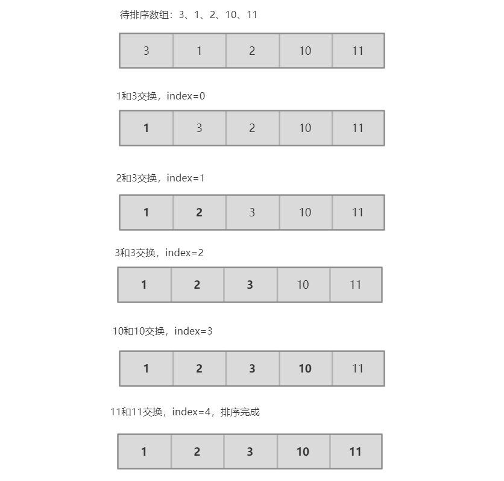

# 选择排序

选择排序算法是排序算法中比较简单而且容易理解的算法。它是这样的：

首先，找到数组中那个最小的元素，其次，将它和数组的第一个元素交换位置（如果第一个元素就是最小元素，就自己和自己交换位置）。再次，在剩下的元素中找到最小的元素，将它和数组中的第二个元素交换位置。如此往复，直到最后一个元素。这种方法就叫做选择排序，因为它不断的选择剩余元素中的最小者。


## 简单原理图



## 选择排序算法的特点

根据选择排序算法的特点，对于N个元素来说，为了实现选择排序，需要进行`N²/2`次比较和`N`次交换

```shell
比较的次数
(N-1)+(N-2)+(N-3)+ ... +3+2+1 = N(N-1)/2 ~ N²/2
交换的次数
N,自己和自己交换也算
```

* 运行时间和输入无关

  为了找出最小的元素而扫描一遍数组并不能为下一遍扫描提供什么信息。这种性质在某些情况下是缺点，因为使用选择排序的人可能会发现，一个已经有顺序的数组或者元素全部相等的数组和一个元素随机的数组所用的时间竟然是一样的。因为对于一个规模为N的数组，不管数组里面装的是什么，这些元素初始时的顺序怎么样，依然要进行N²/2次比较和N次交换。

* 数据移动是最少的

  每次交换总会改变两个位置处元素的值，也能排定一个元素。因此交换的次数总是N，一次交换的次数和数组的大小是线性关系。因此，选择排序的算法时间效率取决于比较的次数。


## 选择排序代码

核心方法：sort方法

```java
public class SelectionSort {
    public static void sort(@NotNull Comparable[] array) {
        for (int i = 0; i < array.length; i++) {
            int minIndex = i;
            for (int j = i + 1; j < array.length; j++) {
                if (less(array[j], array[minIndex])) {
                    minIndex = j;

                }
            }
            exchange(array, i, minIndex);
        }
    }

    /**
     * 验证 a<b
     *
     * @param a
     * @param b
     * @return
     */
    private static boolean less(Comparable a, Comparable b) {
        return a.compareTo(b) < 0;
    }

    /**
     * 交换 下标 i和j 处的值,下标从0开始
     *
     * @param array
     * @param i
     * @param j
     */
    private static void exchange(Comparable[] array, int i, int j) {
        Comparable temp = array[i];
        array[i] = array[j];
        array[j] = temp;
    }

    private static void print(Comparable[] array) {
        for (Comparable comparable : array) {
            StdOut.print(comparable + " ");
        }
        StdOut.println();
    }

    /**
     * 判断数组是否已经排好序(由小到大)
     *
     * @param array
     */
    private static boolean isSorted(Comparable[] array) {
        for (int i = 0; i < array.length - 1; i++) {
            if (less(array[i + 1], array[i])) {
                return false;
            }
        }

        return true;
    }

    public static void main(String[] args) {
        // 测试用例1
        Integer[] array1 = {1, 2, 3, 4, 23, 0, 5, 3};
        sort(array1);
        print(array1);
        System.out.println(isSorted(array1));

        // 测试用例2
        Integer[] array2 = {1};
        sort(array2);
        print(array2);
        System.out.println(isSorted(array2));

        // 测试用例3
        Integer[] array3 = {};
        sort(array3);
        print(array3);


        // 测试用例4
        String[] array4 = {"Hello", "nihao", "world", "World", "a", "A", "b", "B"};
        sort(array4);
        print(array4);
        System.out.println(isSorted(array4));
    }
}

输出:
0 1 2 3 3 4 5 23 
true
1 
true

A B Hello World a b nihao world 
true
```


# 插入排序

我们应该都玩过扑克，有时候整理扑克的时候，想按照2,3,4,5,6....J,Q,K,A来排序。整理的时候会一张一张的来，将每一张牌插入到其他已经有序的牌中的适当位置。在计算机的实现中，为了给要插入的元素腾出足够的空间，我们需要将待插入位置处右边的所有元素向右边移动一位。这种算法叫做**插入排序**。

## 插入排序算法的特点

**与选择排序一样**，当前索引左边的所有元素都是有序的，但它们的最终位置还不确定，为了给更小的元素腾出空间，它们可能移动位置（向右边移动）。但是当索引到达数组右端时，数组排序就完成了。

**和选择排序不同的是**，插入排序所需的时间取决于输入中元素的初始顺序。例如，对于一个很大且其中的元素已经有序（或接近有序）的数组进行排序将会比对随机顺序的数组或是逆序数组进行排序要快得多。

对于随机排列的长度为N且主键不重复的数组，平均情况下插入排序需要 `~N²/4` 次比较以及 `~N² /4` 次交换。最坏情况下需要 `~N² /2` 次比较和 `~N² /2` 次交换，最好情况下需要 `N-1` 次比较和 `0`次交换。

对于一个已经排好序的数组进行排序，所需要的是`N-1`次比较和`0`次交换。

倒置指的是数组中的两个顺序颠倒的元素。比如E X A M P L E 中有11对倒置：E-A，X-A，X-M，X-P，X-L，X-E，M-L，M-E，P-L，P-E以及L-E。当倒置元素很少的时候，插入排序算法是非常快的，甚至比其他的排序算法都快。针对下面的**部分有序**的数组可以执行插入排序：

* 数组中每个元素距离它的最终位置都不远
* 一个有序的大数组接一个小数组
* 数组中只有几个元素位置不正确

插入排序需要的交换操作和数组中倒置的数量相同，需要的比较次数大于等于倒置的数量，小于等于倒置的数量加上数组的大小再减1。因为每次交换都改变了两个顺序颠倒的元素的位置，相当于减少了一对倒置，当倒置数量为0时，排序就完成了。每次交换都对应着一次比较，且1到N-1之间的每个i都可能需要一次额外的比较（在a[i]没有达到数组的左端时）。

## 插入排序代码

核心方法：sort方法

```java
public class InsertionSort {
    public static void sort(@NotNull Comparable[] array) {
        for (int i = 1; i < array.length; i++) {
            for (int j = i; j > 0 && less(array[j], array[j - 1]); j--) {
                exchange(array, j, j - 1);
            }
        }
    }

    /**
     * 验证 a<b
     *
     * @param a
     * @param b
     * @return
     */
    private static boolean less(Comparable a, Comparable b) {
        return a.compareTo(b) < 0;
    }

    /**
     * 交换 下标 i和j 处的值,下标从0开始
     *
     * @param array
     * @param i
     * @param j
     */
    private static void exchange(Comparable[] array, int i, int j) {
        Comparable temp = array[i];
        array[i] = array[j];
        array[j] = temp;
    }

    private static void print(Comparable[] array) {
        for (Comparable comparable : array) {
            StdOut.print(comparable + " ");
        }
        StdOut.println();
    }

    /**
     * 判断数组是否已经排好序(由小到大)
     *
     * @param array
     */
    private static boolean isSorted(Comparable[] array) {
        for (int i = 0; i < array.length - 1; i++) {
            if (less(array[i + 1], array[i])) {
                return false;
            }
        }

        return true;
    }

    public static void main(String[] args) {
        // 测试用例1
        Integer[] array1 = {1, 2, 3, 4, 23, 0, 5, 3};
        sort(array1);
        print(array1);
        System.out.println(isSorted(array1));

        // 测试用例2
        Integer[] array2 = {1};
        sort(array2);
        print(array2);
        System.out.println(isSorted(array2));

        // 测试用例3
        Integer[] array3 = {};
        sort(array3);
        print(array3);
        System.out.println(isSorted(array3));


        // 测试用例4
        String[] array4 = {"Hello", "nihao", "world", "World", "a", "A", "b", "B"};
        sort(array4);
        print(array4);
        System.out.println(isSorted(array4));
    }
}
```


## 使用场景

部分有序的数组，小规模的数组


# 希尔排序

希尔排序是插入排序的进化版本，它先保证h数组有序，h取值是从1,4,13,40...(3h+1)里面取，下面看看关键代码：

```java
public class ShellSort {
    /**
     * 将数组 array 升序排列
     *
     * @param array 待排序的数组
     */
    public static void sort(@NotNull Comparable[] array) {
        int N = array.length;
        int h = 1;
        while (h < N / 3) {
            h = h * 3 + 1; // 1,4,13,40...
        }

        while (h >= 1) {
            // 将数组变为h有序
            for (int i = h; i < N; i++) {
                // 将a[i]插入到a[i-h]、a[i-2*h]、a[i-3*h]...之中,这就是插入排序
                // j >= h是为了保证array[j-h]数组下标不越界
                for (int j = i; j >= h && less(array[j], array[j - h]); j -= h) {
                    exchange(array, j, j - h);
                }
            }

            h = h / 3;
        }
    }


    /**
     * 验证 a<b
     *
     * @param a
     * @param b
     * @return
     */
    private static boolean less(Comparable a, Comparable b) {
        return a.compareTo(b) < 0;
    }

    /**
     * 交换 下标 i和j 处的值,下标从0开始
     *
     * @param array
     * @param i
     * @param j
     */
    private static void exchange(Comparable[] array, int i, int j) {
        Comparable temp = array[i];
        array[i] = array[j];
        array[j] = temp;
    }

    private static void print(Comparable[] array) {
        for (Comparable comparable : array) {
            StdOut.print(comparable + " ");
        }
        StdOut.println();
    }

    /**
     * 判断数组是否已经排好序(由小到大)
     *
     * @param array
     */
    private static boolean isSorted(Comparable[] array) {
        for (int i = 0; i < array.length - 1; i++) {
            if (less(array[i + 1], array[i])) {
                return false;
            }
        }

        return true;
    }

    public static void main(String[] args) {
        // 测试用例1
        Integer[] array1 = {1, 2, 3, 4, 23, 0, 5, 3};
        sort(array1);
        print(array1);
        System.out.println(isSorted(array1));

        // 测试用例2
        Integer[] array2 = {1};
        sort(array2);
        print(array2);
        System.out.println(isSorted(array2));

        // 测试用例3
        Integer[] array3 = {};
        sort(array3);
        print(array3);
        System.out.println(isSorted(array3));


        // 测试用例4
        String[] array4 = {"Hello", "nihao", "world", "World", "a", "A", "b", "B"};
        sort(array4);
        print(array4);
        System.out.println(isSorted(array4));
    }
}
```


# 归并排序

要将一个数组排序，可以先（递归地）将它分成两半分别排序，然后将结果归并起来。归并排序最吸引人的地方在于它能够保证将任意长度为N的数组排序所需的时间和NlogN成正比；它的主要缺点是它所需的额外空间和N成正比。

## 自顶向下排序

对于长度为N的任意数组，自顶向下的归并排序需要 `½NlgN` 到 `NlgN` 此比较，最多需要访问数组 `6NlgN`;

代码:

```java
public class MergeSort {

    /**
     * 归并所需的辅助数组
     */
    private static Comparable[] aux;

    public static void sort(Comparable[] array) {
        aux = new Comparable[array.length]; // 一次性分配空间
        sort(array, 0, array.length - 1);

    }

    /**
     * 将数组 array 升序排列
     * sort()方法的作用在于:安排多次merge()方法调用的正确顺序(本数组要想排序,必须先要让子数组先归并排序)
     *
     * @param array 待排序的数组
     */
    private static void sort(@NotNull Comparable[] array, int low, int high) {
        if (high <= low) {
            return;
        }

        int mid = low + (high - low) / 2;
        // 将左半边排序
        sort(array, low, mid);
        // 将右半边排序
        sort(array, mid + 1, high);

        merge(array, low, mid, high);
    }

    public static void merge(Comparable[] a, int lo, int mid, int hi) {
        int i = lo, j = mid + 1;
        // 先将所有的元素复制到辅助数组aux中,然后再归并会原来的数组a中去
        for (int k = lo; k <= hi; k++) {
            aux[k] = a[k];
        }

        for (int k = lo; k <= hi; k++) {
            if (i > mid) { // 左半边用尽,取右半边的元素王a数组中填充
                a[k] = aux[j++];
            } else if (j > hi) { // 右半边用尽
                a[k] = aux[i++];
            } else if (less(aux[j], aux[i])) { // 右半边的当前元素小于左半边的当前元素,就取右半边的元素
                a[k] = aux[j++];
            } else { // 右半边的当前元素大于等于左半边的当前元素,就取左半边的元素
                a[k] = aux[i++];
            }
        }
    }


    /**
     * 验证 a<b
     *
     * @param a
     * @param b
     * @return
     */
    private static boolean less(Comparable a, Comparable b) {
        return a.compareTo(b) < 0;
    }

    /**
     * 交换 下标 i和j 处的值,下标从0开始
     *
     * @param array
     * @param i
     * @param j
     */
    private static void exchange(Comparable[] array, int i, int j) {
        Comparable temp = array[i];
        array[i] = array[j];
        array[j] = temp;
    }

    private static void print(Comparable[] array) {
        for (Comparable comparable : array) {
            StdOut.print(comparable + " ");
        }
        StdOut.println();
    }

    /**
     * 判断数组是否已经排好序(由小到大)
     *
     * @param array
     */
    private static boolean isSorted(Comparable[] array) {
        for (int i = 0; i < array.length - 1; i++) {
            if (less(array[i + 1], array[i])) {
                return false;
            }
        }

        return true;
    }

    public static void main(String[] args) {
        // 测试用例1
        Integer[] array1 = {3, 2, 4};
        sort(array1);
        print(array1);
        System.out.println(isSorted(array1));

//        // 测试用例2
//        Integer[] array2 = {1};
//        sort(array2);
//        print(array2);
//        System.out.println(isSorted(array2));
//
//        // 测试用例3
//        Integer[] array3 = {};
//        sort(array3);
//        print(array3);
//        System.out.println(isSorted(array3));
//
//
//        // 测试用例4
//        String[] array4 = {"Hello", "nihao", "world", "World", "a", "A", "b", "B"};
//        sort(array4);
//        print(array4);
//        System.out.println(isSorted(array4));
    }
}
```

## 自底向上排序

递归实现的归并排序是算法设计中**分治思想**的典型应用。我们将一个大问题分割成小问题分别解决，然后用所有小问题的答案来解决整个大问题。虽然我们考虑的问题是归并两个大数组，实际上我们归并的数组大多数都非常小。实现归并排序的另一种方法是先归并那些微型数组，然后再成对归并得到子数组，如此这般，直到我们将整个数组归并到一起。这种实现方法比标准递归方法所需的代码量更少。首先我们是两两归并，然后是四四归并，然后是八八归并，一直下去。这也就是归并排序的另一种思路-------自底向上排序：

代码如下：

```java
public class MergeSortBU {

    /**
     * 归并所需的辅助数组
     */
    private static Comparable[] aux;

    public static void sort(Comparable[] array) {
        aux = new Comparable[array.length]; // 一次性分配空间

        int N = array.length;
        for (int sz = 1; sz < N; sz = sz + sz) { // 自低向上,先两两归并,再四四归并,再八八归并...
            for (int lo = 0; lo < N - sz; lo += sz * 2) {//lo:子数组的索引
                // 之所以high要在(lo + sz + sz - 1, N - 1)之中取最小值,是因为最后一次归并时第二个个子数组可能比第一小,为了防止(lo+sz+sz-1)越界,例如有17个元素,如果不过规定的话,租后一次归并时,就会出现越界的情况
                merge(array, lo, lo + sz - 1, Math.min(lo + sz + sz - 1, N - 1));
            }
        }
    }

    public static void merge(Comparable[] a, int lo, int mid, int hi) {
        int i = lo, j = mid + 1;
        // 先将所有的元素复制到辅助数组aux中,然后再归并会原来的数组a中去
        for (int k = lo; k <= hi; k++) {
            aux[k] = a[k];
        }

        for (int k = lo; k <= hi; k++) {
            if (i > mid) { // 左半边用尽,取右半边的元素王a数组中填充
                a[k] = aux[j++];
            } else if (j > hi) { // 右半边用尽
                a[k] = aux[i++];
            } else if (less(aux[j], aux[i])) { // 右半边的当前元素小于左半边的当前元素,就取右半边的元素
                a[k] = aux[j++];
            } else { // 右半边的当前元素大于等于左半边的当前元素,就取左半边的元素
                a[k] = aux[i++];
            }
        }
    }


    /**
     * 验证 a<b
     *
     * @param a
     * @param b
     * @return
     */
    private static boolean less(Comparable a, Comparable b) {
        return a.compareTo(b) < 0;
    }

    /**
     * 交换 下标 i和j 处的值,下标从0开始
     *
     * @param array
     * @param i
     * @param j
     */
    private static void exchange(Comparable[] array, int i, int j) {
        Comparable temp = array[i];
        array[i] = array[j];
        array[j] = temp;
    }

    private static void print(Comparable[] array) {
        for (Comparable comparable : array) {
            StdOut.print(comparable + " ");
        }
        StdOut.println();
    }

    /**
     * 判断数组是否已经排好序(由小到大)
     *
     * @param array
     */
    private static boolean isSorted(Comparable[] array) {
        for (int i = 0; i < array.length - 1; i++) {
            if (less(array[i + 1], array[i])) {
                return false;
            }
        }

        return true;
    }

    public static void main(String[] args) {
        // 测试用例1
        Integer[] array1 = {3, 2, 4};
        sort(array1);
        print(array1);
        System.out.println(isSorted(array1));
    }
}
```


# 快速排序

快速排序是一种分治的排序算法。它将一个数组分成两个子数组，将两部分独立地排序。快速排序和归并排序是互补的：归并排序将数组分成两个子数组进行排序，并将有序的子数组归并以将整个数组排序；而快速排序将数组排序的方式则是当两个子数组都有序时整个数组也就自然有序了。归并排序递归调用是发生在处理数组之前；而快速排序递归调用则是在处理整个数组之后。在归并排序中，一个数组被等分为两半（如果数组个数是奇数，则后一半少一个）；而快速排序中，切分（partition）的位置取决于数组的内容。