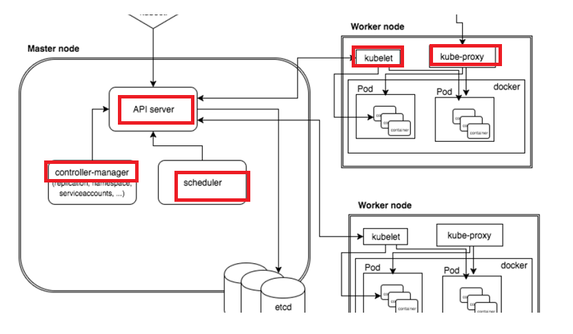

# K8S概识

前置知识：Linux操作系统、Docker

## 第一部分 k8s概念和架构

* Master（主控节点）

  * API Server

    集群统一入口，以restful方式，交给etcd存储

  * controller-manager

    处理集群中常规后台任务，一个资源对应一个控制器

  * scheduler

    几点调度（例如：选择一个节点进行应用部署）

  * etc

    存储系统，用于保存集群中相关数据

* node（工作节点）

  * kubelet

    相当于master派到node节点的代表，用于管理本机容器

  * kube-proxy

    提供网络代理，负载均衡等操作

### 核心概念

#### Pod

* k8s中最小的部署单元
* 它是一组容器的集合
* 当前pod中的容器是共享网络的
* 生命周期是短暂的

#### Controller

* 确保预期pod的副本数
* 进行有状态/无状态应用的部署
* 确保所有的node运行同一个pod
* 一次性任务和定时任务

**通过controller来部署创建pod**

#### Service

* 定义一组pod的访问规则，例如订单服务可能有多个pod，我们可以定义一个订单服务，使得这些pod都向外提供订单服务。

## 第二部分 从零搭建k8s集群

1. 基于客户端工具kubeadm
2. 基于二进制包的方式

## 第三部分 k8s核心概念

## 第四部分 搭建集群监控平台系统

## 第五部分 从零搭建高可用k8s集群

## 第六部分 在集群环境中部署项目

