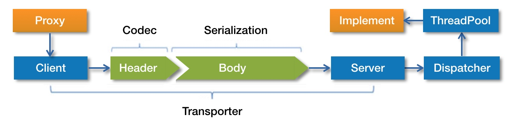

# Dubbo

## Dubbo服务调用过程



首先服务消费者通过代理对象Proxy发起远程调用，接着通过网络客户端Client将编码后的请求给发送给服务提供方的网络层上，也就是Server。Server在收到请求以后，首先要做的事情是对数据包进行解码。然后将解码后的请求发送至分发器Dispatcher，再由分发器将请求派发到指定的线程池上，最后由线程池调用具体的服务。这就是一个远程调用发送与接收的过程。


## 服务调用方式

Dubbo支持同步和异步两种调用方式，其中异步调用还可细分为**有返回值**的异步调用和**无返回值**的异步调用。所谓的无返回值的异步调用指的是服务消费方只管调用但不关心调用结果，此时Dubbo会直接返回一个空的RpcResult。若要使用异步特性，需要消费方手动进行配置。默认情况下，Dubbo使用同步调用方式。

Dubbo默认就是同步调用，我们来看看异步调用是怎么实现的：

```java
@Reference
@Lazy
private BehaviorCollectService behaviorCollectService;

public OutputDTO test2() {
    // 异步调用
    RpcContext.getContext().asyncCall(() -> {
        behaviorCollectService.testAsync("hello");
    });
    return OutputDTO.success("上报成功!");
}
```

在上面的模拟中，testAsync的实现方法中，我sleep了5秒钟的时间，但是调用test2方法的时候是立刻返回“上报成功！”。


