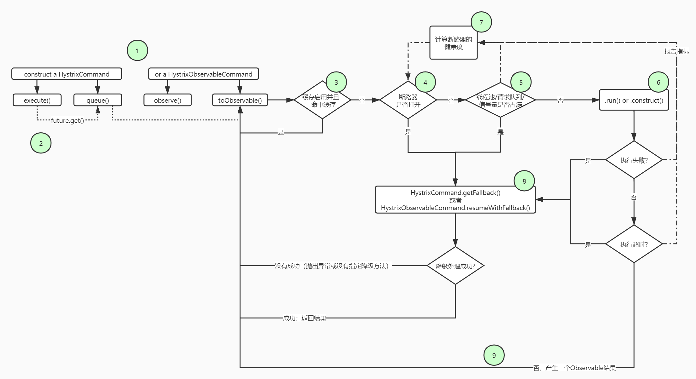

# Hystrix技术详解

## 1.什么是命令模式？

我们先来认识下命令模式

```java
// 1.接收者,处理具体业务逻辑
public class Receiver {
    public void action() {
        System.out.println("我是Receiver,我负责命令的执行");
    }
}

// 2.命令
// 抽象命令
public interface Command {
    void execute();
}
// 命令的具体实现
public class CustomCommand implements Command {
    private Receiver receiver;

    public CustomCommand(Receiver receiver) {
        this.receiver = receiver;
    }

    @Override
    public void execute() {
        if (receiver != null) receiver.action();
    }
}

// 3.命令调用者
public class Invoker {
    private Command command;

    public Command getCommand() {
        return command;
    }

    public void setCommand(Command command) {
        this.command = command;
    }

    public void action() {
        if (command != null) command.execute();
    }
}
```

我们可以看到，命令调用者（Invoker）和操作者（Receiver）通过Command命令实现了解耦，对于调用者来说，我们可以为其注入多个命令操作，比如新建文件、删除文件、复制文件这样三个操作，调用者只需要在需要的时候调用即可，而不需要知道这些操作命令具体是如何实现的。


## 2.Hystrix中的命令模式

Hystrix中通过构建`HystrixCommand`或者`HystrixObservableCommand`对象来表示对依赖服务的操作请求，同时传递所有需要的参数。从其命名中，我们就能知道它采用了命令模式来实现对服务调用操作的封装。而这两个Command对象分别针对不同的应用场景。

* HystrixCommand 用在依赖的服务返回**单个操作结果**的时候
* HystrixObservableCommand 用在依赖的服务返回**多个操作结果**的时候


## 3.命令执行

Hystrix一共存在4种命令的执行方式，而Hystrix在执行时会根据创建的Command对象以及具体的情况来选择一个执行。

其中HystrixCommand实现了下面两个执行方式：

* **execute（）**：同步执行，从依赖的服务返回一个单一的结果对象，或者是在发生错误的时候抛出异常
* **queue（）**：异步执行，它直接返回一个Feture对象，Future对象中包含了服务执行结果时返回的单一结果对象。

而HystrixObservableCommand实现了另外两种执行方式：

* **observe（）**；返回Observable对象，它代表操作的多个结果，它是一个**Hot Observable**。
* **toObservable（）**：同样会返回Observable对象，也代表了操作的多个结果，但它返回的是一个**Cold Observable**对象。

> **Hot Observable和Cold Observable**
>
> 它分别对应上面的`command.observe()`和`command.toObservable`的返回对象。其中Hot Observable，它**不论“事件源”是否有订阅者，都会在创建后对事件进行发布**，所以对于Hot Observable的每一个订阅者都可能是从事件源的中途开始的，并可能只是看到了整个操作流程的**局部**过程，而且Hot Observable和订阅者之间可以是一对多的关系。
>
> 而Cold Observable在没有订阅者的时候并不会发布事件，而是进行等待，直到有订阅者之后才发布事件，当**有多个订阅者的时候，针对每个订阅者Cold Observable都会重新执行一次发射数据流**的代码，因此对于Cold Observable的订阅者，它可以保证从一开始看到整个操作的全部过程。

很明显的是，HystrixObservableCommand中使用了RxJava来实现，然而实际上execute（）、queue（）也都使用了RxJava来实现。我们来看看源码：

```java
public R execute() {
    try {
        return this.queue().get();
    } catch (Exception var2) {
        throw Exceptions.sneakyThrow(this.decomposeException(var2));
    }
}

public Future<R> queue() {
    final Future<R> delegate = this.toObservable().toBlocking().toFuture();
    ...
}
```

* queue()：我们可以看到，`queue()`方法是通过`toObservable()`将当前对象转换成一个Cold Observable,并且通过toBlocking()将该Observable转换成BlockingObservable，BlockingObservable它可以以阻塞式的将数据发射出来。而toFuture方法则把BlockingObservable转换为一个Future，该方法只创建一个Future返回，并不会阻塞，这使得消费者可以自己决定如何处理异步操作。
* execute()：我们可以看到execute直接调用了queue（）方法以后获得一个Future，然后调用Future的get方法实现同步获得任务的执行结果。

需要注意的是：上面两种执行方式都是需要一个Future对象，这就要求Observable只发射一个数据，所以这两个实现只能返回单一的结果。

## 断路器的工作流程



（高清大图请点击：<https://www.processon.com/diagraming/5eaa436ee0b34d05e1ba4191> ）

流程图简述：

1. 


## Hystrix两种隔离模式分析

hystrix隔离模式我只简单的了解2种方式：信号量模式和线程池模式。

### 信号量

信号量，命令在调用线程中执行

### 线程池

命令在线程池执行


## Ribbon的几种负载均衡策略

1. 轮询规则
2. 根据服务是否死掉或者服务处于高并发来分配权重（也就是一个动态调整权重的过程）
3. 根据响应时间来分配权重
4. 随机规则

