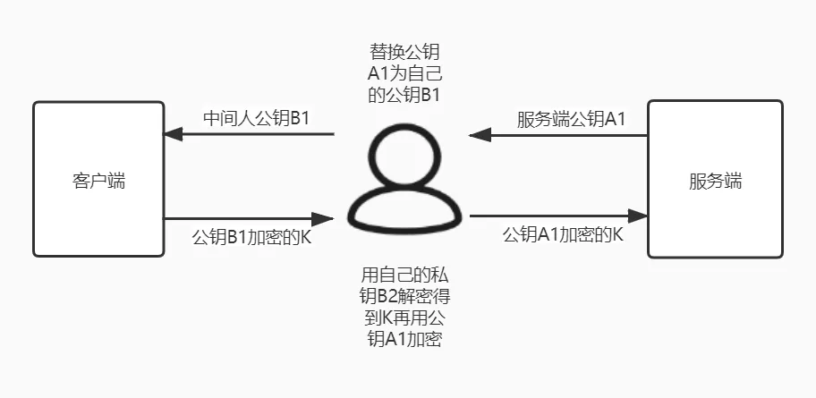

## 1.URI和URL的区别?

URL是一种具体的URI，它不仅唯一标识资源，而且还提供了定位该资源的信息。URI是一种语义上的抽象概念，**可以是绝对的，也可以是相对的**，而URL则必须提供足够的信息来定位，所以，**是绝对的**，而通常说的relative URL，则是针对另一个absolute URL，本质上还是绝对的。

例如：我们数据库找那个存的图片位置如果是：/img/20200420/fjasodifjioasdjf.jpg，那么我们可以认为它是一个URI而不能是URL，因为URL是绝对路径。

参考：<https://www.cnblogs.com/gaojing/archive/2012/02/04/2413626.html>

## 2. HTTPS

安全传输的实现原理：

客户端发送请求给服务端，服务端响应和数字证书（数字证书中包含了公钥Pub、颁发机构信息、公司、域名、有效期等信息），客户端拿到数字证书以后进行验证，验证成功以后提取出数字证书中的公钥Pub并生成随机Key，使用公钥对随机Key加密（我们称之为密文Key），客户端将密文Key发送给服务端，服务端用私钥解密，得到随机Key，然后服务端接下来就使用这个随机Key加密数据传输给客户端，客户端也使用这个随机Key加密数据去请求服务端。其实我们可以看到，随机Key的加密和解密是非对称加密，而客户端和服务端之间使用了随机Key去加密传输的数据是对称加密。

上面这种传输模式看起来很是安全，但是考虑这种情况：

此时遇到的问题是，客户端无法确认给自己响应的公钥Pub是不是自己真实请求的服务端发送过来的。为了解决这个问题，互联网引入了一个公信机构：CA（Catificate Authority）。

这个CA机构是干嘛的呢？

它专门来颁发证书，CA机构自己持有了一对公钥和私钥。它在颁发证书的时候，对证书的明文部分（公司名、域名等）先进行hash，然后再使用自己的秘钥进行加签，就生成了**数字签名**。好嘞，接下来他把公钥和数字签名给了一家互联网公司（注意：私钥是不能给的）。

一般来说，我们的系统或者浏览器中会内置CA机构的证书和公钥信息。

当客户端请求服务端，服务端响应证书（数字签名和明文信息（公司名、域名等））：

1. 客户端拿到证书以后，分解成**明文部分**和**数字签名**
2. 从系统或者浏览器中拿到对应的公钥Pub，使用这个公钥Pub对数字签名进行解签，得到Hash1（哈哈，前面我们不是说这个数字签名是CA机构颁发的嘛，数字签名是通过**私钥加签**的，当然是使用颁发的公钥Pub来解签，这是非对称加密）
3. 从证书（系统或者浏览器的证书）里声明的Hash算法对**明文部分**进行Hash，得到Hash2
4. 如果Hash1=Hash2，则说明明文部分的信息没有被修改，也就是说没有被中间人篡改。

详细解读参考:

<https://mp.weixin.qq.com/s?__biz=MzAwNDA2OTM1Ng==&mid=2453141883&idx=2&sn=3b93d3bed05ec0094a0cae77bf1cc82c&chksm=8cf2dbf8bb8552ee286c4799b30d3847a641760142e50234b12bd042f9d238b3291c161b5996&mpshare=1&scene=24&srcid=&sharer_sharetime=1586915546532&sharer_shareid=dc8fc270d4895826988f6a2f3145b443&key=3337c8b3fa0b953fd153e2f74b6fc4c8be18acc557efb0b3ea9e9e8cd33d8b66e1cc9d88136decafb414cdee56236f2ee5e8d508eace932e49a9c34d6bab3f9ddb67dda9bee7f338247e5e369507a563&ascene=14&uin=MjczMjY2MTk2MA%3D%3D&devicetype=Windows+10+x64&version=6209005f&lang=zh_CN&exportkey=Ayh4TFyq8qEsyc5kL948Wvw%3D&pass_ticket=80pd11DBVmQCEB8Vfw%2FgNWJXsTxsTkzp6T99t8jn79MKYKEtzrdVjK9MtOMDGb%2Bc>