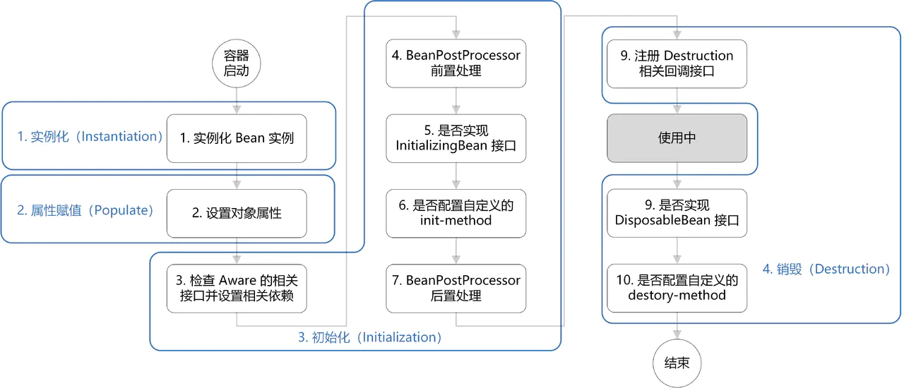
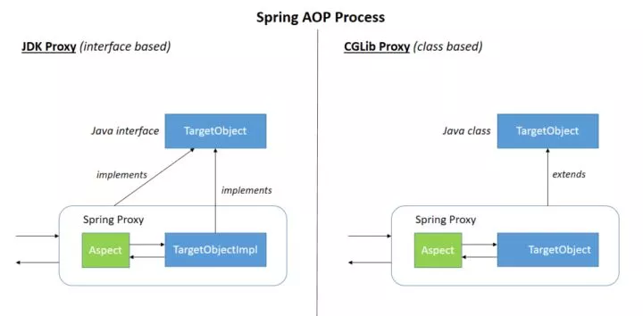
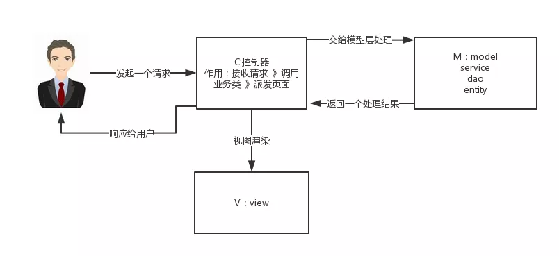
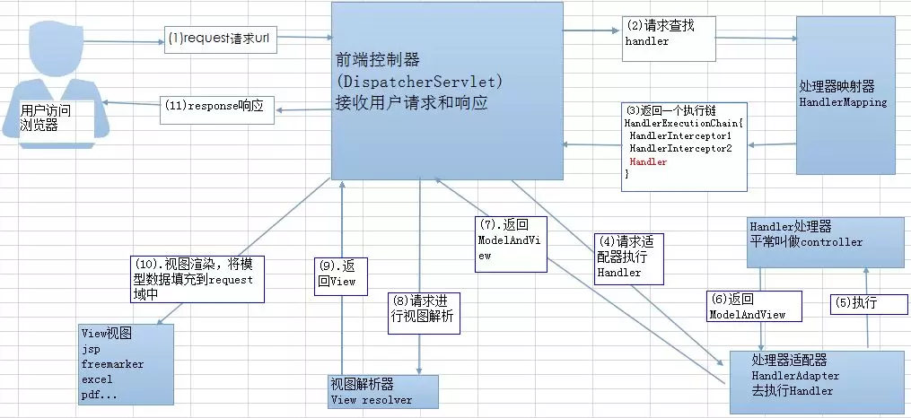

## 1.说说Spring容器的bean实例化过程


## 1. 说说什么是Spring框架？

（回答出Spring框架引入以后能带来哪些帮助，常用哪些模块，IOC和AOP）

我们一般说的Spring框架指的是Spring Framework，它是很多模块的集合，使用这些模块可以很方便的帮助我们开发，它已经做了一些常用组件的测试兼容工作，能够在保证核心容器正常运行的情况下，引入其他例如：发邮件，发消息，定时任务，数据库访问等组件以后正常运行。可以说是当前最流行的web开发一站式解决方案。常用的核心模块有：核心容器、数据访问/集成、Web、AOP（面向切面编程）、工具、消息和测试模块。比如：Core Container中的core组件是Spring所有组件的核心，Beans组件和Context组件是实现IOC和依赖注入的基础，AOP组件用来实现面向切面编程。

Spring 官网列出的 Spring 的 6 个特征: 

- **核心技术** ：依赖注入(DI)，AOP，事件(events)，资源，i18n，验证，数据绑定，类型转换，SpEL。
- **测试** ：模拟对象，TestContext框架，Spring MVC 测试，WebTestClient。
- **数据访问** ：事务，DAO支持，JDBC，ORM，编组XML。
- **Web支持** : Spring MVC和Spring WebFlux Web框架。
- **集成** ：远程处理，JMS，JCA，JMX，电子邮件，任务，调度，缓存。
- **语言** ：Kotlin，Groovy，动态语言。


## 2.列举一些重要的Spring模块。

下图对应的是Spring 4.x版本。目前最新的版本中Web模块的Portlet组件已经被废弃了，同时增加了用于异步响应式处理的WebFlux组件。


* Spring Core：基础，可以说Spring其他所有功能都需要依赖于该类库（例如：spring-beans、spring-core、spring-context等）。主要提供IOC依赖注入功能。
* Spring AOP：提供了面向方面编程的实现。
* Spring Aspects：与AspectJ的集成提供了支持。
* Spring JDBC：Java数据库连接。
* Spring JMS：Java消息服务。
* Spring ORM：用于支持Hibernate等ORM工具。
* Spring Web：为创建Web应用程序提供支持。
* Spring Test：提供了对JUnit 和 TestNG测试的支持。

> Spring AOP和Spring Aspects的区别？
>
> 1. Spring AOP是Spring自己实现的，它提供了面向方面编程的实现，功能基本上已经够用了。Aspects提供了aspectj和spring集成的支持。
> 2. Spring AOP属于运行时增强（动态织入），而AspectJ是编译时增强（静态织入）
> 3. 当我们切面比较少的时候，两者性能差别不是很大。但是如果切面太多的话，最好选择AspectJ，因为它比Spring AOP快很多。
>
> 注意：在使用Spring AOP的时候，如果使用@Aspect注解的话，也要引入aspectj相关的jar包（aspectjweaver.jar），因为这个注解是AspectJ的注解，其实也就是使用了它的注解而已。


## 3.谈谈对于Spring IoC 和 AOP的理解

**IoC：**

（IOC（Inverse of Control：控制反转）答出Spring帮我们创建对象，处理对象之间的依赖，通过依赖注入帮我们解决bean之间复杂的依赖关系）

IOC（Inverse of Control：控制反转）是一种设计思想，就是原本在程序中手动创建对象，交由Spring框架来管理。IOC容器是Spring用来实现IoC的载体，IoC容器实际上是个Map（key，value），Map中存的是各种对象。

将对象之间的相互依赖关系交由IOC容器来管理，并由IoC容器完成对象之间的依赖注入。这样可以很大程度上简化应用的开发，把应用从复杂的依赖关系中解放出来。IOC容器就像一个工厂一样，当我们需要创建一个对象的时候，只需要配置好配置文件/注解即可，完全不用考虑对象是如何被创建出来的。

一般我们使用xml来配置bean，后面注解配置慢慢流行起来了。

### 3.1 简单说说Spring IOC初始化过程。或者说IOC是怎么实现的。

1. 容器配置文件，例如xml配置文件，里面包含了`<bean>`标签

2. 通过ResourceLoader将资源加载出来（我们的ApplicationContext实现了ResourceLoader，因此它是有加载资源的能力的）

3. 通过ResourceLoader加载资源后生成各种Resource（在Resource中定义了许多策略方法，它使用到了策略模式）

4. 通过BeanDefinitionReader组件将Resource读取并解析成一个个的BeanDefinition对象

5. 将BeanDefinition注册到BeanFactory当中去（BeanFactory指的是BeanDefinitionRegistry，使用Map<String,BeanDefinition>对象来保存这些信息）

   深入理解参考：<https://juejin.im/post/5ab30714f265da237b21fbcc> 

### 3.2 Spring IOC中bean的生命周期



补充：BeanPostProcessor接口是Spring对外扩展的接口之一，它的主要用途是提供一个机会，让开发人员能够插手bean的实例化过程。通过实现这个接口，我们就可以在bean的实例化时，对bean进行一些处理。比如我们熟悉的AOP就是在这里将切面的逻辑织入bean当中的。正式因为有了BeanPostProcessor接口作为桥梁，才使得AOP可以和IOC容器产生关联。

深入理解参考：<https://juejin.im/post/5e4791a7f265da5715630629> 


**AOP：**

AOP（Aspect-Oriented Programming：面向切面编程）能够将那些与业务无关，却为业务模块共同调用的逻辑或责任（例如事务处理、日志管理、权限控制等）封装起来，便于减少系统的重复代码，降低模块间的耦合度，并有利于未来的可扩展性和可维护性。

Spring AOP就是基于动态代理的，如果代理的对象实现了某个接口，那么Spring AOP会使用JDK Proxy，去创建代理对象；而对于没有实现接口的对象，就无法使用JDK Proxy去进行代理了，这时候Spring AOP会使用CGLib，这时候Spring AOP会使用CGLib生成一个被代理对象的子类作为代理。



> tips：复习下Java的动态代理
>
> ````java
> public interface People {
>     void say();
> }
> 
> public class Student implements People {
>     @Override
>     public void say() {
>         System.out.println("Hello,I am a Student!");
>     }
> }
> 
> public class PeopleProxy implements InvocationHandler {
>     // 代理的对象(也就是你要代理的类的实例)
>     private Object target;
> 
>     public PeopleProxy(Object target) {
>         this.target = target;
>     }
> 
>     /**
>      * 相当于包装类(装饰者模式)
>      * 每次调用被包装的实例的方法以后,都会走到这个方法中
>      *
>      * @param proxy  代理的实际实例例如 Student实例
>      * @param method 实例的方法
>      * @param args   参数
>      * @return
>      * @throws Throwable
>      */
>     @Override
>     public Object invoke(Object proxy, Method method, Object[] args) throws Throwable {
>         method.invoke(target, args); // 执行被代理类自身的方法
>         System.out.println("你好,我是额外添加的方法");
>         return null;
>     }
> }
> 
> // 测试
> public class Main {
>     public static void main(String[] args) {
> 
>         /*
>         参数说明:arg0:类加载器
>                 arg1:将要实现的接口
>                 arg2:一个InvocationHandler
>          */
>         People people = (People) Proxy.newProxyInstance(People.class.getClassLoader(),
>                 new Class[]{People.class}, new PeopleProxy(new Student()));
>         people.say();
>     }
> }
> ````


我们可以直接使用AspectJ，Spring AOP已经集成了AspectJ，AspectJ应该算是Java生态系统中最完善的AOP框架了。

使用AOP之后，我们可以把一些通用的功能抽象出来，在需要用到的地方直接使用即可，这样大大简化了代码量。并且降低了和业务模块的耦合，易于扩展和维护。

### 3.3 简单说说Spring AOP的实现原理，或者说它的实现过程

Spring Aop实现的代码非常非常的绕。也就是说 Spring 为了灵活做了非常深层次的抽象。同时 Spring为了兼容 `@AspectJ` 的Aop协议，使用了很多 Adapter （适配器）模式又进一步的增加了代码的复杂程度。 Spring 的 Aop的原理可以分为代理对象的创建和代理对象的调用两个过程：

代理的创建（按步骤）：

1. 首先创建代理工厂，代理工厂需要3个重要的信息：拦截器数组，目标对象接口数组，目标对象

2. 创建代理工厂时，默认会在拦截器数组尾部再增加一个默认拦截器----用于调用被代理对象的目标方法

3. 当调用getProxy方法的时候，会根据接口数量（是否大于0），判断是使用JDK还是CGLib创建一个代理对象

   注意：创建代理对象时，同时会创建一个外层拦截器，这个拦截器就是 Spring 内核的拦截器。用于控制整个 AOP 的流程。 

代理的调用

1. 当对代理对象进行调用时，就会触发外层拦截器
2. 外层拦截器根据代理配置的信息，创建**内层拦截器链**。创建的过程中，会根据表达式判断当前拦截是否匹配这个拦截器。而这个拦截器链模式就是**职责链模式**。
3. 当整个链条执行到最后时，就会触发创建代理时那个尾部的默认拦截器，从而调用目标方法。最后返回。

参考：<https://juejin.im/post/5bbff7daf265da0aef4e330c> 


> AOP有五种类型的通知（Advice）
>
> Before、After、Around、After-Returning，After-Throwing


>  这道题还可以回答的更全面些，例如还可以答`Spring AOP基于AspectJ注解是如何实现AOP的`  ?
>
> **AspectJ是一个AOP框架，它能够对java代码进行AOP编译（一般在编译期进行），让java代码具有AspectJ的AOP功能（当然需要特殊的编译器）**，可以这样说AspectJ是目前实现AOP框架中最成熟，功能最丰富的语言，更幸运的是，AspectJ与java程序完全兼容，几乎是无缝关联，因此对于有java编程基础的工程师，上手和使用都非常容易。Spring注意到AspectJ在AOP的实现方式上依赖于特殊编译器(ajc编译器)，因此Spring很机智回避了这点，转向采用动态代理技术的实现原理来构建Spring AOP的内部机制（动态织入），这是与AspectJ（静态织入）最根本的区别。**Spring 只是使用了与 AspectJ 5 一样的注解，但仍然没有使用 AspectJ 的编译器，底层依是动态代理技术的实现，因此并不依赖于 AspectJ 的编译器**。 Spring AOP虽然是使用了那一套注解，其实实现AOP的底层是使用了动态代理(JDK或者CGLib)来动态植入。
>
> （参考：<https://snailclimb.gitee.io/javaguide/#/docs/system-design/framework/spring/Spring?id=springaopioc%e5%ae%9e%e7%8e%b0%e5%8e%9f%e7%90%86> ）
>
> 关键: AspectJ是在编译期进行织入，是静态织入，但是需要特殊的编译器；Spring AOP使用了AspectJ的注解，但是没有引入它的编译器，底层使用的是动态代理技术的实现。


 ## 4.Spring中Bean的作用域有哪些

* singleton

  唯一的Bean实例，Spring中的bean默认都是单例的

* prototype

  每次请求都会创建一个新的实例

* request

  每次HTTP请求都会创建一个新的Bean，该Bean只在当前的request中有效

* session

  每次用户的会话仅创建一个bean，该Bean只在当前的session中有效。它在会话结束时被破坏销毁掉

* session-global

  全局session作用域，仅仅在基于portlet的web应用中才有意义，Spring5已经移除掉portlet这个模块了，转而用webflux代替了。

  > Portlet是能够生成语义代码(例如：HTML)片段的小型Java Web插件。它们基于portlet容器，可以像servlet一样处理HTTP请求。但是，与 servlet 不同，每个 portlet 都有不同的会话。


## 5.Spring中的单例bean的线程安全问题了解吗？

单例的Bean存在线程安全问题，主要是当多个线程同时访问一个对象的时候，这个对象的全局共享属性的写操作会存在线程安全的问题。

常见的两种解决办法：

* 在Bean对象中尽量避免定义全局共享的属性（不太现实）

* 在类中定义一个ThreadLocal成员变量，将需要的可变成员变量保存在ThreaLocal中（推荐）

  > **ThreadLocal的实现原理**
  >
  > 首先，它是一个数据结构，有点儿像HashMap，可以保存“key-value”键值对，key是和当前线程相关的，value就是通常我们想放的线程私有化数据，这样可以保证线程安全。
  >
  > ThreadLocal中定义了一个ThreadLocalMap静态内部类，在Thread实例中持有了这样一个对象，ThreadLocalMap内部是一个Entry数组，初始化时大小是16，Entry对象用来保存每一个key-value键值对，这里的key是ThreadLocal对象，当通过ThreadLocal对象的set方法，会将ThreadLocal对象作为key，要保存的值当做value，然后放到ThreadLocalMap持有的Entry数组里面去。
  >
  > 以ThreadLocal作为key其实是要计算Hash（通过ThreadLocal对象的threadLocalHashCode属性）的，所以就会出现hash冲突的情况，ThreadLocalMap不像HashMap那样，为了解决Hash冲突的情况使用了数组+链表的形式。ThreadLocal使用set时，当hash冲突的时候，会在Entry数组中找下个空的节点，直到存进去为止。
  >
  > 取的时候，调用get方法，先拿到当前线程持有的ThreadLocalMap，然后根据ThreadLocal对象的hash值，定位到Entry数组中的位置（注意不是从0开始的），接下来判断该位置Entry对象中的key是否和get的key一致，如果不一致就判断下一个位置。
  >
  > 因此可以看到，set和get如果hash冲突严重的话，会影响性能，效率很低。
  >
  > **ThreadLocal会引发内存泄漏吗？如何避免？**
  >
  > 会引发内存泄漏。ThreadLocalMap里面的Entry继承了WeakReference（虚引用，引用级别最低的一种），Entry中的key（ThreadLocal）被虚引用保存着，在下一次GC时，ThreadLocal在没有其他的强引用引用的话，就会被回收，如果创建ThreadLocal的线程一直在运行（也就是说没有时间发生GC）时，Entry里面引用的value就有可能一致得不到回收，发生内存泄漏。
  >
  > 在调用ThreadLocal的get和set方法之后可能会清除ThreadLocalMap中key为null的entry，这样value就没有GC Roots可达了，下次GC的时候就可以被回收掉了。我们可以在使用完set方法之后手动的调用remove方法：
  >
  > ```java
  > ThreadLocal<String> localName = new ThreadLocal();
  > try {
  >     localName.set("占小狼");
  >     // 其它业务逻辑
  > } finally {
  >     localName.remove();
  > }
  > ```
  >
  > 参考：<https://juejin.im/post/5a64a581f265da3e3b7aa02d> 


## 6.说说你自己对Spring MVC的了解

谈到这个问题，我们不得不提到之前Model1和Model2这两个没有Spring MVC的时代：

* Model1时代

  我自己几乎没有使用过。在Model1模式下，这个Web应用几乎全部由JSP页面组成，只用少量的JavaBean来处理数据库连接、访问等操作。因此我们可以想到在JSP中嵌套了大量的java代码。在这个模式下，JSP既是控制层又是表现层。显而易见这种模式存在很多问题，比如：1.将控制逻辑和表现逻辑耦合在一起，导致代码重用率极低；2.前端和后端相互依赖，难以进行测试并且开发效率极低。

* Model2时代

  它就是 `JavaBean（Model）+JSP（View）+Servlet（Controller）` 这种开发模式就是早期的JavaWeb MVC开发模式。

  * Model：系统涉及的数据，也就是Dao和Bean。
  * View：展示模型中的数据，只是用来展示。
  * Controller：处理用户的请求，并将数据返回给JSP展示给用户。

  Model2模式下还存在大量问题，它的抽象和封装程度还远远不够，使用Model2进行开发时不可避免的重复造轮子，这大大降低了程序的可维护性和复用性。

于是就诞生了Struts，比如Struts2，它依然比较笨重，而且侵入式还很严重（我们使用struts的时候，必须要继承一些类）。

最终Spring生态圈出现了Spring MVC，Spring MVC是当前最优秀的MVC框架。相比于Struts2，Spring MVC使用更加简单和方便，开发效率更高，并且它的运行速度更快。MVC 是一种设计模式,Spring MVC 是一款很优秀的 MVC 框架。Spring MVC 可以帮助我们进行更简洁的Web层的开发，并且它天生与 Spring 框架集成。Spring MVC 下我们一般把后端项目分为 Service层（处理业务）、Dao层（数据库操作）、Entity层（实体类）、Controller层(控制层，返回数据给前台页面)。 

Spring MVC的简单原理如下图：




## 7.Spring MVC的工作原理了解吗?

原理图如下所示：




DispatcherServlet的作用是接收请求并响应结果，它在整个链中充当了大管家的角色。

流程说明：

1. 用户发送请求
2. 前端控制器DispatcherServlet接收请求，调用处理器映射器HandlerMapping，解析对应的Handler，并生成了一个调用链HandlerExecutorChain（interceptor+handler，handler就是controller）返回给DispatcherServlet
3. 前端控制器调用处理器适配器执行相应的Handler，并返回ModelAndView给前端控制器，Model是返回的数据对象，View是逻辑上的视图（他可能只是一个地址，例如：“index"）
4. 视图解析器ViewResolver会根据View查找实际的View（比如由”index“拼上前后缀得到真实页面是”/mall/index.html"）
5. 前端控制器根据Model结合View进行视图渲染
6. 把View返回给请求者

> 扩展1：通过@ResponseBody注解以后，返回的数据是JSON格式，它的视图解析器是什么？
>
> 没有视图解析器了。@ResponseBody注解的作用是将controller的方法返回的对象通过适当的转换器转换为指定的格式后，写入到response对象的body区，通常返回的数据是Json或者xml。使用此注解以后就不会尝试走视图解析器了，而是直接将数据写入到输出流。


## 8.Spring框架中用到了那些设计模式？

* **控制反转（IOC）和依赖注入（DI）**

  IOC是Spring中非常重要的一个概念，它不是一门技术，而是一种解耦的设计思想。它的主要目的是借助于Spring中的IOC容器实现具有依赖关系的对象之间的解耦，从而降低了代码之间的耦合。Spring IOC容器就像一个工厂一样，当我们需要创建一个对象的时候，我们只需要配置文件/注解来表现出对象之间的依赖，完全不用考虑对象是如何创建出来的。IOC负责创建对象，完成对对象的初始化，管理对象的声明周期。DI是实现控制反转的一种设计模式，DI就是将实例变量传入另一个对象当中去。

* **工厂设计模式**

  Spring使用工厂模式通过BeanFactory、ApplicationContext创建bean对象

  两者对比：

  * BeanFactory：延迟注入，当使用到某个对象的时候才会去创建（也就是第一次去获取Bean的时候，如果Bean还没有创建才会去创建），它会占用更少的内存，程序启动速度更快。

  * ApplicationContext

    容器启动的时候，不管你有没有用到，一次性创建所有的bean。BeanFactory仅提供了最基本的依赖注入支持，ApplicationContext扩展了BeanFactory，除了有BeanFactory的功能以外还有更多额外的功能（因为ApplicationContext接口继承了EnvironmentCapable、MessageSource、ApplicationEventPublisher等等接口，就拥有了读取环境配置、获取资源、事件发布等等的能力），所以开发人员使用更多的是ApplicationContext

    ApplicationContext的三个实现类：

    * ClassPathXmlApplication：从类路径载入xml文件从而加载上下文
    * FileSystemXmlApplication：从文件系统加载xml文件从而载入上下文
    * XmlWebApplicationContext：从web系统载入xml文件作为上下文的配置信息

* **代理设计模式**

  AOP能够将那些与业务无关的，但是又为业务模块所公共调用的逻辑或者责任（例如事务处理、事务、日志处理）封装起来，便于减少重复代码，降低系统耦合度，有利于将来应用的扩展和维护。

  Spring AOP就是基于动态代理的，如果要代理的对象实现了某个接口，就使用Java Proxy生成一个代理对象；而对于没有实现接口的对象，就使用Cglib去生成被代理对象的子类来作为代理。

  当然Spring AOP也集成了AspectJ，AspectJ算是Java生态系统中最完整的AOP框架了。

  > Spring AOP和AspectJ有什么区别？
  >
  > Spring AOP使用了运行时增强，而AspectJ是编译时增强。Spring AOP因为集成了Aspect因此我们主要是使用了它的一些注解，例如@Aspect就是AspectJ的注解。AspectJ使用到了特殊的编译器。如果我们的切面比较少，那么选用Spring AOP就足够了，如果切面比较多的话，最好选用AspectJ，AspectJ比Spring AOP快得多。

* **单例设计模式**

  那些场景我们应该使用单例模式：

  有些对象我们只需要一个，例如：线程池、缓存、对话框、注册表、日志对象等等。事实上这些对象我们只需要一个，创建多了是对系统资源的过度消耗等问题

  使用单例模式的好处：

  对于频繁使用的对象，可以省略创建的时间；对于重量级的对象而言，可以省掉一笔非常可观的时间和资源消耗；减少了new操作的次数，因而减少了内存的使用量，省掉了创建对象所需的io，而且减少GC压力，缩短GC停顿时间。

  Spring中默认创建的对象是单例（singleton）的。

  SPring中单例的实现方式：在xml中通过`<bean>` 标签配置对象；通过注解`@Scope(value="singleton")` ，如果不显示指定，默认也是singleton。然后通过`ConcurrentHashMap`实现单例注册表的特殊方式实现单例模式。Spring实现单例模式的核心代码如下：

* 模板方法设计模式

  模板方法设计模式是一种行为设计模式，它定义了一个操作中的执行骨架，而将一些步骤延迟到子类中去了。（想想好像在 JUC中是不是也大量使用了这种模式呢，JUC是基于AQS实现的，AQS是一个同步器，设计模式使用了模板方法设计模式）。模板方法可以使得子类可以不改变一个算法的结构即可重定义该算法的某些特定步骤的实现方式。

  Spring中的JdbcTemplate、HibernateTemplate等以Template结尾的对数据库操作的类，它们就使用到了模板方法设计模式。一般情况下，我们都是 使用继承的方式来实现模板模式，但是Spring并没有采取这种方式，而是使用了Callback模式与模板方法配合，既达到了代码复用的效果，同时增强了灵活性。

* 包装器设计模式

* 观察者模式

  观察者模式是一种对象行为型模式。它表示一种对象与对象之间具有依赖关系，当一个对象或者对象的状态发生改变时，这个对象所依赖的对象也做出反应。Spring中的事件驱动模型就是观察者模式中一个很经典的应用。

  事件驱动模型中的三种角色：

  1. 事件

     ApplicationEvent充当事件角色，这是一个抽象类，它集成了`java.util.EventObject` 并实现了`java.io.Serializable`。

     Spring中默认存在以下事件，它们都是对ApplicationContextEvent的实现：

     * `ContextStartedEvent`：`ApplicationContext` 启动后触发的事件;
     * `ContextStoppedEvent`：`ApplicationContext` 停止后触发的事件;
     * `ContextRefreshedEvent`：`ApplicationContext` 初始化或刷新完成后触发的事件;
     * `ContextClosedEvent`：`ApplicationContext` 关闭后触发的事件。

  2. 事件发布者

     ApplicationEventPublisher充当了事件发布者角色，它也是一个接口

     ```java
     @FunctionalInterface
     public interface ApplicationEventPublisher {
     	default void publishEvent(ApplicationEvent event) {
     		publishEvent((Object) event);
     	}
     	void publishEvent(Object event);
     
     }
     ```

     `ApplicationEventPublisher` 接口的 `publishEvent` 方法在`AbstractApplicationContext`中被实现，阅读这个方法的实现，我们会看到事件真正是通过`ApplicationEventMulticaster` 来广播出去的。

  3. 事件监听者

     ApplicationListener充当了事件监听者的角色，它是一个接口，里面定义了一个onApplicationEvent（）方法来处理ApplicationEvent。使用示例如下：

     ```java
     // 定义一个事件,继承自ApplicationEvent并且写相应的构造函数
     public class DemoEvent extends ApplicationEvent{
         private static final long serialVersionUID = 1L;
     
         private String message;
     
         public DemoEvent(Object source,String message){
             super(source);
             this.message = message;
         }
     
         public String getMessage() {
              return message;
               }
     
     
     // 定义一个事件监听者,实现ApplicationListener接口，重写 onApplicationEvent() 方法；
     @Component
     public class DemoListener implements ApplicationListener<DemoEvent>{
     
         //使用onApplicationEvent接收消息
         @Override
         public void onApplicationEvent(DemoEvent event) {
             String msg = event.getMessage();
             System.out.println("接收到的信息是："+msg);
         }
     
     }
     // 发布事件，可以通过ApplicationEventPublisher  的 publishEvent() 方法发布消息。
     @Component
     public class DemoPublisher {
     
         @Autowired
         ApplicationContext applicationContext;
     
         public void publish(String message){
             //发布事件
             applicationContext.publishEvent(new DemoEvent(this, message));
         }
     }
     ```

* **适配器模式**

  适配器模式将某个类的接口转换成客户端期望的另一个接口表示，主要的目的是兼容性，让原本因接口不匹配而不能一起工作的两个类可以协同工作。其别名为包装器（Wrapper）。

  我们可以将需要被适配的类、接口、对象（我们有的），简称为src（source）；最终需要的输出（我们想要的），简称为dist（destination），适配器称之为Adapter。适配器给我们的感觉就像是：**src->Adapter->dst**，即src以某种形式（三种形式分别对应三种适配器模式）给到Adapter里，最终转化成了dst。

  更多关于适配器模式的介绍参考：<https://blog.csdn.net/zxt0601/article/details/52848004>

  **Spring AOP中的适配器模式：**

  我们知道Spring AOP的实现是基于代理模式，但是Spring AOP的增强或通知（Advice）使用到了适配器模式，与之相关的是`AdvisorAdapter`。Advice常用的类型有：

  * `BeforeAdvice`（前置通知，方法执行前）
  * `AfterAdvice`（后置通知，目标方法执行后，不管是正常执行还是抛出异常）
  * `AfterReturningAdvice`（目标方法返回之后，可以对目标方法的返回值进行处理）
  * `AfterThrowingAdvice` 目标方法抛出异常之后
  * `AroundAdvice` 环绕通知

  每个类型的通知都会被适配（转化）成相应的 `MethodInterceptor` 接口类型的对象，如何适配呢，那就是处于中间的适配器了，比如BeforeAdvice使用了MethodBeforeAdviceInterceptor适配成了MethodInterceptor：

  ```java
  public class MethodBeforeAdviceInterceptor implements MethodInterceptor, BeforeAdvice, Serializable {
      private final MethodBeforeAdvice advice;
  
      public MethodBeforeAdviceInterceptor(MethodBeforeAdvice advice) {
          Assert.notNull(advice, "Advice must not be null");
          this.advice = advice;
      }
  
      public Object invoke(MethodInvocation mi) throws Throwable {
          this.advice.before(mi.getMethod(), mi.getArguments(), mi.getThis());
          return mi.proceed();
      }
  }
  ```

  src：MethodBeforeAdvice对象，可以在方法执行前执行我们的特定逻辑（例如参数处理/校验等等）

  dist：我们的目标是想在方法执行时实现拦截，并织入前置advice，也就是我们这里的`MethodInterceptor` 

  adapter：MethodBeforeAdviceInterceptor，它在构造时接收一个MethodBeforeAdvice对象，然后在执行invoke的时候，完成适配。


  > 适配器模式还有接口适配器模式，啥是接口适配器模式呢？
  >
  > 当不需要**全部实现**接口提供的方法时，可先设计一个**抽象类**实现接口，并为该接口中每个方法提供一个**默认实现**（空方法），那么该抽象类的子类可**有选择**地覆盖父类的某些方法来实现需求，它适用于**一个接口不想使用其所有的方法**的情况。
  >
  > Spring中的许多带有Adapter的使用到了适配器模式，例如：`WebMvcConfigurerAdapter`，虽然Spring 5.0以后这个东西废除了，因为java8可以有default方法。

  **Spring MVC中的适配器模式**：

  在Spring MVC中，DispatcherServlet根据请求信息调用HandlerMapping，解析查找对应的Handler（也就是我们常说的Controller控制器）。解析到对应的Handler后，就将Handler交由处理器适配器HandlerAdapter。

  > **为什么要在 Spring MVC 中使用适配器模式？** 
  >
  > Spring MVC 中的 `Controller` 种类众多，不同类型的 `Controller` 通过不同的方法来对请求进行处理。如果不利用适配器模式的话，`DispatcherServlet` 直接获取对应类型的 `Controller`，需要的自行来判断，像下面这段代码一样：
  >
  > ```
  > if(mappedHandler.getHandler() instanceof MultiActionController){  
  >    ((MultiActionController)mappedHandler.getHandler()).xxx  
  > }else if(mappedHandler.getHandler() instanceof XXX){  
  >     ...  
  > }else if(...){  
  >    ...  
  > }  
  > ```
  >
  > 假如我们再增加一个 `Controller`类型就要在上面代码中再加入一行 判断语句，这种形式就使得程序难以维护，也违反了设计模式中的开闭原则 – 对扩展开放，对修改关闭。

* 装饰者模式

  比如我们熟悉的一众 Aware，BeanNameAware，BeanFactoryAware，MessageSourceAware等等，我们的类中通过实现这些类，就会获得相应的功能资源，相当于被装饰了。


## 9.@Bean和@Component的区别?

@Bean注解放在方法上，方法中包含构造该bean并return的逻辑，这个对象会注册为Spring应用上下文中的bean，当我们引用第三方库中需要装配其对应的一个实例的时候，是无法通过@Component来实现的，只能通过@Bean来实现，他也是在容器初始化的使用就创建的；@Component注解放在类上面，它通常是通过类路径扫描来自动侦测并自动装配到Spring容器中去。下面这个例子是通过@Component无法实现的：

```java
@Bean
public someService getService(status) {
    case (status)  {
        when 1:
                return new ServiceImplA();
        when 2:
                return new ServiceImplB();
        when 3:
                return new ServiceImplC();
    }
}
```


## 10.将一个类声明为Spring的bean的注解有哪些?

@Component

@Bean

@Controller

@Service

@Repository


## 11.Spring管理事务的方式有几种?

编程式事务：在代码中手动开启和关闭事务，也就是硬编码，不推荐使用

声明式事务：在配置文件中配置，推荐使用

声明式事务实现方式又有两种：注解和xml配置，原理都是切面（切面里面又是通过拦截器来实现的）


## 12.Spring中的事务隔离级别有哪几种？

> 回顾：事务相关
>
> 事务的基本要素：ACID，即原子性、一致性、隔离性、持久性
>
> 事务的分类：按照不同的分类方法：
>
> * 数据库分为本地事务（一个数据库）跟全局事务（分布式事务，设计两个或者多个数据库）
> * Java事务类型分为JDBC事务和JTA（Java Transaction API）事务，JDBC事务是数据库事务中的本地事务，通过Connection对象控制管理。JTA事务是Java EE数据库事务规范，JTA只提供了接口，由各个厂商提供实现
> * 编程式事务和声明式事务
>
> Spring中的声明式事务的原理：1.开启事务，在相关的类或方法上面通过@Transactional标识 2.Spring在启动的时候回去解析生成相应的Bean，这时候会去查看带有注解的类或者方法，并为这些类生成代理对象，并根据@Transactional的相关参数进行相关配置，事务的开启提交和回滚都是在代理对象里面完成的 3.真正的数据库层的事务提交和回滚是通过binlog或者redo log实现的。（binlog：binlog记录了对MySQL数据库执行更改的所有操作，但是不包括SELECT和SHOW这类操作，因为这类操作对数据本身并没有修改；redo log：redo log又称重做日志文件，用于记录事务操作的变化，记录的是数据修改之后的值，不管事务是否提交都会记录下来。在实例和介质失败（media failure）时，redo log文件就能派上用场，如数据库掉电，InnoDB存储引擎会使用redo log恢复到掉电前的时刻，以此来保证数据的完整性。）
>
> redo log 和 bin log的区别一定要看!!!
>
> 参考：<https://blog.csdn.net/wanbin6470398/article/details/81941586> 一定要看

事务的隔离级别有：读未提交（Read Uncommitted）、读已提交（Read Committed）、可重复读（Repeatable Read）、串行读（Serializable Read）；

基本概念：

* 脏读：读到了一个事务还没有提交的数据
* 不可重复读：事务t1中读取到的数据后，另一个事务t2对数据进行了修改并且提交了，t1再次读发现数据不一样了，t1的两次读均在同一个事务中进行的
* 幻读：会话T1事务中执行一次查询，然后会话T2新插入一行记录，这行记录恰好可以满足T1所使用的查询的条件。然后T1又使用相同 的查询再次对表进行检索，但是此时却看到了事务T2刚才插入的新行

不可重复读和幻读非常容易混淆，不可重复读侧重于修改，幻读侧重于数据的新增和删除。解决不可重复读需要锁注满足条件的行就行了，而解决幻读得锁表。

不同的事务隔离级别就是为了解决上面的问题的：

| 隔离级别                     | 隔离级别的值 | 脏读 | 不可重复读 | 幻读 |
| ---------------------------- | ------------ | ---- | ---------- | ---- |
| 读未提交（Read-Uncommitted） | 0            | 是   | 是         | 是   |
| 读已提交（read-committed）   | 1            | 否   | 是         | 否   |
| 可重复读（repeatable-read）  | 2            | 否   | 否         | 是   |
| 串行化    （serializable）   | 3            | 否   | 否         | 否   |

- **TransactionDefinition.ISOLATION_DEFAULT:** 使用后端数据库默认的隔离级别，Mysql 默认采用的 REPEATABLE_READ隔离级别 Oracle 默认采用的 READ_COMMITTED隔离级别.
- **TransactionDefinition.ISOLATION_READ_UNCOMMITTED:** 最低的隔离级别，允许读取尚未提交的数据变更，**可能会导致脏读、幻读或不可重复读**
- **TransactionDefinition.ISOLATION_READ_COMMITTED:** 允许读取并发事务已经提交的数据，**可以阻止脏读，但是幻读或不可重复读仍有可能发生**
- **TransactionDefinition.ISOLATION_REPEATABLE_READ:** 对同一字段的多次读取结果都是一致的，除非数据是被本身事务自己所修改，**可以阻止脏读和不可重复读，但幻读仍有可能发生。**
- **TransactionDefinition.ISOLATION_SERIALIZABLE:** 最高的隔离级别，完全服从ACID的隔离级别。所有的事务依次逐个执行，这样事务之间就完全不可能产生干扰，也就是说，**该级别可以防止脏读、不可重复读以及幻读**。但是这将严重影响程序的性能。通常情况下也不会用到该级别。


## 13.Spring中有哪几种事务传播行为？

**支持当前事务的情况：**

- **TransactionDefinition.PROPAGATION_REQUIRED：** 如果当前存在事务，则加入该事务；如果当前没有事务，则创建一个新的事务。
- **TransactionDefinition.PROPAGATION_SUPPORTS：** 如果当前存在事务，则加入该事务；如果当前没有事务，则以非事务的方式继续运行。
- **TransactionDefinition.PROPAGATION_MANDATORY：** 如果当前存在事务，则加入该事务；如果当前没有事务，则抛出异常。（mandatory：强制性）

**不支持当前事务的情况：**

- **TransactionDefinition.PROPAGATION_REQUIRES_NEW：** 创建一个新的事务，如果当前存在事务，则把当前事务挂起。
- **TransactionDefinition.PROPAGATION_NOT_SUPPORTED：** 以非事务方式运行，如果当前存在事务，则把当前事务挂起。
- **TransactionDefinition.PROPAGATION_NEVER：** 以非事务方式运行，如果当前存在事务，则抛出异常。

**其他情况：**

- **TransactionDefinition.PROPAGATION_NESTED：** 如果当前存在事务，则创建一个事务作为当前事务的嵌套事务来运行；如果当前没有事务，则该取值等价于TransactionDefinition.PROPAGATION_REQUIRED。