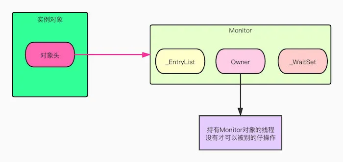

## 1.java8有哪些新特性，你都使用过哪些？

* lambda表达式：更加简洁了，针对那些函数式接口（Function Interface）可以使用lambda表达式

* stream及其相关的一些流式操作

  我们可以对包含一个或者多个元素的的集合做各种操作。这些操作可以是中间操作或者是终端操作哦，终端操作会返回一个结果，而中间操作还是会返回一个Stream流。常用的操作有：

  * filter：过滤
  * map：转换
  * collect：转换成集合或者列表或者map
  * match：匹配，包含 allMatch、anyMatch等等
  * count：计数
  * reduce：*减少、缩小*。通过入参的 `Function`，我们能够将 `list` 归约成一个值。它的返回类型是 `Optional` 类型。 

  流又有顺序流和并行流，当数据量很大时，基于并行流的操作速度会明显加快

  ```java
  List<String> strings = Arrays.asList("Hello", "Java", "8", "!");
  // 创建顺序流，顺序流是单线程的
  Stream<String> stream = strings.stream();
  // 创建并行流
  Stream<String> stringStream = strings.parallelStream();
  ```

* Optional

  Optional他不是一个函数式接口，设计它的目的是为了防止空指针异常。我们可以将

  Optional看做是包装对象（可能是null，也可能非null）的容器。

* 方法接口（函数式接口）

  除default方法外只有一个抽象方法的接口，可以用`@FunctionInterface` 注解标注，例如：

  ```java
  @FunctionalInterface
  public interface MyFunctionInterface {
      default void test(){
          
      }
      String subBlank(String s);
  }
  ```

  `java.util.function` 包下面给我们提供了许多的函数式接口，例如Predicate（断言，判断）、Consumer（消费）、BiConsumer（消费两个）、Supplier（生产者）、Comparator（比较者）等等等等

* 方法引用

  通过`::` 来引用方法或者构造器，例如：

  ```java
  @Data
  public class Apple {
      // 颜色
      private String color;
      // 重量
      private Double weight;
      // 价格
      private Double price;
  }
  
  // 静态方法
  Function<Integer, String> function_0 = String::valueOf;
  // 实例方法
  Function<Apple, String> function_1 = Apple::getColor;
  ```

* 新的日期相关的API，例如LocalDateTime、LocalDate、LocalTIme等等

* 方法中允许添加默认（default）接口

* 静态导入

  ```java
  import static java.util.UUID.*;
  
  public class StaticImport {
      public static void main(String[] args) {
          UUID hello = fromString("hello");
      }
  }
  ```

**Stream深入理解：**

Stream作为Java 8的新特性之一，它与Java IO包中的InputStream和OutStream完全不是一个概念。Java 8中的Stream是对集合功能的一种增强，主要用于对集合对象的进行简单高效的聚合和大批量的数据操作，结合Lambda表达式可以提高开发效率和代码可读性。

特点（重点）：

1. 无存储。它不是一种数据结构，只是某种数据源的一种视图（想想数据库中的视图，数据库视图可以看做是一个移动的窗口，通过它可以看到感兴趣的的数据；stream流可以铜鼓各种filter、map、match...从而给我们返回感兴趣的数据）。
2. 对Stream的操作会产生一个结果，但是Stream并不会改变数据源，比如对stream进行过滤操作会过滤掉一些元素从而产生一个新的stream，但是数据源并没有被改变；
3. 惰式执行。Stream上的操作不会立即执行，只有等到用户真正需要结果的时候才会执行，例如这句代码并不会真正的执行`menu.stream().filter(c -> c.getCalories() > 100);`
4. 只会被消费一次。stream只能被消费一次，一旦遍历以后就会失效，就像容器的迭代器那样，要想再次遍历必须重新生成。


## 2.Stream中的foreach对比列表的For-Each带来了那些优化？

例如我们把一个列表中的所有形状设置成红色，利用for-each我们可以这么做：

**第一种**：

```java
for (Shape shape : shapes){
    shape.setColor(RED)
}
```

**第二种**：使用java8扩展后的的集合框架则可以这样写:

```java
shapes.foreach(s -> s.setColor(RED));
```

**第一种**写法我们叫外部迭代，for-each调用`shapes`的`iterator()`依次遍历集合中的元素。这种外部迭代有一些问题：

- for循环是串行的，而且必须按照集合中元素的顺序依次进行；
- 集合框架无法对控制流进行优化，例如通过排序、并行、短路求值以及惰性求值改善性能。

**第二种**写法我们叫内部迭代，两段代码虽然看起来只是语法上的区别，但实际上他们内部的区别其实非常大。**用户把对操作的控制权交还给类库，从而允许类库进行各种各样的优化（例如乱序执行、惰性求值和并行等等**）。总的来说，内部迭代使得外部迭代中不可能实现的优化成为可能。

外部迭代同时承担了做什么（把形状设为红色）和怎么做（得到Iterator实例然后依次遍历），而**内部迭代只负责做什么**，**而把怎么做留给类库**。这样代码会变得更加清晰，而集合类库则可以在内部进行各种优化。


## 3.说说synchronized的实现原理

synchronized是依赖于存储在对象头中的monitor（监视器锁）来实现的，每个对象都拥有自己的监视器。

```java
Object o = new Object();
synchronized(o){
    hello();
}
```

`hello()`方法要想得到执行，必须要持有o对象上的monitor锁。

在JVM找那个，对象在内存中分为三个区域：对象头（Header）、实例数据（Instance Data）和对齐填充（Padding），以HotSpot为例，Hotspot的对象头主要包括两部分数据：Mark Word（标记字段，默认存储对象的HashCode、分代年龄和锁标志位信息）、Klass Pointer（类型指针），你可以看到在对象头中保存了**锁标志位**和**指向 monitor 对象的起始地址**，如下图所示，右侧就是对象对应的 Monitor 对象：



当Monitor被某个线程持有后，就会处于锁定状态，Owner会指向一个线程（那个线程获取到了这把锁就指向谁了），另外 Monitor 中还有两个队列分别是`EntryList`和`WaitList`，主要是用来存放进入及等待获取锁的线程。（参考：三太子敖丙公众号）

JVM基于进入和退出Monitor对象来实现方法同步和代码块同步。代码块同步是使用monitorenter和monitorexit指令来实现的，monitorenter指令是在编译的时候插入到同步代码块的开始位置，monitorexit指令在编译时插入到同步代码块的结束位置。当执行monitorenter的时候，首先会去尝试获取对象的monitor，如果这个锁（也就是monitor）没有被锁定，或者当前线程已经拥有了那个对象的锁，就把锁的计数器加1；相应的执行monitorexit指令的时候将锁的计数器减1，当计数器变为0时，锁就释放了。如果获取锁失败了，当前线程就会阻塞等待，直到对象锁被另一个线程释放为止。

监视器锁（Monitor）本质是依赖于操作系统的Mutex Lock（互斥锁）来实现的。每个对象都对应于一个可称为“互斥锁”的标记，这个标记用来保证在任一时刻，只能有一个线程访问该对象。互斥锁用于保护临界区，确保同一时间只有一个线程（此处的线程是操作系统底层的原生线程）可以访问数据。对共享资源的访问先对互斥量进行加锁，如果互斥量已经上锁，调用线程就会阻塞，只到互斥量被解锁。在完成了对共享资源的访问之后，要对互斥量进行解锁。


### 3.1 解释下synchronized是如何实现内存可见性的

同步块的可见性是由 如果对一个变量执行加锁操作，将会清空工作内存中此变量的值，在执行引擎使用这个变量之前需要重新load或assign操作初始化变量的值；对一个变量进行解锁操作之前，必须先把此变量同步会主内存中（执行store和write操作）。synchronized同步以后，每个线程完成了对共享变量的读写以后，其他线程才能访问，通俗来讲我们一个个来访问它，轮到它的时候才会看得到，因此实现了内存可见性。

### 3.2 解释下volatile是如何实现内存可见性的

回答这个问题一定要先简单介绍下Java内存模型（JMM）：所有的变量都存储主内存中，每条线程都还有自己的工作内存，线程的工作内存中保存了该线程使用到的变量到主内存的副本拷贝，线程对变量的所有操作（读取、赋值）都必须在工作内存中进行，而不能直接读写主内存中的值。不同的线程之间不能访问对方工作内存中的变量，线程间变量的值的传递均需要在主内存来完成。当两个线程同时对一个变量进行操作时，操作的是各自线程的工作内存中的变量，对方是无法看到的，这样就会引发问题。工作内存和主内存之间的交互操作有8种（lock锁定、unlock解锁、read读取、load载入、use使用、assign赋值，store存储、write写入），volatile通过加入内存屏障来禁止这些指令重排序，从而达到内存可见性的目的。

宏观上来看，例如`Object o = new Object();`这个语句其实是有三步操作：1.分配内存；2.初始化一个Object对象；3.将对象的地址赋给o从而达到引用变量。为了提高性能，编译器和处理器会对指令2和3进行重新排序，最后的执行顺序很可能是1、3、2，就会引发问题，用volatile修饰对象，避免了这种重排序，从而达到了内存可见性。


## 4.说说Lock的实现原理

访问共享资源的时候，为了避免出现竞争状态下共享资源出现不一致问题，Java提供了`synchronized`和`lock`来加锁。`synchronized`是Java底层支持的，而`lock`则是jdk实现的。以`ReentrantLock`为例，它是`Lock`的一个实现，并且是可重入的。构造它是可以指定是否公平锁。`Lock`中持有了`Sync`对象，Sync类又有两个实现，一个是公平的，一个是非公平的，默认是非公平的。Sync继承了`AQS（AbstractQueuedSynchronizer）`，众多细节就在这个`AQS`里面了。`AQS`是一个双向链表，每个节点保存了当前线程对象、上一个和下一个线程对象，还有一个状态量（`waitStatus`）,他们都用`volatile`修饰了。这是Lock锁的基本数据结构（双向链表+int类型的状态量）。

Lock锁获取锁的过程（非公平锁）：`lock.lock();`先尝试去获取锁（刚进来的线程会先去尝试获取锁，通过CAS将状态量修改为1），如果获取到了，ok，执行吧，同时将节点从列表中删除！如果没有获取到锁，就会尝试做三件事：再尝试获取一次、将当前线程加入到双向链表里面去（这步骤操作也是自旋哈，因为可能同时有好多线程都想将线程添加到尾部）、通过自旋判断刚刚加入的这个线程是否可以获取到锁（因为刚刚加入的线程可能处于双向列表的头部）。如果获取锁失败了，同时添加进链表以后也没有获取到锁，ok，停下吧，去链表里面等着吧！

Lock释放锁的过程，就是修改状态值，调整等待链表（下个节点该你上场啦！）

通俗来讲：等待的线程会放在双向链表中，链表的首部会通过CAS算法尝试修改状态量为1；公平锁是一进来就去链表的尾部等着，非公平是一进来会尝试两次获取锁（先直接去获取一次；加入到双向链表之前再去获取一次）。它是一种乐观锁，也就是读多写少的场景下很适合。