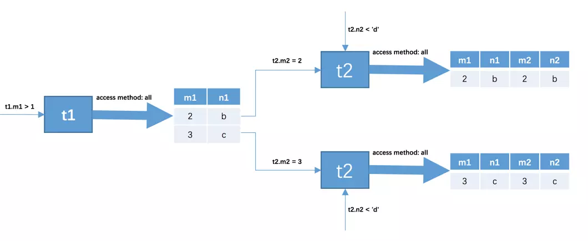

## 1.查询语句的基本格式

```mysql
#select 字段 1 , 字段 2 , 字段 3 , 表达式 , 函数 , ...
#from 表名
#where 条件
#group by 列名
#having 带组函数的条件
#order by 列名（ORDER BY 除了可以对指定的字段进行排序，还可以使用函数进行排序，例如：rder by abs(a)，根据绝对值进行排序；order by默认升序排列）
```

例如:

`select  id,name from people where name = 'wangle';` 查询姓名为wangle的id和name信息

`select age,count(age) from people where age > 10 group by age having count(age) < 15;`对年龄大于10的人按照年龄来分组，同时统计出每组的人数，统计完以后，再对统计结果进行筛选，筛选出人数小于15的组。

> 巴拉巴拉说了这么大一堆，其实我隐含了 where子句和having子句的区别，那到底有什么区别呢？
>
> 1. where子句不能放在group by后面
> 2. having子句是和group by子句一起用的，放在group by后面，此时的作用相当于where。（啥，相当于where，懵了。。。可以这么说吧，group by分组用的，分完组以后，会得到一个分组后的结果，比如年龄相同的一个组，那么多个组，如果我们想知道那些分组人数小于15，这个时候就需要使用having子句了）
> 3. where后面不能跟聚合函数，例如 avg(age)，count(id)，sum(age)等，但是having可以。


## 2.字符函数

upper / lower / initcap/length / lpad / rpad / replace / trim

* upper  转换为大写，例如：`select id,upper(name) from people`
* lower  转换为小写
* length  取长度
* lpad 左补齐，例如：`select id,lpad(name,10,'*') from people;` name字段长度设置为10,不足的话在左边补 \*
* rpad  右补齐
* replace 字符替换
* trim 去除前后的空格
* concat 字符串连接，例如 `select id，concat(frist_name,concat(" ",last_name)) from people;`
* substring(str,a,b) 字符串提取，从字符串的第a位开始提取，提取b位，第一位是1。例如：`select substring(name,1,1) from people;`
* left(str,n)提取字符串最左边的n个字符，例如：`select id,left(name,2) from people;`
* right(str,n)


## 3.结果集操作

数据库中查询结果的结果集（ResultSet），例如结果集A和结果集B：

A = {1,2,3,4,5}

B = {4,5,6,7,8}

A∪B = {1,2,3,4,5,6,7,8}，A和B加起来，去除重复的部分

A∩B = {4,5}，A和B公共的部分

A-B = {1,2,3}，A中有而B中没有的

当列的**个数、列的顺序、列的数据类型**一致时 , 我们称这两个**结果集结构相同** ，只有结果集结构相同的集合才能做集合操作。

* 合集（并集）

  `union` 和 `union all`

  * union

    union会去除重复记录，并且会排序（升序）

    ```sql
    select empno,ename,deptno from scott.emp where deptno = 10
    union
    select empno,ename,deptno from scott.emp where ENAME = 'WANGLE';
    -- 结果如下:
    EMPNO   ENAME   DEPTNO
    7782	CLARK	10
    7839	KING	10
    7934	MILLER	10
    7935	WANGLE	10
    ```

  * union all

    不会去除重复记录，也不会排序

    ```sql
    select empno,ename,deptno from scott.emp where deptno = 10
    union all
    select empno,ename,deptno from scott.emp where ENAME = 'WANGLE';
    -- 结果如下,我们可以看到它是没有顺序,并且是没有去除重复记录的
    EMPNO   ENAME   DEPTNO
    7935	WANGLE	10
    7782	CLARK	10
    7839	KING	10
    7934	MILLER	10
    7935	WANGLE	10
    ```

    在满足功能的前提下，优先选择`union all` （为什么？）

    注意：

    使用UNION和UNION ALL的时候，只能在最后使用一个ORDER BY命令，它是将两个结果集合并在一起以后，再进行排序；另外在使用ORDER By进行排序的时候，注意两个结果集的别名保持一致

* 交集

  intersect

  ```sql
  select empno,ename,deptno from scott.emp where deptno = 10
  intersect
  select empno,ename,deptno from scott.emp where ENAME = 'WANGLE';
  -- 结果如下:
  EMPNO   ENAME   DEPTNO
  7935	WANGLE	10
  ```

  可以看到展示两个集合重复的部分

* 差集

  ```sql
  select empno,ename,deptno from scott.emp where deptno = 10
  minus
  select empno,ename,deptno from scott.emp where ENAME = 'WANGLE';
  -- 结果如下:
  EMPNO   ENAME   DEPTNO
  7782	CLARK	10
  7839	KING	10
  7934	MILLER	10
  ```

  可以看到展示了在A集合中存在，但是在B集合中不存在的结果


## 4.连接查询

### 4.1连接的本质&查询过程

我们先建立2张表：

```mysql
mysql> SELECT * FROM t1;
+------+------+
| m1   | n1   |
+------+------+
|    1 | a    |
|    2 | b    |
|    3 | c    |
+------+------+
3 rows in set (0.00 sec)

mysql> SELECT * FROM t2;
+------+------+
| m2   | n2   |
+------+------+
|    2 | b    |
|    3 | c    |
|    4 | d    |
+------+------+
3 rows in set (0.00 sec)
```

连接的本质就是把各个连接表中记录都取出来，依次匹配的组合加入到结果集并返回给用户。所以我们把上面t1表和t2两个表连接起来的过程如下所示：

.png)

这个过程看起来就像是把t1表的记录和t2表的记录连起来组成更大的记录，所以这个查询过程就是连接查询。连接查询的结果集中包含一个表中的每一条记录与另一个表中的每一条记录相互匹配的组合，像这样的结果集就可以称之为**笛卡尔积**。因为表`t1`中有3条记录，表`t2`中也有3条记录，所以这两个表连接之后的笛卡尔积就有`3×3=9`行记录。在`MySQL`中，连接查询的语法也很随意，只要在`FROM`语句后边跟多个表名就好了，比如我们把`t1`表和`t2`表连接起来的查询语句可以写成这样：

```mysql
select * from t1,t2;
```

我们可以连接任意数量的表，但是如果没有限制的话，这些表连接起来的笛卡尔积是非常大的，比如3张表，每张表的记录都是100条，他们连接以后产生的笛卡尔积高达100万条记录。因此我们在连接的时候设置比较的条件是很有必要的，在连接查询中，使用的过滤条件可以分为两种：

* 涉及单表的条件

  也称之为**搜索条件**，比如`t1.n1>'c'` 它是只针对t1表的过滤条件，`t2.m2>3`只是针对t2表的过滤条件。

* 涉及多表的条件

  `t1.m1 = t2.m2`、`t1.n1 > t2.n2`这些都是涉及2个表。

接下来我们来看看这条语句的执行过程：

```mysql
SELECT * FROM t1, t2 WHERE t1.m1 > 1 AND t1.m1 = t2.m2 AND t2.n2 < 'd';
```

1. 先确定第一个需要查询的表，这个表我们称之为驱动表（如何确定驱动表可以去了解下，总的就是选取代价最小的访问方法去执行单表查询）。此处假设使用t1表作为驱动表，则先去t1表中找到满足 `t1.m1>1`的记录，得到了2条记录，得到的结果为：

   | m1   | n1   |
   | ---- | ---- |
   | 2    | b    |
   | 3    | c    |

   我们看到有2条记录。

2. 针对上面的数据，再去t2表中查询，我们把t2表称之为被驱动表。因为涉及多表的条件`t1.m1 = t2.m2`，其中的m1我们已经知道是2和3了，因此变为了执行下面的两个查询

   ```mysql
   select * from t2 where m2 = 2 and n2 < 'd';
   select * from t2 where m2 = 3 and n2 < 'd';
   ```

整个连接查询的执行过程就如下图所示:



最后得到的结果如下:

```mysql
+------+------+------+------+
| m1   | n1   | m2   | n2   |
+------+------+------+------+
|    2 | b    |    2 | b    |
|    3 | c    |    3 | c    |
+------+------+------+------+
```

从上边两个步骤可以看出来，我们上边唠叨的这个两表连接查询共需要查询1次`t1`表，2次`t2`表。当然这是在特定的过滤条件下的结果，如果我们把`t1.m1 > 1`这个条件去掉，那么从`t1`表中查出的记录就有3条，就需要查询3次`t2`表了。也就是说在两表连接查询中，驱动表只需要访问一次，被驱动表可能被访问多次。

> 问题：驱动表查询出来的结果集存放在哪里呢？
>
> 哪里都不存，驱动表每获取一条记录，就去被驱动表找相应的记录，找完了就发送给客户端，然后再获取驱动表的下一条记录，循环往复，直至驱动表中没有符合条件的记录。

接下来我们根据上面的连接原理来细分下几种连接查询的本质不同。

* **内连接**

  `INNER JOIN`

  ```mysql
  -- 写法1:
  select t1.*,t2.* from t1 inner join t2;
  -- 写法2:
  select t1.*,t2.* from t1,t2;
  ```

  对于`内连接`的两个表，驱动表中的记录在被驱动表中找不到匹配的记录，该记录不会加入到最后的结果集，我们上边提到的连接都是所谓的`内连接`。哈哈，是不是相当于求交集呢。

* **外连接-左连接**

  `LEFT JOIN`

  ```mysql
  select t1.*,t2.* from t1 left join t2 on t1.n1=t2.n2;
  ```

  选取左边的表作为驱动表，驱动表中的记录即使在被驱动表中找不到匹配记录，也仍需要加入到结果集中

* **外连接-右连接**

  `RIGHT JOIN`

  ```mysql
  select t1.*,t2.* from t1 right join t2 on t1.n1=t2.n2;
  ```

  选取右边的表作为驱动表，驱动表中的记录即使在被驱动表中找不到匹配记录，也仍需要加入到结果集中。


可是这样仍然会出现问题，即使对于外连接来说，有时候我们并不想把驱动表的全部记录加入到结果集中。这就犯难了，有时候匹配失败要加入结果集，有时候又不要加入结果集，这可咋办。哈哈，其实过滤条件分为两种，即on和where，他们放在不同的地方，它们的语义也不同

1. where子句中的过滤条件

   where子句中的过滤条件就是我们常见的那种，不论是内连接还是外连接，只要不满足过滤条件，都不会加入到结果集中

2. on子句中的过滤条件

   对于外连接驱动表的记录来说，如果在被驱动表中没找到符合的过滤条件的记录，驱动表的记录仍会加入到结果集中，对应的被驱动表的记录用NULL填充

接下来我们来演示一下：

```mysql
mysql> select t1.*,t2.* from t1 left join t2 on t1.m1 = t2.m2 and t2.m2 = 2;
+----+----+------+------+
| m1 | n1 | m2   | n2   |
+----+----+------+------+
|  2 | b  |    2 | b    |
|  1 | a  | NULL | NULL |
|  3 | c  | NULL | NULL |
+----+----+------+------+
3 rows in set

mysql> select t1.*,t2.* from t1 left join t2 on t1.m1 = t2.m2 where t2.m2 = 2;
+----+----+----+----+
| m1 | n1 | m2 | n2 |
+----+----+----+----+
|  2 | b  |  2 | b  |
+----+----+----+----+
1 row in set

mysql> 
```

`t2.m2 = 2`这个条件放在连接条件on子句里面，代表的是在被驱动表中只有满足这个条件的记录才会加入到结果集中；`t2.m2 = 2`这个过滤条件放在where子句里面，代表的是：不管该条件是过滤驱动表还是被驱动表，只要不满足过滤条件，都不会加入到结果集中。

另外需要说明的是，这个ON子句是专门为外连接驱动设计，用来决定被驱动表中哪些应该加入到结果集中，当把On子句放在内连接（inner join）中，MySQL会把它和WHERE子句一样对待，也就是说：内连接中的WHERE子句和ON子句是等价的。（其实很简单，内连接相当于没有驱动表和被驱动表之分了）


### 4.2 扩展的一些链接查询

1. 全连接（MySQL不支持，Oracle支持）

   在左连接的基础上，被驱动表不符合过滤条件的记录也会放入到结果集中，相当于求全集

2. 左连接但不包含内连接

   左连接完成以后得到一个结果集，再提取出`被驱动表`的字段为空的就是最终的结果集

   ```mysql
   select t1.*,t2.* from t1 left join t2 on t1.n1=t2.n2 where t2.n2 is null;
   ```

   哈哈，快去回顾下 where子句和on子句的区别吧。

3. 右连接但不包含内连接

   ```mysql
   select t1.*,t2.* from t1 right join t2 on t1.n1=t2.n2 where t1.n1 is null;
   ```


参考：<https://juejin.im/book/5bffcbc9f265da614b11b731/section/5c061b0cf265da612577e0f4>