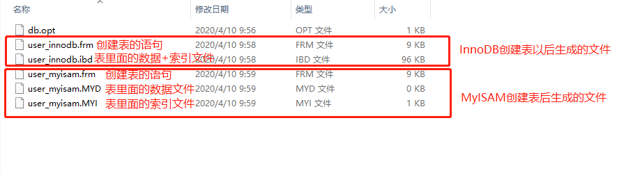
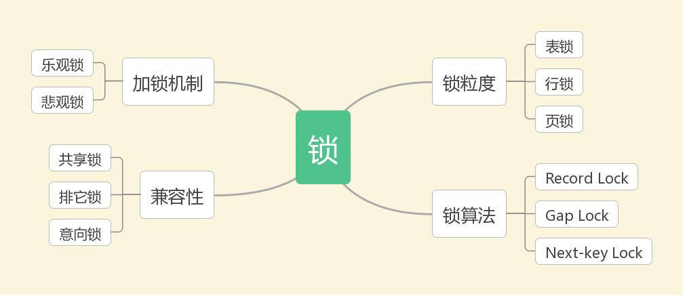

## 1.谈谈MySQL客户端和服务端的连接过程

我们知道MySQL是C/S架构，即客户端/服务端架构，客户端和服务端是两个进程，客户端进程向服务端进程发送请求并得到回复的过程是一个进程间通信的过程。MySQL支持TCP/IP、命名管道和共享内存、Unix域套接字文件这三种客户端和服务端之间的通信方式。一般来说肯定TCP/IP连接方式用的最多了。MySQL客户端发起请求连接时，会携带socket（ip地址+端口号）、用户名、密码等等信息，服务端校验用户名和密码还有权限，用来判断是否允许连接到数据库实例。


## 2.说说MySQL的基本架构

客户端 -> 连接管理（连接器） -> 查询缓存 -> 语法分析（分析器） -> 查询优化（优化器） -> 执行器 -> 引擎 -> 文件系统

几点说明：

1. 连接管理（连接器）：每当有一个客户端连接到服务器的时候，服务器就会创建一个线程专门用来处理该连接对应的客户端和服务端之间的一些交互（增删改查请求），当客户端退出连接时，该线程被释放，但是不会被立即回收销毁，而是会将它缓存起来，以供下个请求使用（因为线程的创建和销毁本来就是重量级的）。但是线程分配的太多又会影响系统性能，因此需要控制连接到服务器的客户端的数量。当连接建立的时候，负责的线程会一直等待客户端的请求，如果一段时间以后（默认是8小时），客户端没有和服务端交互，连接就会自动断开，这个时间参数是`wait_timeout`控制的。
2. 查询缓存：MySQL服务器处理**查询请求**时，会将刚刚处理过的查询请求及结果缓存起来，如果下次有一模一样的请求过来的时候，就可以直接去缓存里面取，不用去底层查找了。这个缓存可以在不同的客户端之间共享（相当于MySQL服务端维护了一个map，key是查询语句，value是查询结果。需要注意的是：如果两个查询请求的语句有稍稍的不同，例如空格、注释、大小写等等，都会导致缓存不能命中）。另外如果查询请求中包含了一些系统表，那么请求和结果就不会缓存。缓存非常容易失效，只要该表的数据被修改（使用了insert、update、delete、truncate table、alter table、drop table、drop database）都会导致该表的所有缓存变为无效并被删除。因此慎用mysql自己的缓存，一般改用缓存中间件，例如redis。MySQL 5.7开始已经不推荐使用mysql缓存了，并且MySQL 8.0以后，缓存被删除了。
3. 语法解析：客户端发过来的只是文本，需要对这些文本做一些处理，比如提取出表名、列表、关键字，判断语法是否正确等等。
4. 查询优化：我们表中有索引，优化会确认使用哪个索引；对执行顺序进行优化，条件那么多，先查哪个表，再查那个表，还是先关联，最后由优化器确定到底使用哪种方案。
5. 执行器：执行器调用存储引擎的提供的API，具体的任务就会落到具体的存储引擎上，例如InnoDB或者MyISAM。我们知道表是一行行的记录构成的，但是这些都是逻辑概念，物理上如何表示，怎么从表中读取数据，怎么把数据放到磁盘上，这些都是存储引擎干的事情。
6. 存储引擎：下面详细再说。


## 3.说说InnoDB和MyISAM的区别。

比较之前，肯定要先简单说说。

### 3.1 InnoDB

* 页

  InnoDB是一个将表中的数据存储到磁盘上的存储引擎，所以即使关机重启以后我们的数据还是存在的。读写都是需要先将磁盘上的数据加载到内存，然后再进行一些处理，如果是数据的修改，还要将修改后的数据再保存到磁盘上。这就涉及到内存和磁盘数据的交互了，**页**是MySQL中磁盘和内存交互的基本单位。InnoDB将数据分为若干个页，以页作为内存和磁盘交互的基本数据单位，InnoDB中页的大小一般为16KB，也就是一般情况下，一次最少从磁盘上读取16KB的数据到内存中，然后再进行处理。**数据页之间是双向链表。**

* 行格式

  行构成了页，MySQL中表的一行数据对应一个行格式。InnoDB默认有四种行格式：Compact、Redundant、Dynamic、Compressed。InnoDB默认是Dynamic。

  一个页通常是16KB，当记录中的数据太多，当前页放不下的时候，会把多余的数据存放在其他页中，这种现象称为**行溢出**。

* 一个数据页有许多个行构成的（如果放不下，就会放到后面的页中去）

* InnoDB会把页中的记录划分为若干个组，每个组的最后一个记录的偏移量作为一个槽，存放在Page Directory中，所以在一个页中个根据主键查找是非常快的：

  1. 通过二分法二分法确定记录所在的槽
  2. 通过记录的next_record属性遍历该槽中所有的记录进行主键匹配。

**总结来说（重点）：**

1. 各个数据页可以组成一个双向链表
2. 而每个数据页中的记录又可以组成一个单向链表
3. 每个数据页都会为存在其中的行记录维护一个页目录，通过主键查找某条记录的时候可以在页目录中通过二分查找法快速定位到对应的槽（啥是槽？InnoDB会将页中记录划分为若干个组，每个组最后一个记录的偏移量作为一个槽，存放在Page Directory中），然后再遍历槽中的数据就可以找到对应的记录了
4. 以其他列（非主键）作为搜索条件：只能从最小记录开始依次遍历单链表中的每条记录

### 3.2 InnoDB和MyISAM的主要区别

| 方面         | InnoDB | MyISAM |
| :----------- | ------ | ------ |
| 事务         | 支持   | 不支持 |
| 外键         | 支持   | 不支持 |
| 行级锁       | 支持   | 不支持 |
| 自动奔溃恢复 | 支持   | 不支持 |
|              |        |        |

还有：MySQL 5.1及之前的版本中，MyISAM是默认的存储引擎，而在MySQL 5.5之后，InnoDB称为了MySQL默认的存储引擎。MyISAM会对整张表加锁，而不是针对行加锁；MyISAM数据可被压缩，存储空间很少，而且MyISAM在筛选大数据时非常快。

InnoDB是事务型引擎，当事务异常提交时，会被回滚。同时，InnoDB支持行锁。此外InnoDB需要更多的存储空间，它会在内存中建立其专门的缓冲池用于高速缓冲数据和索引。InnoDB支持自动崩溃恢复特性。

某些情况下，使用MyISAM也是比较适合的，例如读密集的情况下。

上面这么多不同点，随便抓一个，就能成为一个考点。


### 3.3 说说InnoDB和MyISAM使用B+Tree实现原理的不同

* MyISAM

  叶子结点包括了key和value，**key存放的是索引**，**value存的是数据地址**（可以理解为行记录的地址）。在根据索引检索的时候，如果指定的key存在，则取出value的值，然后根据这个值为地址去读取相应的记录。这被称为**非聚簇索引**，也叫非聚集索引（即索引和数据是分开的）。

* InnoDB

  根据主键索引（primary key是默认的主键索引，如果没有则取unique的列为主索引，如果连unique都没有，那就弄个row_id）构建一个B+树的索引数据结构，它的叶子结点data域保存了完整的数据记录，也就是说InnoDB的**数据文件本身就是索引**，这也是“聚簇索引”的由来。除了主索引，我们还可以创建其他的索引，例如：

  ```sql
  create table people(id int primary key, name varchar(20));
  -- 上面以已经指定了一个主键，所以它默认就有主索引了，接下来我们添加一个普通索引，这个普通索引也是二级索引
  ALTER TABLE people ADD INDEX index_n(name);
  ```

  **在根据主索引搜索时，找到叶子结点后，直接找到key所对应的节点即可取出数据；在根据辅助索引进行搜索时，叶子节点中存储主键值，每次查找数据时，根据索引找到叶子节点中的主键值，根据主键值再到聚簇索引中得到完整的一行记录。**

  > 我建了两个表
  >
  > ```mysql
  > create table user-innodb (id int primary key auto_increment,name varchar(10))engine=innodb;
  > 
  > create table user_myisam (id int primary key auto_increment,name varchar(10))engine=myisam;
  > ```
  >
  > 执行这两个指令以后，系统出现了以下的文件：
  >
  > 
  >
  > 从生成的文件来看，这两个引擎底层数据和索引的组织方式是不一样的，MyISAM把数据文件和索引文件分开了，这也是**非聚集索引方式**；InnoDB引擎将数据和索引放到了一个文件里了，这叫做聚集索引的方式。

### 3.4 为什么说MyISAM的查询性能更好？

因为MyISAM在叶子结点上找到数据记录的物理位置以后，就可以直接定位到数据记录。但是InnoDB使用到非主键索引查询以后，还要再去主键索引树上查询一次，才可以定位到数据的具体位置。MyISAM只需要一步，而InnoDB需要2步，因此MyISAM的查询性能更高。

注意：MyISAM普通索引，叶子结点存储的也是数据的物理地址。

## 4. 什么是索引

是一种**快速查询**表中内容的机制（意思是为了查询而生的），类似书的目录，引用在表中某些个字段之上，但存储时独立于表之外。

我们可以把索引表当做是表和行记录（构成数据页的东东，把它们叫做行记录，或者行格式）的中间表，它维护了表的索引列到物理数据地址之间的映射。

在InnoDB数据页中，行记录是根据主键（如果没有主键，也没有unique的列，则会生成隐藏的rowid作为“主键”）排列起来，并且所有的记录呈现一个单链表的形态（通过next_record指向下个记录）。查询的时候，先去匹配索引，然后根据索引对应的数据的行位置去提取数据。

创建索引的语句：

```mysql
-- 创建索引的语句
-- 1.添加PRIMARY KEY（主键索引） 
mysql>ALTER TABLE table_name ADD PRIMARY KEY (column_name);
-- 2.添加UNIQUE(唯一索引) 
mysql>ALTER TABLE table_name ADD UNIQUE (column) ;
-- 添加主键列和唯一列都会默认添加索引
------------------------------------------------------------
-- 3.添加INDEX(普通索引) 
mysql>ALTER TABLE table_name ADD INDEX index_name (column); 
-- 4.添加FULLTEXT(全文索引) 
mysql>ALTER TABLE table_name ADD FULLTEXT (column);
-- 5.添加多列索引,也叫联合索引,添加到多列上面的
mysql>ALTER TABLE table_name ADD INDEX index_name (column1, column2, column3);
```

索引查询也是用到才会加载到内存，不用到就不加载，每次会加载一个页面

### 4.1 什么是主键索引

索引文件同时也是数据文件，存储了整张表的数据。也就是说平时我们执行sql按照主键查询的时候，那么就只需要从这个索引文件中获取数据即可。这种索引也叫做**聚集索引**，原因是索引和数据**聚集**在一起。

### 4.2 什么是辅助索引

**非自增主键索引**，也可以叫做**非聚集索引**。这种索引文件的叶子结点存储了**键值**和**书签**，键值指的就是列的值，书签对应的就是该记录的主键的值，如果按照某个辅助索引来查询数据的时候，如果没有用到**覆盖索引**，那么就得分两步走：

1. 先从辅助索引中获取数据对应的主键
2. 根据主键从聚集索引中获取真实的数据

## 5.索引有哪些特点

1. 索引一旦建立，数据库系统（MySQL或者Oracle）会对他们进行自动维护，插入、修改、删除只要涉及到索引改变的，都会使得索引表进行更新
2. 用户不用显示的指定在查询语句中指定使用那些索引。
3. 在定义的`primary key` 或者 `unique` 约束后系统会自动在相应的列上创建索引
4. 用户也能根据自己的需求，对指定单个字段或多个字段，添加索引


## 6.什么时候应该要创建索引

较频繁的作为查询条件的字段应该建立索引（在where子句、连接查询的on子句等）


## 7. 什么时候不应该创建索引

1. 表经常更新（insert、update、delete），因为表数据更新以后，对应的索引也会进行更新
2. 表很小（记录超少），建立索引去优化一张小表的查询**性价比**太低
3. 列表经常不作为连接条件或出现在where子句中
4. 对于哪些定义为text，image和bit数据类型的列不应该创建索引，这是因为这些数据要么特别大，要么取值很少。
5. 唯一性太差的字段不适合单独创建索引，即使该字段频繁的作为查询条件


## 8.索引有哪些优缺点

任何事物都有两面性，索引也不例外，它的优点有：

1. 唯一索引，保证了数据库表中数据的唯一性
2. 使用索引，可以在查询中，使用优化隐藏器（优化器）提供性能，减少磁盘IO，从而加快数据检索速度。在经常需要搜索的列上，可以加快搜索的速度；在作为主键的列上，强调该列的唯一性和组织表中数据的排列结构（想想一个数据页中的数据都是按照主键排列的，他们呈现出单链表的形态）；在经常用在连接的列上，这些列主要是一些外键，可以加快连接速度；在经常需要根据范围进行搜索的列上创建索引，因为索引已经排序，其指定范围内的数据是连续的；在经常需要排序的列上创建索引，因为索引已经排好序，这样查询可以利用索引的排序，加快排序所用的时间；在经常使用在where子句中的列上面创建索引，加快条件的判断速度。

它的缺点有：

1. 占用额外的物理空间，特别是聚集索引，需要较大的空间
2. 当对表中的数据进行增加、删除和修改的时候，索引也要动态的维护，这样就降低了数据的维护速度，并且随着数据量的增大，耗费的时间会越来越多。

来吧，尝试几道索引的面试题，检验下自己：<https://www.cnblogs.com/gaoquanquan/p/11030999.html>


## 9.事务

### 9.1 什么是事务

事务指的是逻辑上的一组操作，要么都执行成功，要么都执行失败。

### 9.2 事务的四大特性

ACID

* 原子性（Atomic）：事务是最小的执行单位，它不允许再分割了。事务中的执行逻辑要么全部执行成功，要么全部执行失败。
* 一致性（Consistency）：执行事务的前后，数据保持一致。拿转账来说，A转给了B1000元，转账前后A和B账户上的钱金额一致。
* 隔离性（Isolation）：事务之间是相互独立的，不会相互干扰。
* 持久性（Durability）：一个事务提交以后，它对数据库数据的改变是持久的，即使是发生了故障也不应该对其有任何影响。

### 9.3 并发事务会带来哪些问题

多个事务并发进行，经常会访问操作相同的数据来完成自己的任务，并发不可避免，但是它会带来以下问题：

* 脏读

  在一个事务中读取了另一个事务未提交的数据，然后使用了这个数据，会引发接下来的操作可能都是不对的。

* 不可重复读

  A事务操作期间内，多次读取数据，在A事务操作期间内，B事务对这些数据做了修改并提交了，A事务为了校验而再次读取了数据，这时数据不一样了。（不可重复读，即原始读取不可重复）

* 幻读（又叫虚读）

  幻读和不可重复读类似。在A事务操作期间内，A先读取了数据，此时B事务添加（删除）了几条数据并提交了，A事务再次查询，发生多了或者少了一些原本不存在的记录，就像发生幻觉一样

* 丢失修改

  指的是A事务读取了数据a，事务B也读取了数据a，A事务修改了a数据并提交了，事务B修改了数据a也提交了，这个时候A事务做出的修改被事务B给覆盖了。

> 不可重复读和幻读的区别
>
> 不可重复读指的是A读取的数据以后，这些数据被事务B**修改**了并提交了，此时A再读取发现数据中某些列变了；幻读是事务A读取数据以后，事务B**插入或者删除**了一些数据并提交了，事务A再次读取发现多了或者少了一些记录。一个针对的是修改，一个是插入和删除。

### 9.4 事务隔离级别有哪些

* READ_UNCOMMIT（读未提交）

  最低的隔离级别，允许读取尚未提交的数据变更。**会导致脏读、幻读和不可重复读**。

* READ_COMMIT（读已提交）

  允许读取其他并发事务已经提交的数据。**避免脏读，会导致幻读、不可重复读。**

* REPEATABLE_READ（可重复读）

  对同一字段的多次读取结果是一样的，除非数据是被本身事务自己修改的。**避免脏读和不可重复读，但是避免不了幻读。**

* SERIALIZABLE（可串行化）

  最高的隔离级别，完全服从ACID的隔离级别，所有的事务都串行化依次执行。**也就是说它会解决并发导致的一切数据共享问题。**

我们可以看到数据库提供了上面几种隔离级别。Oracle默认的隔离级别是READ_COMMIT，MySQL的InnoDB引擎的默认隔离级别是REPEATABLE_READ。

注意：**与SQL标准不同的地方在于，InnoDB存储引擎在REPEATABLE_READ事务隔离级别下使用的是`Next-Key Lock` 算法，它可以避免幻读的产生，这与其他数据库系统（如SQL Server）是不同的。也就是说InnoDB的隔离级别REAPETABLE_READ已经可以完全保证事务隔离性（ACID）的要求，即达到了SQL标准的SERIALIZABLE标准。**众所周知，隔离性越低，因事务导致的锁数量会减少，因此大部分数据库系统的隔离级别都是READ_COMMITED，但是我们需要知道的是，InnoDB使用的REPEATABLE_READ不会有任何性能损失。

InnoDB 存储引擎在 **分布式事务** 的情况下一般会用到 **SERIALIZABLE(可串行化)** 隔离级别。


## 10.说说数据库的锁机制与InnoDB锁算法

**锁机制：**

- MyISAM 采用表级锁（table-level locking）
- InnoDB支持行级锁和表级锁，默认为行级锁。

表级锁和行级锁的对比：

- 表级锁

  MySQL中锁定粒度最大的一种锁，对当前操作的整张表进行加锁。它具有的特点是操作简单，加锁快，不会出现死锁。因为他锁定粒度最大，因此锁冲突概率最高，并发量小

- 行级锁

  MySQL中锁定粒度最小的一种锁，对当前操作的行进行加锁。行级锁能大大减少锁冲突的概率。并发度高，加锁开销最大，加锁慢，会出现死锁。

**InnoDB锁算法：**

- 记录锁（Record Lock ）

  单个行记录上的锁。它是对索引项进行加锁的，锁定符合条件的行，其他事务不能修改和删除加锁项。**可以解决脏读和不可重复读**（我的理解是：对索引进行加锁，索引一定得是主索引，因为要唯一的区分一个数据行）

- 间隙锁（Gap Lock）

  间隙锁，对索引项之间的间隙加锁，锁定记录的范围（间隙？哪里的间隙？第一条记录前的间隙和最后一条记录后的间隙），不包含索引项本身。其他事务不能在锁的范围内插入数据，这样就防止了别的事务新增幻影行。

- Next-key Lock

  锁定索引项本身和索引范围。即在功能上是Record Lock和Gap Lock的结合。可以解决幻读问题。


## 11. MySQL中的锁类型



（图片来源于：<https://juejin.im/post/5c6f489651882562914ed5ff>）

可以看到，按照不同的划分方法，锁的类型是不一样的，锁粒度的划分方法和锁算法相关的在上面已经介绍过了，我们来看看乐观锁、悲观锁、共享锁、排它锁、意向锁。

**加锁机制**：

* 乐观锁

  大多是基于数据版本记录来实现

* 悲观锁

  往往依靠数据库提供的锁机制

**兼容性：**

表级锁和行级锁进一步划分为共享锁和排它锁

- 共享锁（Shared Lock，简称**S锁**）

  **又被称为读锁**，其他用户可以并发读取数据，但任何事务都不能获取数据上的排他锁（也就是读的同时你不能去获取写锁），直到已释放所有共享锁。

- 排它锁（Exclusive Lock，简称**X锁**）

  **排它锁（Exclusive lock,简记为X锁）又称为写锁**，若事务T对数据对象A加上X锁，则只允许T读取和修改A，其它任何事务都不能再对A加任何类型的锁，直到T释放A上的锁。它防止任何其它事务获取资源上的锁，直到在事务的末尾将资源上的原始锁释放为止。**在更新操作(INSERT、UPDATE 或 DELETE)过程中始终应用排它锁。**

另外再看下另外两个表级锁，**意向共享锁和意向排它锁**：

当一个事务需要获取的数据行已经被加上共享锁的时候，这个事务可以继续对数据行加上共享锁（读锁）；如果一个事务需要的数据行已经被加上读锁的时候，那么这个事务对该数据行不能加任何锁（不管是共享锁和排它锁）。而意向锁的意思就是我想要去加锁，如果它遇到的某个资源已经被其他事务锁定时，如果需要个共享锁，就加个意向共享锁（Intention Shared Lock，简称IS），如果需要个排它锁，就加个意向排它锁（Intention Exclusive Lock，简称 IX）。**IS、IX锁是表级锁，它们的提出仅仅为了在之后加表级别的S锁和X锁时可以快速判断表中的记录是否被上锁，以避免用遍历的方式来查看表中有没有上锁的记录，也就是说其实IS锁和IX锁是兼容的，IX锁和IX锁是兼容的。**


## 12.简单说下MVVC原理

`MVCC`（Multi-Version Concurrency Control ，多版本并发控制）指的就是在使用`READ COMMITTD`、`REPEATABLE_READ`这两种隔离级别的事务在执行普通的`SELECT`操作时访问记录的版本链的过程，这样子可以使不同事务的`读-写`、`写-读`操作并发执行，从而提升系统性能。`READ COMMITTD`、`REPEATABLE READ`这两个隔离级别的一个很大不同就是：生成ReadView的时机不同，READ COMMITTD在每一次进行普通SELECT操作前都会生成一个ReadView，而REPEATABLE READ只在第一次进行普通SELECT操作前生成一个ReadView，之后的查询操作都重复使用这个ReadView就好了。

详细参考：<https://juejin.im/book/5bffcbc9f265da614b11b731/section/5c923cfcf265da60f00ecaa9>


## 13.谈谈你们是如何优化大表的

当MySQL单表记录过大时，数据库的CRUD性能会明显下降，一些常见的优化措施如下：

1.分库分表

2.大表拆分（一个表的列很多，可以将这个表拆成2张表，第二种表存放第一张表中数据的唯一标识，也就是外键啦）

3.读写分离 主库负责写，从库负责读

4.我们还可以限制下客户端的查询行为，例如禁止不带任何查询限制条件的语句，禁止`select *`。


## 14.分库分表之后，id主键如何处理？

分成多个表以后（例如，用户user表，分成了user_1，user_2...这些表）,每个表的主键ID都从1开始累加，这显然是不对的。我们需要一个全局唯一ID来区分不同表中的记录。生成全局ID有以下这些方式：

1. **UUID** 可以保证全局唯一，但是不适合用来做主键，因为它太长了，导致索引占用空间大不说，还会影响查询效率。它比较适合生成唯一的名字标识，比如文件名称
2. **利用Redis生成ID** 例如维护一个整数型的string值，从1开始，每次调用`incr key_name` 会返回一个自增1的唯一数值。它灵活方便，不依赖于数据库。但是引入它会增加系统复杂性（什么，为了获取个ID我要整个redis），系统可用性降低（redis崩了，我岂不是insert不了数据了）
3. **Twitter的snowflake算法**
4. **美团Leaf分布式ID生成系统**


## 15.一条语句的执行过程

**查询语句：**

`select * from tb_student  A where A.age='18' and A.name=' 张三 ';`

1. 获取连接，指明主机，用户名，密码等信息，其实就是通过TCP建立长连接的过程
2. 检查语句是否有权限（是否有select的权限）

2. 查询缓存（MySQL 8.0以后移除了，如果没有开启查询缓存，则跳过）

3. 语法分析 提取出关键字段，例如那些是表名、那些是列名，同时判断语句是否正确

4. 优化器优化 优化器决定使用哪种方案，例如上面的语句有两种方案:

   ```mysql
   a.先查询学生表中姓名为“张三”的学生，然后判断是否年龄是 18。
   b.先找出学生中年龄 18 岁的学生，然后再查询姓名为“张三”的学生。
   ```

5. 执行器 执行器调用存储引擎API，由存储引擎去和数据库文件打交道，查出结果并返回

**更新语句：**

`update tb_student A set A.age='19' where A.name=' 张三 ';`

更新的时候肯定要先去查的，因此它会先沿着上面查询的语句走，只不过在更新的时候会记录日志：

1. 执行器先查询 `name=‘张三’` 这条数据
2. 拿到查询的结果以后，执行器把`age`改为`19`然后调用引擎的统一API（引擎有统一的API，每个API怎么实现依赖于底层的存储引擎）写入这条数据，保存到内存中
3. 记录`redo log`,并设置`redo log`的状态为`prepare`状态，并告诉执行器，我执行完成了，随时可以提交持久化到文件中去
4. 执行器收到通知以后，记录`bin log`同时设置redo log为提交状态
5. 更新完成

> redo log和bin log
>
> * redolog
>
>   重做日志，属于物理内容，上面存的是数据库中最终的内容，相当于数据了，有固定的大小，可以循环读写。一般设置`innodb_flush_log_at_trx_commit`为1，表示`commit`事务时将`redolog`上面的数据刷入到磁盘（具体的可以自行研究redolog file 和redolog buffer）。具有两个状态分别是**prepare**和**commit**，在MySQL重启恢复时会根据commit状态恢复数据。commit以后的数据可以被覆盖擦除。InnoDB使用它来支持事务。
>
> * binlog
>
>   归档日志，属于逻辑日志，上面存储的是最初的修改逻辑可以简单的理解为sql语句，可以追加写，一般设置sync_binlog为1，表示commit事务时将binlog上面的数据刷入到磁盘进行归档。数据恢复和同步都是通过binlog来实现的。（存的是命令，用来做主从库的同步和数据恢复）
>
> * 我们看到，redolog先是设置状态为prepare，然后再去处理binlog，最后又设置redolog为commit状态，也就是两阶段提交，为什么要两阶段提交呢？
>
>   **保证以上所有的过程如果出现MySQL实例奔溃都不会导致事务的丢失或异常。**
>
>   例如：`**update T set value = value+1 where ID =2**`
>
>   1. 词法分析器识别出事update语句；
>
>   2. 执行器去InnoDB中进行查询，找到满足ID = 2 的数据；
>
>   3. 执行器将value的值加1；
>
>   4. 执行器让InnoDB将刚刚的新值写入到InnoDB的内存中；
>
>   5. InnoDB在redolog中加入一条记录，并把该记录的状态设置为prepare；
>
>   6. 执行器经“update T set value = value+1 where ID =2” 写入到binlog中；
>
>   7. 此时提交事务，将redolog中prepare的的记录状态设为commit，并且将内存中的新数据刷入磁盘。
>
>   在第5步之前崩溃了，没有redolog和binlog也就是本身这条update语句就执行失败了（客户端拿到失败的结果），没有任何的redolog和binlog，不会产生任何影响；在5和6步之间发生崩溃了，只有prepare状态的redolog，恢复是比对redolog和binlog，发现只有一条prepare状态的redolog，那么进行事务的回滚，保证redolog和binlog的统一；如果在6和7步之间发生崩溃，此时有binlog和prepare状态的redolog，就会根据binlog对对redolog进行补偿，并设置redolog状态为commit状态，提交binlog，此时事务得到了保证；最后一步之后发生了crash，redolog和binlog都是正常的，比对redolog和binlog进行恢复即可。
>
>   参考：<https://juejin.im/post/5c249e9a6fb9a049d5198dd5>


-------------------------------------------------------

以下面试总结根据：<https://juejin.im/post/5e6509fd518825490d1267eb> 总结而来，有的题目只是简单的理解后摘录过来，有的是在原答案基础上进行融会贯通而来的，仅限自己的理解，记录自己的学习过程。


## 1.说说MySQL数据库索引的相关知识吧，索引有哪些数据结构？

索引有Hash和B+树两种数据结构。在MySQL数据库中，我们创建索引的时候可以指定索引类型，有`HASH`和`BTREE`的选项。我们创建表的时候指定了 `primary key` 和 `unique` 的列会自动给我们创建BTREE类型的索引表。


## 2. 说说为什么要用B+树，而不用Hash表、完全平衡二叉树、B树这些呢？

回答这个问题我们要明白这几种数据结构的优缺点。

- **Hash表**

  它是根据索引列的值通过Hash算法找到数组下标（Hash表实际上是一个数组，字段值所对应的数组下标是哈希算法随机算出来的，所以可能出现**哈希冲突**，当出现哈希冲突的时候，解决办法是将这些hash碰撞的的数据链接起来，也叫链地址法。等值查询的时候先计算Hash值，还要检查该Hash值是否存在Hash碰撞，如果有碰撞，则要一直遍历到链表末尾，只到找到真正key对应的数据为止），拿到数据，这个数据相当于行记录的地址，然后去读取这个地址上的值，这样就完成了查询。但是它对于：

  ```mysql
  select * from user where name > '张三';
  ```

  这样的查询语句就无能为力了呀，因为Hash表是无序的数组，此时就要进行全表扫描了。因此我们可以总结：

  **Hash表的特点是可以快速的进行精确查询（等值查询），但是范围查询需要进行全表扫描，效率很低。**

  > Hash表在那些场景下比较适合？
  >
  > 等值查询的场景，就是利用Key-Value的情况，例如Redis、Memcached等这些NoSQL的中间件。
  >
  > Hash表是无序的，等值查询效率很高，能不能让Hash表排个序，这样等值查询和范围查询都很好呀？
  >
  > 可以的，也就是有序数组，但是维护这样一张有序的Hash表成本很大呀，数据的更新修改删除都会导致数组耗费大量的时间来调整，因此它比较适合做哪些静态数据。例如你去年一年的信用卡消费账单就比较适合用这种数据结构来存储。

- **完全平衡二叉树**

  它是有序的，所以支持范围查找，但是查找时，它是时间复杂度是`O(Log(N))`，为了维持它的平衡，更新时时间复杂度也是`O(Log(N))`。另外，如果索引数据很多（例如几千万的数据），那么树会很高，查询的成本就会随着树高的增加而增加，如果数据是放在机械硬盘里面的，速度会更慢。

- **B树**

  B树要比二叉树要矮，结点可以存储多个关键字，关键字是有序的，范围查询时通过结点的关键字也能快速定位到数据所在的子树，它本身就很优秀了。但是B+树是它的升级版，更优秀。

- **B+树**

  B+树是B树的升级版，它比B树还要矮（为什么更矮呢？因为B+树非叶子结点存储的是索引，相比于B树的结点都存储的是数据，这样在存储容量有限的情况下，单节点也能存储大量索引，使得整个B+树高度降低，减少了IO次数），这样磁盘的IO次数可以进一步降低；B+树非叶子结点不存放数据，因此相同的空间下可以支持更多的索引；并且叶子结点有指向下个叶子结点的指针，这样范围查询的效率会更高

  > 一个B+树的结点到底多大合适?
  >
  > 数据页的整数倍比较合适，因为MySQL使用的InnoDB引擎磁盘和内存的交互单位是数据页（数据页大小一般是16KB）


## 3.说说select * from user where account = 'zhangsan'这条语句的底层的查询过程，其中id为user表的主键。

分两种情况：

* account上有索引（回顾：该索引是什么类型的索引？辅助索引，又叫二级索引）

  1. 根据关键字zhangsan找到对应的id值，假如为002（id为主键）
  2. 根据id值定位到数据所在的数据页（数据页之间是双向链表关联的，所以是双向遍历）
  3. 找到数据页以后，再单向遍历行数据（因为行数据之间是单链表），找到对应id=002对应的数据行
  4. over

  以上过程就是**回表**。回到主键索引树搜索的过程就是回表。避免回表也有方法，那就是**覆盖索引**。

  > 啥叫**覆盖索引**？
  >
  > 覆盖索引是select的数据列只用从索引中就能够取得，不必读取数据行，换句话说查询列要被所建的索引覆盖。 
  >
  > 例如我们在id上有个索引，它是主键索引，另外还有个name也是个索引。它在B+树中每个节点存在的形式是`(3,'zhangsan'),(8,'lisi')`，可以看到索引的关键字是由主键id和name组合起来的。如果我们不用`select * from user where account = 'zhangsan';`，而改用`select id from user where account = 'zhangsan'`，这样在通过‘zhangsan’ 找到节点以后，发现上面已经有id了，直接返回即可，不用回到主键ID去查询。
  >
  > 很多联合索引的建立，就是为了支持覆盖索引，特定的业务能极大的提升效率。

* account上没有索引

  what？没有索引，那你去全表扫描吧！


## 4. 说说最左匹配原则（重点）

简单来说，如果表拥有一个联合索引, 任何一个索引的最左前缀都会被优化器用于查找列. 比如, 如果你创建了一个三列的联合索引包含(col1, col2, col3)，你的索引会生效于(col1), (col1, col2), 以及(col1, col2, col3)。

举个栗子（来源于<https://juejin.im/post/5da53e04e51d45782f663c04>）：

```mysql
CREATE TABLE user (
    id         INT NOT NULL,
    last_name  CHAR(30) NOT NULL,
    first_name CHAR(30) NOT NULL,
    PRIMARY KEY (id),
    INDEX name (last_name,first_name)
);
```

其中我们定义了一个联合索引name，包含的列为last_name和first_name。该索引可以用于为`last_name`和`first_name`值的组合指定一个已知范围内的查询. 同样也可以用于只指定了`last_name`列值的查询, 因为这个列是索引的一个最左前缀(就如下一节所说)。通俗来说，last_name必须放在最左边。因此，索引name可以用于下面的查询语句：

```mysql
select * from user where last_name = 'LeBron';

select * from user where last_name = 'LeBron' and first_name = 'James';

select * from user where last_name = 'LeBron' and (first_name = 'LeBron' OR last_name = 'James');

select * from user where last_name = 'LeBron' and (first_name >= 'A' and last_name <= 'M');
```

然而，索引name不能用于下列的查询：

```mysql
select * from user where first_name = 'Curry';

select * from user where last_name = 'Stephen' and first_name = 'Curry';
```

为什么会这样呢？

因为B+树中结点是按照创建联合索引时指定列的顺序排列的，关键字中的last_name是有序的，但是，first_name是无序的。例如一个结点可以是这样的:

`（dehua，liu）（huateng，ma）` last_name是有序的,但是first_name是无序的。


## 5. MySQL联合索引最多支持多少个列？

> MySQL can create composite indexes (that is, indexes on multiple columns). An index may consist of up to 16 columns. For certain data types, you can index a prefix of the column (see [Section 8.3.5, “Column Indexes”](https://dev.mysql.com/doc/refman/8.0/en/column-indexes.html)).

MySQL官方文档。16列。


## 6. MySQL 一张表最多支持多少个索引? 

一个表最多16个索引,最大索引长度256字节。


## 7.我们知道页里面的数据是通过主键升序排序并且是单向链表，那么通过`order by id desc`进行主键的降序排序，它是怎么利用索引从后往前获取的？

通过槽。我们知道每个数据页里面都有个叫槽的东东（InnoDB会把页中的记录划分为若干个组，每个组的最后一个记录的偏移量作为一个**槽**，存放在Page Directory中，所以在一个页中根据主键查找记录是非常快的），数据页是双向链表，我们遍历数据页的时候先看下Page Directory中的槽，找到最后满足最后一个记录所在的数据页，然后再逆向遍历下数据页，读出数据页中的记录即可。


参考：

本文内容大部分来源于：<https://juejin.im/post/5a9ca0d6518825555c1d1acd> 

索引的最左匹配原则：<https://juejin.im/post/5da53e04e51d45782f663c04> 

