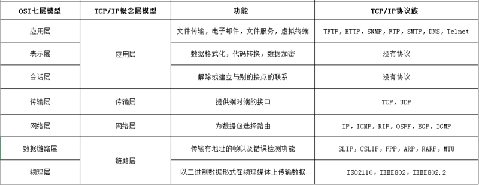
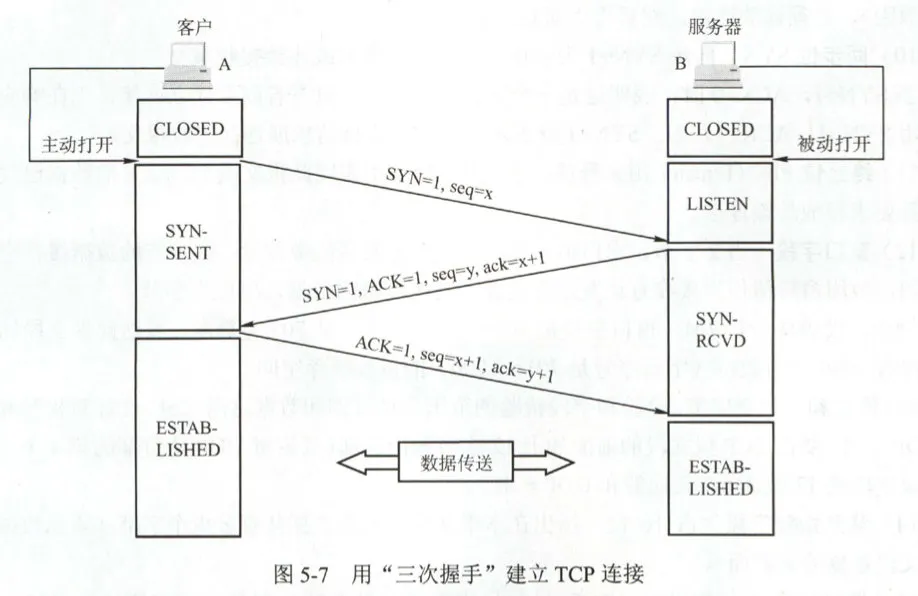
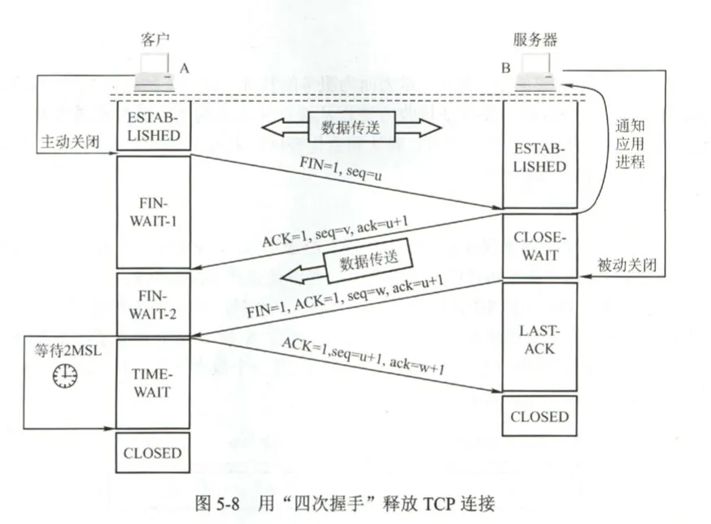

# TCP/IP相关知识点

## TCP/IP网络模型

计算机与网络设备要相互通信，双方就必须基于相同的方法。比如，如何探测到通信目标、由那一边先发起通信请求、使用哪种语言进行通信、怎样结束通信等规则都需要事先确定。不同硬件、不同操作系统之间的通信所有这一切都需要一种规则。而我们将这种规则称为协议（protocol）。

**TCP/IP是互联网相关各类协议族的总称，比如：TCP、UDP、IP、FTP、HTTP、SMTP等都属于TCP/IP协议族内的协议。**

TCP/IP模型是互联网的基础，它是一系列网络协议的总称。这些协议可以划分为四层，分别为：链路层、网络层、传输层、应用层。

通过上图，我们来总结下TCP/IP各层的主要作用：

* 链路层：负责封装和解析IP报文，发送和接收ARP、RARP报文等
* 网路层：负责路由以及把分组报文发送给目标网络或者主机
* 传输层：负责对报文进行分组和重组，并以TCP或UDP协议格式封装报文
* 应用层：负责向用户提供应用程序，比如HTTP、FTP、Telnet、DNS、SMTP等。

## UDP

**UDP全称是用户数据报协议，在网络中它与TCP协议一样用于处理数据包，它是一种无连接的协议。在OSI模型中，它在第四层，处于IP层的上一层。UDP不提供数据包分组、组装、不提供对数据包进行排序的缺点，也就是说当报文发送以后，是无法得知是否安全完整到达的。**

它有以下几个特点：

1. 面向无连接

   不需要向TCP一样先建立连接，想发数据就可以开始发了。并且只是数据报文的搬运工，不会对数据报文做任何拆分和拼接操作。具体来说就是：

   * 在发送端，应用层将数据传递给传输层的UDP协议，UDP只是给数据增加一个UDP头标识下是UDP协议，然后就传递给网络层了。
   * 在接收端，网络层将数据传递给传输层，UDP去除IP报文头就传递给应用层，不会做任何的拼接操作

2. 有单播、多播、广播的功能

   也就是说支持一对一，一对多，多对多的方式

3. UDP是面向报文的

   发送方的UDP对应用程序交下来的报文，在添加首部以后就交付给IP层。它对应用层交付下来的报文既不合并，也不拆分，而是保留这些报文的边界。因此，**应用程序必须选择合适大小的报文**。

4. 不可靠性

   首先不可靠性体现在无连接上，它通信之前不需要建立连接，想发就发。

   并且收到什么数据就传递什么数据，并且也不会备份数据，发送数据以后也不关心对方是否已经正确收到数据了。

   再者网络是不可靠的，但是UDP没有拥塞控制，它一直会以恒定的速度发送数据。即使网络环境不好，也不会对发送数据的速率进行调整。这样，使用它的弊端是网络条件不好的情况下可能会导致丢包，但是优点也很明显，在某些实时性要求比较高的场景（比如电话会议），就需要使用UDP而不是TCP。

5. 头部开销小，传输数据报文时是很高效的

   它的头部包含了以下几个数据：

   * 两个16位的端口号，分别是源端口（可选字段）和目标端口。总共占用2+2=4个字节
   * 整个数据报文的长度。2个字节
   * 整个数据报文的校验和（IPv4可选字段），该字段用于发现头部信息和数据中的错误

   因此我们可以看到，UDP头部的开销小，只有8字节，相比TCP的至少20字节要少的多，在传输数据报文时是很高效的

但是对于哪些体积大的文件，例如视频、音乐等，就必须要先分拆成一个个的小数据包，然后再发送，因此引出了TCP协议。

TCP协议，即传输控制协议，它有以下特点：

* TCP是面向连接的**传输层**协议

  也就是必须要先建立连接（三次握手建立连接）。

* 每一条TCP连接只能有两个端点（endpoint），每一条TCP连接只能是点对点的（一对一），也就说它只支持单播

  一个发，一个收。TCP连接的端点不是主机，不是主机的IP地址，不是应用进程，也不是传输层的协议端口。TCP连接的端点叫做**套接字**。套接字：socket = （IP地址:端口号）。也就是说：每条TCP连接唯一的被通信两端的两个端点（即两个套接字）确定。

* TCP提供可靠交付服务（如何实现可靠服务的）

* TCP提供全双工通信（每个端点可以同时发和收）

  发送者发送数据，接收者接收，接收者适时还要回复发送者数据有没有收到；发送者发快了，接收者处理不过来，会给发送者一个反馈；等等。。。所以必须是全双工的

* 面向字节流

  将数据先放入TCP缓存里面去，然后取出数据转化成二进制，发送给另一端，另一端是先放入TCP缓存，然后再对二进制数据进行解读

* 提供拥塞控制

  当网络出现拥塞的时候，TCP能够减小向网络注入数据的速率和数量，缓解拥塞

## TCP协议是如何实现可靠传输的

数据传输是由传输层传输的。

### 可靠传输的工作原理--停止等待协议

分为2中情况:

* 无差错情况

  A发送出去了，B收到以后给A回复一个确认号（确认号是期待收到对方下一个报文段的第一个数据字节的序号 ），然后A收到B的响应以后，继续发送。

* 有差错（超时重传）

  A发送出去了，没有收到B的回复，就会默认等待 RTT再多一点儿时间（RTO，发送方根据RTO采样计算出来的），如果超过这个时间了，就会重新传。RTT指的是往返时延

触发超时重传，可能是B回复时包丢了，也可能是B的确认迟到了

**记住一点，只要A没有收到B的回复，就会重传**。

使用上面的确认和重传机制，我们就可以在不可靠的传输网络上实现可靠的通信。这种可靠的传输协议常称为**自动重传请求ARQ（Automatic Repeat reQuest）**。

AQR表明重传的请求是自动进行的。接收方不需要请求发送方重传某个出错的分组（包）。

### 停止等待协议的缺点

大部分时间都浪费在等待接收方回复上面了，信道利用率低。

信道利用率公式：

`U = Td / (Td + RTT + Ta) `，Td指的是发送数据包需要的时间，Ta指的是接收回复所用的时间。分母几乎是确定的，为了提高信道利用率，就得提高RTT的值，因此就有了“**流水线传输**”

### 停止等待协议改进版----流水线传输

发送方可连续发送多个分组，不必每发完一个分组就停下来等待对方的确认（回复）。由于信道上一直有数据不间断的传送，这种传输方式可以获得很高的信道利用率。

那么问题由产生了，怎么实现可靠传输呢？也就是说我发数据出去了，怎么去确认对方有没有收到，以便于在没有收到确认的时候重新发送数据呢？所以就引出了 **连续AQR协议**

#### 连续AQR协议

发送窗口（滑动窗口）内的数据被保存到TCP缓存中，已经发送过的数据包收到确认以后，窗口往前移动。但是还会每个分组都必须要确认，效率还不是很高。改进方式是**累积确认**。

累积确认可以在1、2、3数据都收到的时候，之用回复A说3已经收到了，这样发送方就知道1/2/3都收到了。但是还是不够好，比如B收到了1.2.4.5，丢失了3怎么办，这个时候只能回复2,4.5就会重发。

### 综上，TCP是如何实现可靠传输的呢？

1. 以字节为单位的滑动窗口技术

   滑动窗口会在TCP缓存中移动，A的发送窗口和B的接收窗口大小是一样的。当滑动窗口中的数据已经被发送了，并且接收方已经应答了，则由左至右选取已经被发送的连续数据，给予回复。例如：A收到了来自B的1.2.3.4.5.8.9.10数据已收到的应答，则会在将滑动窗口往前移动到 6的位置处。

   我们知道，A发送给B数据以后，如果B没有收到，或者B收到了但是再给A应答的包丢失了，此时A就要重传数据包给B。**TCP每发送一个报文段，就对这个报文段设置一次计时器。只要计时器设置的重传时间到了但是还没有收到确认，就要重传这一报文段。**

   

## TCP报文的首部格式

由上图可知：

TCP首部由 20字节的固定首部+选项和填充部分，选项和填充部分是非必须的，所以TCP报文首部最小长度为20字节，此时选项和填充部分的长度为0个字节。

**源端口**，16位，也就2个字节，取值范围最大为1-65536，代表着发送端的端口号。

**目的端口**，16位，也就是2个字节，取值范围也是1-65536，代表着接收端的端口号。

**序号**，32位，也就是4个字节，代表当前分组的数据部分的第一个字节是整个待发送数据的第几个字节

**确认号**，32位，也就是4个字节，代表接收方已经收到了该字节编号以前的字节，期待下次对方发送的字节序号。

如下图所示，模拟了全双工通信时，确认号和序号的规则：

#### 标记位（标识位）说明

他们都是1位，要么是0，要么是1

* URG：为1时，标识紧急指针有效。啥意思呢？也就是不在发送方的TCP缓存里面排队了，马上将此分组传给接收方，相当于这个数据包发送时要插队了，对于终止传送很有效。
* ACK：确认标识，连接建立成功后，总为1。为1时确认号有效 
* SYN：为1时，代表客户端建立连接的请求包；当服务端同意建立TCP连接时，这个标识也会传1
* PSH：为1时，接收方应尽快把这个报文交给应用层
* RST：复位标识，重新建立连接。在浏览器中请求一个http地址，突然点击了一个刷新，此时RST就会设置为1
* FIN：数据传输完了，此时就要释放连接，此时这个标识就是1

#### 窗口

接收端期望接收的字节数。解决流量控制问题。

#### MSS 最长报文大小

- 最常见的可选字段
- MSS只能出现在SYN时传过来（第一次握手和第二次握手时）
- 指明本端能接收的最大长度的报文段
- 建立连接时，双方都要发送MSS
- 如果不发送，默认为536字节

#### 校验和

由发送端计算和存储，由接收端校验。解决数据正确性问题。

它校验TCP首部和数据两个部分

#### 紧急指针

紧急指针指明了紧急数据尾部在这个数据包里面的第多少个字节，例如紧急指针是50，表明1-50字节是需要紧急处理的，50以后的是不着急的

## 高频面试题之-TCP三次握手的过程（建立连接）

参考：<https://juejin.im/post/5a0444d45188255ea95b66bc> 

**在三次握手建立连接的阶段，是不会传输TCP报文段的，传输的是传输控制块TCB（Transmission Control Block），传输控制块存储了每一个连接中的一些重要的信息，比如：TCP连接表，指向发送和接收缓存的指针，指向重传队列的指针，当前发送和接收序号等等。**

如图所示，可以看到TCP连接的过程为三次握手的过程，其中第二次握手干了2件事情：应答客户端的连接请求+同意连接时发送的包含自身数据通讯时的初始序号：

可以看到，最开始的时候Client和Server都是处于`CLOSED`状态，由于服务端不知道到底要和谁建立连接，所以其职能被动打开，然后监听端口，此时Server处于`Listen`状态。

### 第一次握手

客户端向服务端发送连接请求报文段。客户端会主动打开，然后构建好TCB【SYN=1，seq=x】此时标记位中`SYN`是`1`（为1时，代表客户端建立连接的请求包），以及初始序号seq（代表当前分组的数据部分的第一个字节是整个待发送数据的第几个字节，这里假如是`X`），这两个字段保存在TCP请求头里面。结合图2来看，请求发送以后，客户端进入`SYN-SENT`（同步已发送）状态。

### 第二次握手

服务端收到客户端建立连接的请求以后，会构建TCB报文【SYN=1，ACK=1，seq=y，ack=x+1】，然后发送给客户端。这里SYN代表建立连接的标识，为1代表建立连接的请求包；ACK为确认标识，为1代表确认有效；ack=x+1，确认号，告诉客户端：你的x+1之前的字节我都收到了；seq=y代表自己的序号，因为TCP是全双工的，它也在向客户端发送自己的这些通信细节内容。发送完成以后服务端就进入到`SYN-RECEIVED`状态。其实我们可以看到，这次握手做了两件事情，应答客户端还有包含自身通讯的初始序号（TCP是全双工的，你告诉我你通讯的一些细节，当然我也得告诉你呀）。

### 第三次握手

当客户端收到连接同意的应答以后，因为应答里面包含了服务端传来的SYN以及序号等信息，客户端就要响应服务端，告诉他我也同意你连接我（全双工的嘛，我和你建立连接，你也要和我建立连接；内容有发送序号，还有确认号ACK=Y+1）。也就是说构建TCB【ACK=1，ack=y+1，seq=x+1】当发送完这个“应答”以后，客户端便进入到`ESTABLISH`状态，服务端收到这个应答以后，也进入到ESTABLISH状态了，此时连接就建立成功了。

## 高频面试题之-TCP四次挥手的过程（断开连接）

参考：<https://juejin.im/post/5a0444d45188255ea95b66bc> 

深入了解，参考：<https://mp.weixin.qq.com/s?__biz=MzI4Njg5MDA5NA==&mid=2247487107&idx=1&sn=f7680e34769f92b42ce2f389d964e374&chksm=ebd74f82dca0c6944f42457f5ce1ee49a5393315f02507360622b46b539c0d4776a142857095&mpshare=1&scene=24&srcid=0429XEvt7WAreH1A06pkCxAN&sharer_sharetime=1588123054128&sharer_shareid=dc8fc270d4895826988f6a2f3145b443&key=aade33cbd39cb82c08124d9300fa0923c283348f29e2c8141c5d8a741578e569780fc526ff7a4935e50ac389ae3ddff8f8abebfc1c2a53a3092eca8bb505e506fbf5cf13704721a2d973823d1a7af2d4&ascene=14&uin=MjczMjY2MTk2MA%3D%3D&devicetype=Windows+10+x64&version=62090070&lang=zh_CN&exportkey=A1%2B6DpKVn5ZeCByMZcEFAjY%3D&pass_ticket=NBlCdnE3RFzpL7rvdf6fr72p13GpPE9SV8RhRFpK2SKd3twyEGhH7Fwe4I0rkvLu> 

**TCP是全双工的，断开连接时，两端都需要发送FIN和ACK**。（其实建立连接的时候又何尝不是呢，因为服务端响应客户端建立连接请求以及服务端请求客户端建立连接请求，这两个请求合并为一个了，共同组成了建立连接时的第二次握手）

最开始的时候，客户端和服务端都处于`ESTABLISHED`状态,然后客户端会主动关闭，而服务端会被动关闭。

### 第一次挥手

当客户端A认为数据发送完成，则它需要向服务端B发送释放连接的请求。客户端发送一个【FIN=1，seq=结束的报文段+1，这里假设为u】A发送请求以后，进入到`FIN_WAIT_1`状态，等待服务器的反馈。

### 第二次挥手

B收到A的释放请求以后，**B会告诉自己的上层（应用层）要释放TCP连接**。然后发送一条【ACK=1，ack=u+1，seq=v，其中ACK是1代表确认标识，ack代表确认号，seq是序号】给客户端，并进入到`CLOSE_WAIT`状态，此时表明A到B的连接已经释放了，B不再接收A发的数据了。但是因为TCP连接时双向的，因此B仍然可以向A发送数据。A收到该请求以后，会从`FIN_WAIT_1`进入到`FIN_WAIT_2`状态。

### 第三次挥手

B此时如果还有数据没有发完，就会继续发送（第二次挥手以后，A不能向B发送数据了，但是B依然是可以向A发送数据的）。数据发送完毕以后，会向A发送一条【FIN=1，ACK=1，seq=w，ack=u+1】给客户端，告知客户端，服务端现在可以关闭了，然后B从`CLOSED-WAIT`状态进入到`LAST_ACK`状态。

### 第四次挥手

A收到释放的请求以后，向B发送【ACK=1，seq=u+1，ack=w+1】告知B我已经知道你准备好关闭了，此时A进入到`TIME_WAIT`状态。该状态会持续2MSL（最大段生存期，指报文段在网络中生存的时间，超时会被抛弃）时间，若该段时间内没有B的重发的话，A就会进入到CLOSED状态。当B收到确认应答以后，也便进入到CLOSED状态。

### 为什么客户端在最后一次挥手以后要等待2MSL的TIME_WAIT？

TIME_WAIT状态解读

第四次挥手以后，主动关闭的一方会进入到这样一个特殊的状态，这个状态标准的持续时间是4分钟，四分钟以后才会进入到CLOSED状态，释放套接字资源。不过在具体的实现上这个时间是可以调整的。

这就好比主动分手的方要承担的责任，是你提出的分手，你得付出代价。这个代价就是持续时长为4分钟的TIME_WAIT状态。**它的作用是重传最后一个ACK报文，确保对方能够收到**。怎么理解呢？想想这样一种场景，第三次挥手是服务端向客户端发起的释放连接的请求，它请求发出去以后，就要等到客户端的ACK，网络是不可靠的，可能客户端并没有收到，或者收到了但是ACK的时候丢失了，当服务端等待一定的时间以后，发现客户端的ACK还没有来（相当于第四次挥手），就会重发关闭连接的请求（FIN）。这个过程可能不止持续一次，因此主动关闭连接的一方就要有这么一个状态TIME_WAIT状态，用来确认对方能够收到最后一次应答。

另外，**在这段时间内，该链路在对话期间由于产生的残余报文（因为可能路径过于崎岖，数据报文走的时间太长，可能重传的报文都收到了，但是初始报文还没有收到）传过来时，都会被立即丢弃**。**默认的4分钟的时间足以使这些残留报文彻底消逝，不然当该端口被其他的TCP连接重复利用时，这些残留的报文可能会干扰新的连接。**

## 四次挥手一定是四次挥手吗，为何不能三次挥手？

* 首先如果丢掉最后一次挥手，那么服务端就不知道自己关闭连接的报文有没有传输成功，可能半路上就失败了，如果半路上失败了，而客户端就不知道了，就会导致客户端一直在等待服务器关闭，但是此时服务器发完最后一次挥手就关闭了；
* 如果中间两次挥手合并，也就是服务端响应客户端断开连接的请求和服务端发送关闭连接的请求合并为一次，这样肯定是不行的，因为服务端此时可能还有好多报文没有收到，此时关闭将会有很大的影响。

> 扩展：为什么视频用UDP而不是用的TCP？
>
> tcp需要进行三次握手，建立会话需要时间，tcp在网络拥塞的情况下会进行tcp全局同步，根据网络带宽调整tcp滑动窗口大小，引起tcp传输速度下降，甚至有可能会导致tcp报文没有带宽可用，导致tcp饿死，而视频传输对带宽的需求比较大，对时延要求比较高，对丢包率要求不是那么高，udp是面向无连接的传输协议，不需要进行三次握手，也没有tcp的滑动窗口，报文也比tcp小，正好满足了对视频传输的要求 

学完以后要能回答出这几个问题：

* TCP如何实现可靠传输的
* TCp怎么实现流量控制的
* TCP怎么避免网络堵塞的